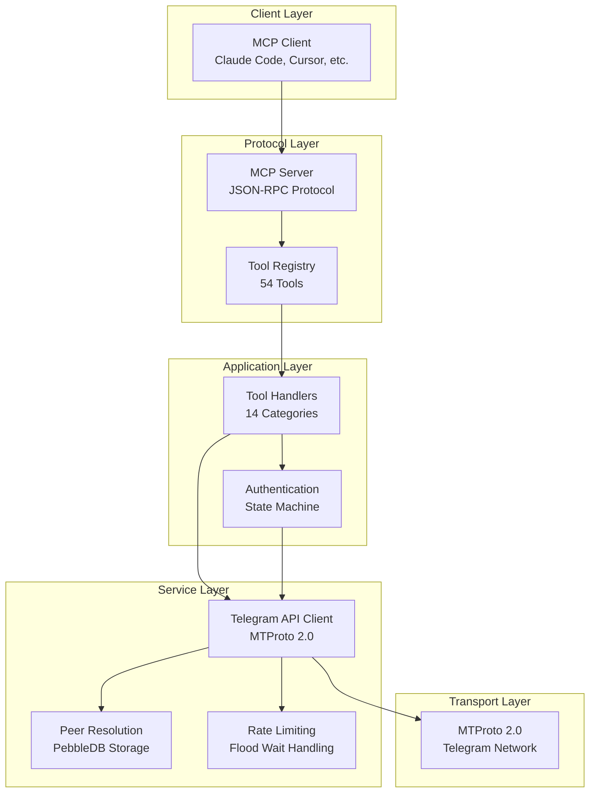

# Telegram MCP Server - Complete Documentation

## Overview

The **Telegram MCP Server** is a production-ready Model Context Protocol (MCP) server that provides AI assistants with comprehensive access to Telegram as a user account. Built on pure Go using the [gotd/td](https://github.com/gotd/td) MTProto 2.0 implementation, it exposes 54 tools across 14 functional categories.

### Quick Links

- [Architecture Overview](#architecture-overview)
- [Installation](#installation)
- [Quick Start](#quick-start)
- [Documentation Index](#documentation-index)
- [Tool Reference](#tool-reference)
- [Development Guide](#development-guide)

## Key Features

✅ **Full User Account Access** - Interact with Telegram as a real user, not a bot
✅ **MCP-Driven Authentication** - Complete auth flow through AI client interfaces
✅ **54 Comprehensive Tools** - Messages, chats, media, contacts, admin functions, and more
✅ **Session Persistence** - Auto-reconnect with saved sessions
✅ **Dual Transport** - Stdio for local clients, HTTP for remote deployments
✅ **Production Ready** - Docker support, health checks, comprehensive error handling

## Architecture Overview



## Installation

### From Source

```bash
go install github.com/nguyenvanduocit/telegram-mcp@latest
```

### From Binary

Download the latest release from [GitHub Releases](https://github.com/nguyenvanduocit/telegram-mcp/releases).

### Docker

```bash
docker build -t telegram-mcp .
```

## Quick Start

### 1. Get API Credentials

Visit [https://my.telegram.org/apps](https://my.telegram.org/apps) and create an application to get:
- `api_id`: Numeric ID
- `api_hash`: Hash string

### 2. Configure Environment

Create a `.env` file:

```bash
TELEGRAM_API_ID=12345
TELEGRAM_API_HASH=your_api_hash_here
TELEGRAM_PHONE=+1234567890
TELEGRAM_SESSION_DIR=~/.telegram-mcp  # Optional
```

### 3. Run the Server

```bash
# Stdio mode (for Claude Code, Cursor, etc.)
telegram-mcp --env .env

# HTTP mode (for remote deployments)
telegram-mcp --env .env --http_port 3000
```

### 4. Configure MCP Client

**For Claude Code** (`~/.config/claude-code/config.json`):

```json
{
  "mcpServers": {
    "telegram": {
      "command": "telegram-mcp",
      "env": {
        "TELEGRAM_API_ID": "12345",
        "TELEGRAM_API_HASH": "your_api_hash",
        "TELEGRAM_PHONE": "+1234567890"
      }
    }
  }
}
```

### 5. Authenticate

On first run, authenticate through your AI client:

1. `telegram_auth_status` - Check state (should show "waiting_code")
2. `telegram_auth_send_code` - Submit code from SMS/Telegram
3. `telegram_auth_send_password` - Submit 2FA password if enabled

## Documentation Index

### Core Documentation

| Document | Description | Link |
|----------|-------------|------|
| **Main Documentation** | Complete system overview and architecture | [telegram-mcp.md](telegram-mcp.md) |
| **Service Layer** | Telegram client, auth state machine, peer resolution | [service-layer.md](service-layer.md) |
| **Tool Layer** | Tool implementation patterns and categories | [tool-layer.md](tool-layer.md) |
| **Main Entry Point** | Startup, initialization, configuration | [main-entry-point.md](main-entry-point.md) |

### Tool Category Documentation

| Category | Tools | Description |
|----------|-------|-------------|
| [Authentication](tools/telegram_auth.md) | 3 | Auth flow management |
| [Messages](tools/telegram_message.md) | 14 | Send, search, edit, delete messages |
| [Chats](tools/telegram_chat.md) | 8 | Manage chats and dialogs |
| [Media](tools/telegram_media.md) | 4 | Upload and download files |
| [Users](tools/telegram_user.md) | 4 | User information and resolution |
| [Contacts](tools/telegram_contact.md) | 3 | Contact management |
| [Reactions](tools/telegram_reaction.md) | 2 | Message reactions |
| [Invites](tools/telegram_invite.md) | 3 | Invite link management |
| [Notifications](tools/telegram_notification.md) | 2 | Notification settings |
| [Forums](tools/telegram_forum.md) | 3 | Forum topic management |
| [Stories](tools/telegram_story.md) | 4 | Story operations |
| [Admin](tools/telegram_admin.md) | 4 | Admin and moderation |
| [Folders](tools/telegram_folder.md) | 2 | Chat folder management |
| [Profile](tools/telegram_profile.md) | 1 | Profile updates |
| [Drafts](tools/telegram_draft.md) | 3 | Draft message management |

## Tool Reference

### Authentication Tools (3)

| Tool | Description |
|------|-------------|
| `telegram_auth_status` | Check current authentication state |
| `telegram_auth_send_code` | Submit SMS/app verification code |
| `telegram_auth_send_password` | Submit 2FA password |

### Message Tools (14)

| Tool | Description |
|------|-------------|
| `telegram_send_message` | Send text messages |
| `telegram_get_history` | Get message history |
| `telegram_search_messages` | Search within a chat |
| `telegram_search_global` | Search across all chats |
| `telegram_forward_message` | Forward messages |
| `telegram_edit_message` | Edit sent messages |
| `telegram_delete_message` | Delete messages |
| `telegram_pin_message` | Pin a message |
| `telegram_unpin_all_messages` | Unpin all messages |
| `telegram_read_history` | Mark as read |
| `telegram_set_typing` | Send typing indicator |
| `telegram_delete_history` | Clear chat history |
| `telegram_translate` | Translate messages |
| `telegram_send_poll` | Create polls/quizzes |

### Chat Tools (8)

| Tool | Description |
|------|-------------|
| `telegram_list_chats` | List dialogs/chats |
| `telegram_get_chat` | Get chat details |
| `telegram_search_chats` | Search chats globally |
| `telegram_join_chat` | Join via username/link |
| `telegram_leave_chat` | Leave a chat |
| `telegram_create_group` | Create new group |
| `telegram_toggle_dialog_pin` | Pin/unpin dialogs |
| `telegram_mark_dialog_unread` | Mark as unread |

### Media Tools (4)

| Tool | Description |
|------|-------------|
| `telegram_download_media` | Download files |
| `telegram_send_media` | Upload and send files |
| `telegram_get_file_info` | Get file metadata |
| `telegram_view_image` | View images (AI vision) |

### User Tools (4)

| Tool | Description |
|------|-------------|
| `telegram_get_me` | Get current user info |
| `telegram_resolve_username` | Resolve @username |
| `telegram_get_user` | Get user details |
| `telegram_search_contacts` | Search contacts |

### Admin Tools (4)

| Tool | Description |
|------|-------------|
| `telegram_edit_admin` | Edit admin rights |
| `telegram_edit_banned` | Ban/restrict users |
| `telegram_get_participants` | List members |
| `telegram_get_admin_log` | View admin actions |

**And 23 more tools across Contacts, Reactions, Invites, Notifications, Forums, Stories, Folders, Profile, and Drafts.**

## Development Guide

### Project Structure

```
telegram-mcp/
├── main.go                      # Entry point
├── services/
│   └── telegram.go              # Telegram client & state machine
├── tools/
│   ├── telegram_auth.go         # Authentication (3 tools)
│   ├── telegram_message.go      # Messages (14 tools)
│   ├── telegram_chat.go         # Chats (8 tools)
│   ├── telegram_media.go        # Media (4 tools)
│   ├── telegram_user.go         # Users (4 tools)
│   ├── telegram_contact.go      # Contacts (3 tools)
│   ├── telegram_reaction.go     # Reactions (2 tools)
│   ├── telegram_invite.go       # Invites (3 tools)
│   ├── telegram_notification.go # Notifications (2 tools)
│   ├── telegram_forum.go        # Forums (3 tools)
│   ├── telegram_story.go        # Stories (4 tools)
│   ├── telegram_admin.go        # Admin (4 tools)
│   ├── telegram_folder.go       # Folders (2 tools)
│   ├── telegram_profile.go      # Profile (1 tool)
│   └── telegram_draft.go        # Drafts (3 tools)
├── docs/
│   ├── README.md                # This file
│   ├── telegram-mcp.md          # Main documentation
│   ├── service-layer.md         # Service layer docs
│   ├── tool-layer.md            # Tool layer docs
│   └── main-entry-point.md      # Main function docs
├── go.mod
├── go.sum
├── Dockerfile
└── README.md
```

### Adding a New Tool

1. **Define input struct**:
```go
type myToolInput struct {
    Peer string `json:"peer" jsonschema:"required"`
    Data string `json:"data" jsonschema:"required"`
}
```

2. **Register tool**:
```go
func RegisterMyTools(s *server.MCPServer) {
    s.AddTool(
        mcp.NewTool("telegram_my_tool",
            mcp.WithDescription("Tool description"),
            mcp.WithString("peer", mcp.Required(), mcp.Description("Peer identifier")),
            mcp.WithString("data", mcp.Required(), mcp.Description("Data parameter")),
        ),
        mcp.NewTypedToolHandler(handleMyTool),
    )
}
```

3. **Implement handler**:
```go
func handleMyTool(ctx context.Context, _ mcp.CallToolRequest, input myToolInput) (*mcp.CallToolResult, error) {
    peer, err := services.ResolvePeer(ctx, input.Peer)
    if err != nil {
        return mcp.NewToolResultError(err.Error()), nil
    }

    // Implementation...

    return mcp.NewToolResultText("Success"), nil
}
```

4. **Register in main.go**:
```go
tools.RegisterMyTools(mcpServer)
```

### Code Patterns

#### Error Handling
```go
// Resolution error
peer, err := services.ResolvePeer(ctx, input.Peer)
if err != nil {
    return mcp.NewToolResultError(err.Error()), nil
}

// API error
result, err := api.Method(ctx, req)
if err != nil {
    return mcp.NewToolResultError(fmt.Sprintf("operation failed: %v", err)), nil
}
```

#### Peer Storage
```go
result, err := api.Method(ctx, req)
if modified, ok := result.AsModified(); ok {
    services.StorePeers(ctx, modified.GetChats(), modified.GetUsers())
}
```

#### Random ID Generation
```go
func randomID() int64 {
    var b [8]byte
    _, _ = rand.Read(b[:])
    return int64(binary.LittleEndian.Uint64(b[:]))
}
```

### Testing

#### Unit Tests
```go
func TestHandleSendMessage(t *testing.T) {
    ctx := context.Background()
    input := sendMessageInput{
        Peer:    "@test",
        Message: "Hello",
    }

    result, err := handleSendMessage(ctx, mcp.CallToolRequest{}, input)

    if err != nil {
        t.Fatalf("unexpected error: %v", err)
    }

    if result.IsError {
        t.Fatalf("expected success, got error: %s", result.Content)
    }
}
```

#### Integration Tests
```bash
# Test with environment
TELEGRAM_API_ID=12345 \
TELEGRAM_API_HASH=test \
TELEGRAM_PHONE=+1234567890 \
telegram-mcp --env .env.test
```

### Best Practices

1. **Always resolve peers before API calls**
2. **Store peers from all API responses**
3. **Use appropriate pagination for list operations**
4. **Provide clear error messages**
5. **Validate input parameters**
6. **Handle all error cases**
7. **Format results for readability**
8. **Use context from parameters**
9. **Be mindful of rate limits**
10. **Document complex logic**

## Deployment

### Docker

**Build**:
```bash
docker build -t telegram-mcp .
```

**Run**:
```bash
docker run -d \
  -e TELEGRAM_API_ID=12345 \
  -e TELEGRAM_API_HASH=your_hash \
  -e TELEGRAM_PHONE=+1234567890 \
  -v telegram-data:/data \
  -p 3000:8080 \
  telegram-mcp \
  --http_port 8080
```

### Docker Compose

```yaml
version: '3.8'
services:
  telegram-mcp:
    build: .
    environment:
      TELEGRAM_API_ID: ${TELEGRAM_API_ID}
      TELEGRAM_API_HASH: ${TELEGRAM_API_HASH}
      TELEGRAM_PHONE: ${TELEGRAM_PHONE}
    volumes:
      - telegram-data:/data
    ports:
      - "3000:8080"
    command: ["--http_port", "8080"]

volumes:
  telegram-data:
```

### Kubernetes

```yaml
apiVersion: v1
kind: ConfigMap
metadata:
  name: telegram-mcp-config
data:
  TELEGRAM_SESSION_DIR: "/data"
---
apiVersion: v1
kind: Secret
metadata:
  name: telegram-mcp-secrets
type: Opaque
stringData:
  TELEGRAM_API_ID: "your-api-id"
  TELEGRAM_API_HASH: "your-api-hash"
  TELEGRAM_PHONE: "+1234567890"
---
apiVersion: apps/v1
kind: Deployment
metadata:
  name: telegram-mcp
spec:
  replicas: 1
  selector:
    matchLabels:
      app: telegram-mcp
  template:
    metadata:
      labels:
        app: telegram-mcp
    spec:
      containers:
      - name: telegram-mcp
        image: telegram-mcp:latest
        args: ["--http_port", "8080"]
        envFrom:
        - configMapRef:
            name: telegram-mcp-config
        - secretRef:
            name: telegram-mcp-secrets
        volumeMounts:
        - name: data
          mountPath: /data
      volumes:
      - name: data
        persistentVolumeClaim:
          claimName: telegram-data
---
apiVersion: v1
kind: Service
metadata:
  name: telegram-mcp
spec:
  selector:
    app: telegram-mcp
  ports:
  - port: 8080
    targetPort: 8080
```

## Troubleshooting

### Common Issues

#### "Missing required environment variables"

**Cause**: Required variables not set.

**Solution**:
```bash
export TELEGRAM_API_ID=12345
export TELEGRAM_API_HASH=your_hash
export TELEGRAM_PHONE=+1234567890
```

#### "Telegram client not initialized"

**Cause**: Client startup failed or still initializing.

**Solution**: Check logs for authentication errors or network issues.

#### "Peer not found in local storage"

**Cause**: Peer ID not in cache.

**Solution**: Use username instead for first reference, or ensure peer has been cached.

#### Flood wait errors

**Cause**: Hit Telegram rate limits.

**Solution**: Automatically handled by middleware. Reduce request frequency if persistent.

### Debug Logging

Enable debug logging in `services/telegram.go`:

```go
lg, _ := zap.NewDevelopment()  // Instead of NewProduction()
```

### Health Checks

For HTTP mode, implement health check endpoint:

```go
http.HandleFunc("/health", func(w http.ResponseWriter, r *http.Request) {
    state := services.GetAuthState()
    w.WriteHeader(http.StatusOK)
    fmt.Fprintf(w, `{"status":"ok","auth_state":"%s"}`, state)
})
```

## Performance

### Benchmarks

| Operation | Time | Notes |
|-----------|------|-------|
| Cold Start | ~500ms | Includes session loading |
| Warm Start | ~50ms | Session cached |
| Message Send | ~100ms | Includes peer resolution |
| Chat List | ~200ms | 20 chats with pagination |
| Media Download | Variable | Depends on file size |

### Optimization Tips

1. **Use peer caching**: Resolve once, use ID thereafter
2. **Batch operations**: Use pagination for large datasets
3. **Connection pooling**: Automatic with gotd/td
4. **Rate limiting**: Already configured for optimal throughput

## Security

### Best Practices

1. **Credential Management**:
   - Never commit `.env` files
   - Use secret management in production
   - Rotate credentials periodically

2. **File Permissions**:
   ```bash
   chmod 600 .env
   chmod 700 ~/.telegram-mcp
   ```

3. **Network Security**:
   - Use TLS for HTTP mode in production
   - Restrict access with firewall rules
   - Add authentication layer for HTTP endpoint

4. **Session Security**:
   - Store sessions in secure directory
   - Set appropriate file permissions
   - Consider encryption for session files

## Contributing

### Development Setup

```bash
# Clone repository
git clone https://github.com/nguyenvanduocit/telegram-mcp.git
cd telegram-mcp

# Install dependencies
go mod download

# Run tests
go test ./...

# Build
go build -o telegram-mcp
```

### Pull Request Process

1. Fork the repository
2. Create a feature branch
3. Make your changes
4. Add tests
5. Submit pull request

### Code Style

- Follow standard Go conventions
- Use `gofmt` for formatting
- Add comments for exported functions
- Document complex logic

## License

MIT License - See [LICENSE](../LICENSE) for details.

## Support

- **Issues**: [GitHub Issues](https://github.com/nguyenvanduocit/telegram-mcp/issues)
- **Discussions**: [GitHub Discussions](https://github.com/nguyenvanduocit/telegram-mcp/discussions)
- **Email**: support@example.com

## Acknowledgments

Built with:
- [gotd/td](https://github.com/gotd/td) - Pure Go MTProto implementation
- [mark3labs/mcp-go](https://github.com/mark3labs/mcp-go) - MCP server framework
- [cockroachdb/pebble](https://github.com/cockroachdb/pebble) - Embedded key-value store

## Changelog

See [CHANGELOG.md](CHANGELOG.md) for version history.
