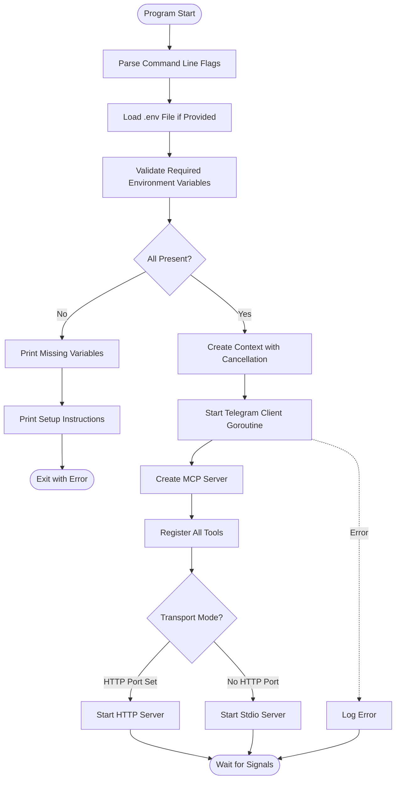
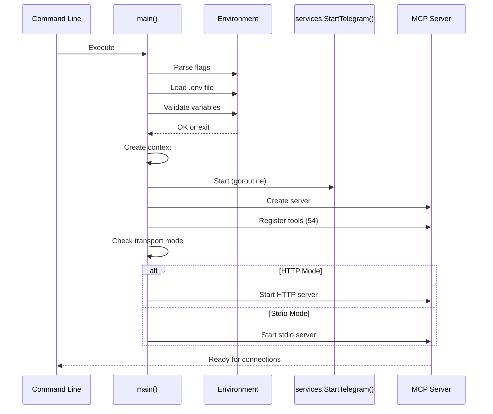
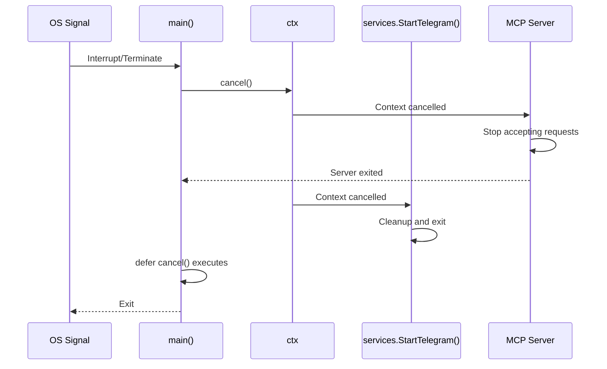

# Main Entry Point Documentation

## Overview

`main.go` is the entry point for the Telegram MCP server. It handles initialization, environment setup, server configuration, and coordinates the startup of both the Telegram client and the MCP server.

## Architecture



## Source Code Analysis

### Imports

```go
import (
    "context"
    "errors"
    "flag"
    "fmt"
    "log"
    "os"

    "github.com/joho/godotenv"
    "github.com/mark3labs/mcp-go/server"
    "github.com/nguyenvanduocit/telegram-mcp/services"
    "github.com/nguyenvanduocit/telegram-mcp/tools"
)
```

**Dependencies**:
- **Standard library**: context, errors, flag, fmt, log, os
- **godotenv**: Environment variable loading from .env files
- **mcp-go/server**: MCP server framework
- **services**: Telegram client service layer
- **tools**: Tool registration functions

## Main Function

### Function Signature

```go
func main()
```

**Purpose**: Program entry point. No return value (exits directly).

### Flow Breakdown

#### 1. Command Line Flag Parsing

```go
envFile := flag.String("env", "", "Path to environment file")
httpPort := flag.String("http_port", "", "Port for HTTP server. If not provided, will use stdio")
flag.Parse()
```

**Flags**:
- `--env`: Path to .env file (optional)
- `--http_port`: HTTP server port (optional, defaults to stdio mode)

**Usage Examples**:
```bash
# Use environment variables from shell
telegram-mcp

# Load from .env file
telegram-mcp --env .env

# Run as HTTP server on port 3000
telegram-mcp --http_port 3000

# Combine options
telegram-mcp --env .env --http_port 3000
```

#### 2. Environment File Loading

```go
if *envFile != "" {
    if err := godotenv.Load(*envFile); err != nil {
        fmt.Printf("Warning: Error loading env file %s: %v\n", *envFile, err)
    }
}
```

**Behavior**:
- Non-blocking: Errors are warnings, not fatal
- Loads into process environment
- Used before validation

#### 3. Environment Variable Validation

```go
requiredEnvs := []string{"TELEGRAM_API_ID", "TELEGRAM_API_HASH", "TELEGRAM_PHONE"}
var missing []string
for _, env := range requiredEnvs {
    if os.Getenv(env) == "" {
        missing = append(missing, env)
    }
}

if len(missing) > 0 {
    fmt.Println("Missing required environment variables:")
    for _, env := range missing {
        fmt.Printf("  - %s\n", env)
    }
    fmt.Println()
    fmt.Println("Setup:")
    fmt.Println("1. Get API credentials from https://my.telegram.org/apps")
    fmt.Println("2. Set environment variables:")
    fmt.Println("   TELEGRAM_API_ID=12345")
    fmt.Println("   TELEGRAM_API_HASH=your_api_hash")
    fmt.Println("   TELEGRAM_PHONE=+1234567890  (your Telegram account phone number)")
    fmt.Println("   TELEGRAM_SESSION_DIR=~/.telegram-mcp  (optional)")
    os.Exit(1)
}
```

**Required Variables**:
- `TELEGRAM_API_ID`: Numeric API ID
- `TELEGRAM_API_HASH`: API hash string
- `TELEGRAM_PHONE`: Phone number in international format

**Optional Variables**:
- `TELEGRAM_SESSION_DIR`: Session storage path (defaults to `~/.telegram-mcp`)

**Validation Logic**:
1. Check each required variable
2. Collect missing variables
3. If any missing, print helpful error message
4. Exit with status code 1

#### 4. Context Creation

```go
ctx, cancel := context.WithCancel(context.Background())
defer cancel()
```

**Purpose**: Create cancellable context for graceful shutdown.

**Lifecycle**:
- Created at startup
- Cancelled on defer (program exit)
- Used by Telegram client goroutine

**Use Cases**:
- Graceful shutdown on interrupt signals
- Cleanup of resources
- Cancellation of ongoing operations

#### 5. Telegram Client Startup

```go
go func() {
    if err := services.StartTelegram(ctx); err != nil && !isContextCanceled(err) {
        log.Printf("Telegram client error: %v", err)
    }
}()
```

**Concurrency**: Runs in separate goroutine.

**Error Handling**:
- Context cancellation errors are suppressed (normal shutdown)
- Other errors are logged but don't crash the server
- MCP server continues even if Telegram client fails

**Rationale**: The MCP server can still respond to auth status queries even if the client is disconnected.

#### 6. MCP Server Creation

```go
mcpServer := server.NewMCPServer(
    "Telegram MCP",
    "1.0.0",
    server.WithLogging(),
    server.WithRecovery(),
)
```

**Server Options**:
- **Name**: "Telegram MCP"
- **Version**: "1.0.0"
- **Logging**: Enabled (request/response logging)
- **Recovery**: Enabled (panic recovery)

**Panic Recovery**: Catches panics in tool handlers and returns errors instead of crashing.

#### 7. Tool Registration

```go
tools.RegisterAuthTools(mcpServer)
tools.RegisterMessageTools(mcpServer)
tools.RegisterChatTools(mcpServer)
tools.RegisterMediaTools(mcpServer)
tools.RegisterUserTools(mcpServer)
tools.RegisterReactionTools(mcpServer)
tools.RegisterInviteTools(mcpServer)
tools.RegisterNotificationTools(mcpServer)
tools.RegisterContactTools(mcpServer)
tools.RegisterForumTools(mcpServer)
tools.RegisterStoryTools(mcpServer)
tools.RegisterAdminTools(mcpServer)
tools.RegisterFolderTools(mcpServer)
tools.RegisterProfileTools(mcpServer)
tools.RegisterDraftTools(mcpServer)
```

**Registration Order**: Follows tool category structure.

**Total Tools**: 54 tools across 14 categories.

**Registration Pattern**:
```go
func RegisterAuthTools(s *server.MCPServer) {
    s.AddTool(
        mcp.NewTool("tool_name", /* ... */),
        mcp.NewTypedToolHandler(handlerFunc),
    )
}
```

#### 8. Transport Selection

```go
if *httpPort != "" {
    fmt.Printf("Starting Telegram MCP Server on http://localhost:%s/mcp\n", *httpPort)
    httpServer := server.NewStreamableHTTPServer(mcpServer, server.WithEndpointPath("/mcp"))
    if err := httpServer.Start(fmt.Sprintf(":%s", *httpPort)); err != nil && !isContextCanceled(err) {
        log.Fatalf("Server error: %v", err)
    }
} else {
    if err := server.ServeStdio(mcpServer); err != nil && !isContextCanceled(err) {
        log.Fatalf("Server error: %v", err)
    }
}
```

**Transport Modes**:

1. **HTTP Mode** (when `--http_port` is set):
   - Binds to specified port
   - Exposes MCP endpoint at `/mcp`
   - Streamable (supports SSE)
   - Use for remote deployments

2. **Stdio Mode** (default):
   - Uses stdin/stdout for JSON-RPC
   - Standard MCP transport for local tools
   - Used by Claude Code, Cursor, etc.

**Server Lifecycle**:
- Blocks until server exits
- Errors are fatal unless context is cancelled
- Context cancellation propagates from main

## Helper Function

### `isContextCanceled(err error) bool`

```go
func isContextCanceled(err error) bool {
    if err == nil {
        return false
    }
    return errors.Is(err, context.Canceled) || errors.Is(err, context.DeadlineExceeded)
}
```

**Purpose**: Distinguish context cancellation from actual errors.

**Returns**: `true` if error is context-related, `false` otherwise.

**Usage**:
```go
if err != nil && !isContextCanceled(err) {
    // Handle actual error
    log.Printf("Error: %v", err)
}
```

**Error Types Checked**:
- `context.Canceled`: Context was cancelled
- `context.DeadlineExceeded`: Context deadline passed

## Execution Flow

### Startup Sequence



### Shutdown Sequence



## Configuration

### Environment Variables

#### Required

| Variable | Type | Example | Description |
|----------|------|---------|-------------|
| `TELEGRAM_API_ID` | Integer | `12345` | API ID from my.telegram.org |
| `TELEGRAM_API_HASH` | String | `a1b2c3d4...` | API hash from my.telegram.org |
| `TELEGRAM_PHONE` | String | `+1234567890` | Account phone number |

#### Optional

| Variable | Type | Default | Description |
|----------|------|---------|-------------|
| `TELEGRAM_SESSION_DIR` | Path | `~/.telegram-mcp` | Session storage directory |

### Command Line Flags

| Flag | Type | Default | Description |
|------|------|---------|-------------|
| `--env` | Path | (none) | Path to .env file |
| `--http_port` | Port | (none) | HTTP server port (enables HTTP mode) |

## Deployment Modes

### 1. Stdio Mode (Default)

**Use Case**: Local MCP clients (Claude Code, Cursor, etc.)

**Startup**:
```bash
telegram-mcp
```

**Configuration** (for Claude Code):
```json
{
  "mcpServers": {
    "telegram": {
      "command": "telegram-mcp",
      "env": {
        "TELEGRAM_API_ID": "12345",
        "TELEGRAM_API_HASH": "your_hash",
        "TELEGRAM_PHONE": "+1234567890"
      }
    }
  }
}
```

**Communication**: JSON-RPC over stdin/stdout.

### 2. HTTP Mode

**Use Case**: Remote deployments, Docker, cloud services.

**Startup**:
```bash
telegram-mcp --http_port 3000
```

**Configuration**: Direct HTTP requests to `http://localhost:3000/mcp`.

**Communication**: HTTP with streaming support.

### 3. Docker Mode

**Dockerfile**:
```dockerfile
FROM golang:1.24-alpine AS builder
WORKDIR /app
COPY . .
RUN go build -o telegram-mcp

FROM alpine:latest
COPY --from=builder /app/telegram-mcp /usr/local/bin/
ENV TELEGRAM_SESSION_DIR=/data
VOLUME /data
ENTRYPOINT ["telegram-mcp"]
```

**Run**:
```bash
docker run -d \
  -e TELEGRAM_API_ID=12345 \
  -e TELEGRAM_API_HASH=your_hash \
  -e TELEGRAM_PHONE=+1234567890 \
  -v telegram-data:/data \
  -p 3000:8080 \
  telegram-mcp \
  --http_port 8080
```

## Error Handling

### Startup Errors

**Environment Validation Errors**:
```go
// Missing required variables
os.Exit(1)  // Fatal
```

**Handled by**: Printing helpful setup instructions and exiting.

### Runtime Errors

**Telegram Client Errors**:
```go
if err := services.StartTelegram(ctx); err != nil && !isContextCanceled(err) {
    log.Printf("Telegram client error: %v", err)
}
```

**Handled by**: Logging error, continuing to serve MCP.

**Rationale**: Auth status queries can still work even if client is disconnected.

### Server Errors

**Stdio/HTTP Server Errors**:
```go
if err := server.ServeStdio(mcpServer); err != nil && !isContextCanceled(err) {
    log.Fatalf("Server error: %v", err)
}
```

**Handled by**: Fatal exit (log.Fatalf).

**Rationale**: Server errors are unrecoverable.

## Signal Handling

### Context Propagation

```go
ctx, cancel := context.WithCancel(context.Background())
defer cancel()

// Context passed to Telegram client
go func() {
    services.StartTelegram(ctx)
}()
```

**Signals**:
- **SIGINT (Ctrl+C)**: Triggers context cancellation
- **SIGTERM**: Triggers context cancellation
- **Graceful Shutdown**: Context propagates to all components

### Cleanup Sequence

1. Signal received
2. `defer cancel()` executes
3. Context cancelled
4. Telegram client receives cancellation
5. Server stops accepting connections
6. Program exits

## Performance Considerations

### Startup Time

**Breakdown**:
- Flag parsing: < 1ms
- Environment validation: < 1ms
- MCP server creation: ~10ms
- Tool registration: ~50ms (54 tools)
- Telegram client init: ~500ms (session loading)

**Total**: ~500-600ms for cold start, ~50ms for warm start (session cached).

### Memory Usage

**Baseline**:
- Binary: ~20 MB
- MCP server: ~5 MB
- Telegram client: ~50 MB
- Peer cache: Grows with usage

**Total**: ~75-100 MB baseline.

### Concurrency

**Goroutines**:
- Main: 1
- Telegram client: 1+
- HTTP server: 1+ (per request)

**Context**: Shared across all goroutines for coordination.

## Troubleshooting

### Common Issues

#### 1. "Missing required environment variables"

**Cause**: Required variables not set.

**Solution**:
```bash
export TELEGRAM_API_ID=12345
export TELEGRAM_API_HASH=your_hash
export TELEGRAM_PHONE=+1234567890
```

#### 2. "Telegram client error"

**Cause**: Authentication failure or network error.

**Solution**: Check logs, verify credentials, test network connectivity.

#### 3. Server exits immediately

**Cause**: Fatal server error or signal.

**Solution**: Check logs, verify port availability (HTTP mode).

#### 4. "Context canceled" errors

**Cause**: Normal shutdown signal.

**Solution**: These are normal, can be ignored.

## Best Practices

### Development

1. **Use .env files for local development**:
   ```bash
   telegram-mcp --env .env
   ```

2. **Enable debug logging for troubleshooting**:
   ```go
   mcpServer := server.NewMCPServer(
       "Telegram MCP",
       "1.0.0",
       server.WithLogging(),
   )
   ```

3. **Test both transport modes**:
   ```bash
   # Stdio mode
   telegram-mcp

   # HTTP mode
   telegram-mcp --http_port 3000
   ```

### Production

1. **Always set required environment variables**
2. **Use session directory with proper permissions**:
   ```bash
   export TELEGRAM_SESSION_DIR=/var/lib/telegram-mcp
   chmod 700 /var/lib/telegram-mcp
   ```
3. **Use process manager for daemon mode**:
   ```bash
   # systemd
   systemctl start telegram-mcp

   # Docker
   docker restart telegram-mcp
   ```

4. **Monitor logs for errors**:
   ```bash
   journalctl -u telegram-mcp -f
   ```

## Security Considerations

### Credential Protection

1. **Never commit .env files**:
   ```gitignore
   .env
   .env.local
   ```

2. **Use secret management in production**:
   ```bash
   # Kubernetes
   kubectl create secret generic telegram-creds \
     --from-literal=API_ID=12345 \
     --from-literal=API_HASH=your_hash \
     --from-literal=PHONE=+1234567890
   ```

3. **File permissions**:
   ```bash
   chmod 600 .env
   chmod 700 ~/.telegram-mcp
   ```

### Network Security

1. **HTTP mode**: Use reverse proxy with TLS
2. **Firewall**: Restrict access to HTTP endpoint
3. **Authentication**: Add auth layer for HTTP mode

## Testing

### Unit Tests

```go
func TestIsContextCanceled(t *testing.T) {
    ctx, cancel := context.WithCancel(context.Background())
    cancel()

    err := ctx.Err()
    if !isContextCanceled(err) {
        t.Error("Expected context error to be detected")
    }
}
```

### Integration Tests

```bash
# Test with mock environment
TELEGRAM_API_ID=12345 \
TELEGRAM_API_HASH=test \
TELEGRAM_PHONE=+1234567890 \
telegram-mcp --env .env.test
```

## Future Enhancements

### Potential Improvements

1. **Signal handling**: Explicit SIGINT/SIGTERM handlers
2. **Health checks**: HTTP endpoint for service health
3. **Metrics**: Prometheus metrics export
4. **Configuration file**: YAML/TOML config support
5. **Multiple sessions**: Support for multiple Telegram accounts
6. **Dynamic tool loading**: Plugin architecture

### Example: Signal Handler

```go
sigChan := make(chan os.Signal, 1)
signal.Notify(sigChan, os.Interrupt, syscall.SIGTERM)

go func() {
    <-sigChan
    fmt.Println("\nShutting down gracefully...")
    cancel()
}()
```

## Related Documentation

- [Service Layer](service-layer.md): Telegram client management
- [Tool Layer](tool-layer.md): Tool implementation details
- [Main Documentation](telegram-mcp.md): Overall architecture
