# Telegram MCP (telegram-mcp)

## Overview

**Telegram MCP** is a Model Context Protocol (MCP) server that provides a comprehensive interface for interacting with Telegram's API. It exposes Telegram functionality through a set of tools that can be used by AI assistants and other MCP clients to perform various Telegram operations including messaging, chat management, media handling, and user information retrieval.

### Purpose

This module bridges the gap between Telegram's powerful API and MCP-compatible applications, enabling:
- **Automated messaging workflows** - Send, edit, delete, search, and forward messages
- **Chat management** - List, join, leave, and create groups/channels
- **Media operations** - Upload and download files, photos, and documents
- **User interactions** - Search contacts, resolve usernames, and retrieve user information

### Key Features

- **Full Telegram API Coverage** - Comprehensive tool set covering major Telegram operations
- **Dual Transport Support** - Works via stdio or HTTP server (configurable)
- **MCP-Driven Authentication** - Auth exposed as MCP tools (no terminal interaction needed)
- **Session Persistence** - Maintains login state across restarts
- **Rate Limiting** - Built-in flood wait handling and rate limiting
- **Peer Resolution** - Automatic resolution of usernames and chat IDs

---

## Architecture Overview

### High-Level Architecture

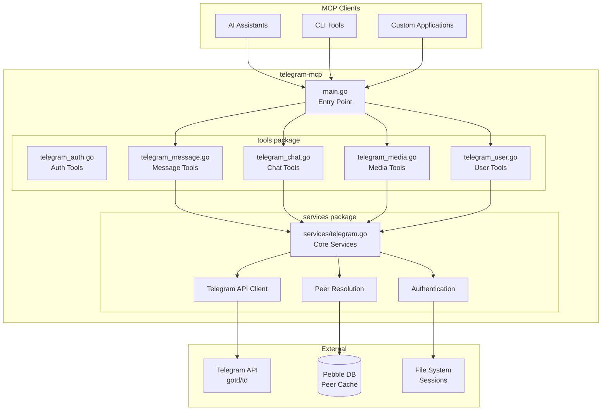

### Component Dependencies

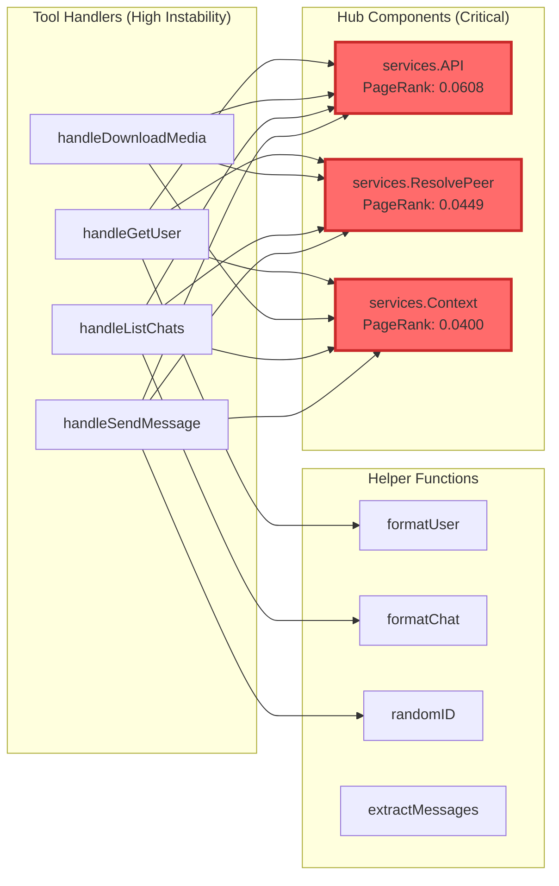

### Module Structure

The system is organized into two main packages:

| Package | Purpose | Files | Key Components |
|---------|---------|-------|----------------|
| **main** | Entry point & server setup | `main.go` | Server initialization, environment validation |
| **services** | Core Telegram client management | `services/telegram.go` | API client, authentication, peer resolution |
| **tools** | MCP tool implementations | `telegram_*.go` | Auth, message, chat, media, and user tools |

---

## Core Components

### Services Package (`services/telegram.go`)

The services package provides the foundational infrastructure for Telegram operations.

#### **Hub Component: API()**

**Purpose:** Returns the Telegram API client instance after ensuring the client is ready.

**Architecture Role:** Central hub with **21 callers** (fan-in=21), making it the most critical dependency in the system.

**Callers:** All tool handlers that need to make Telegram API calls.

**Breaking Change Impact:** Any modification to this function would affect all 21+ tool handlers across the entire system.

```mermaid
graph TD
    API["API() *tg.Client"]
    
    API --> H1[handleSendMessage]
    API --> H2[handleGetHistory]
    API --> H3[handleSearchMessages]
    API --> H4[handleForwardMessage]
    API --> H5[handleDeleteMessage]
    API --> H6[handleEditMessage]
    API --> H7[handlePinMessage]
    API --> H8[handleListChats]
    API --> H9[handleGetChat]
    API --> H10[handleSearchChats]
    API --> H11[handleJoinChat]
    API --> H12[handleLeaveChat]
    API --> H13[handleCreateGroup]
    API --> H14[handleDownloadMedia]
    API --> H15[handleSendMedia]
    API --> H16[handleGetFileInfo]
    API --> H17[handleGetMe]
    API --> H18[handleResolveUsername]
    API --> H19[handleGetUser]
    API --> H20[handleSearchContacts]
    API --> H21[StartTelegram]
    
    style API fill:#ff6b6b,stroke:#c92a2a,stroke-width:3px
```

**Usage Pattern:**
```go
api := services.API()
result, err := api.MessagesSendMessage(ctx, request)
```

---

#### **Hub Component: ResolvePeer()**

**Purpose:** Resolves a peer identifier (username or numeric ID) to a Telegram InputPeerClass.

**Architecture Role:** Critical hub with **15 callers** and **2 callees** (ResolveUsername, GetInputPeerByID). Betweenness centrality: 0.0046 (highest in the system).

**Callers:** All tool handlers that need to identify chats, users, or channels.

**Delegates To:**
- `ResolveUsername()` - For @username resolution
- `GetInputPeerByID()` - For numeric ID lookup

**Breaking Change Impact:** Would affect all tools that interact with peers (virtually all operations).

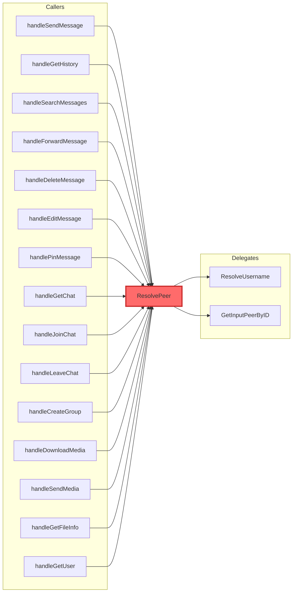

**Resolution Strategy:**
```go
func ResolvePeer(ctx context.Context, identifier string) (tg.InputPeerClass, error) {
    // 1. If starts with "@", resolve username
    if strings.HasPrefix(identifier, "@") {
        return ResolveUsername(ctx, identifier)
    }
    
    // 2. Try parsing as numeric ID
    id, err := strconv.ParseInt(identifier, 10, 64)
    if err != nil {
        // 3. Fallback to username resolution
        return ResolveUsername(ctx, identifier)
    }
    
    // 4. Look up by ID
    return GetInputPeerByID(ctx, id)
}
```

---

#### **Hub Component: Context()**

**Purpose:** Returns the Telegram client context, blocking until the client is ready.

**Architecture Role:** Hub with **16 callers**. Provides synchronized access to the client context.

**Concurrency Pattern:** Uses a channel-based ready signal to ensure callers wait for client initialization.

```go
func Context() context.Context {
    <-ready  // Block until client is ready
    return telegramCtx
}
```

**Lifecycle Management:**
- Created during `StartTelegram()`
- Closed when the Telegram client shuts down
- All tool handlers depend on this context for API calls

---

### Tool Packages

The tools are organized by functional area:

#### **Auth Tools** (`tools/telegram_auth.go`)

Provides MCP-driven authentication for the Telegram client.

**Available Tools:**
- `telegram_auth_status` - Check current authentication state
- `telegram_auth_send_code` - Submit SMS/app verification code
- `telegram_auth_send_password` - Submit 2FA password

---

#### **Message Tools** (`tools/telegram_message.go`)

Provides comprehensive message operations including send, edit, delete, search, forward, pin, and history retrieval.

📖 **Detailed Documentation:** [tools_message.md](tools_message.md)

**Available Tools:**
- `telegram_send_message` - Send messages to chats
- `telegram_get_history` - Retrieve message history
- `telegram_search_messages` - Search messages in chats
- `telegram_forward_message` - Forward messages between chats
- `telegram_delete_message` - Delete messages
- `telegram_edit_message` - Edit sent messages
- `telegram_pin_message` - Pin/unpin messages

---

#### **Chat Tools** (`tools/telegram_chat.go`)

Manages dialogs, groups, and channel operations.

📖 **Detailed Documentation:** [tools_chat.md](tools_chat.md)

**Available Tools:**
- `telegram_list_chats` - List user's dialogs
- `telegram_get_chat` - Get detailed chat information
- `telegram_search_chats` - Search for chats globally
- `telegram_join_chat` - Join public chats/channels
- `telegram_leave_chat` - Leave chats or channels
- `telegram_create_group` - Create new group chats

---

#### **Media Tools** (`tools/telegram_media.go`)

Handles file upload/download and media inspection.

📖 **Detailed Documentation:** [tools_media.md](tools_media.md)

**Available Tools:**
- `telegram_download_media` - Download media from messages
- `telegram_send_media` - Upload and send files
- `telegram_get_file_info` - Get media metadata without downloading

---

#### **User Tools** (`tools/telegram_user.go`)

Provides user information and contact management.

📖 **Detailed Documentation:** [tools_user.md](tools_user.md)

**Available Tools:**
- `telegram_get_me` - Get current user info
- `telegram_resolve_username` - Resolve @username to peer info
- `telegram_get_user` - Get detailed user information
- `telegram_search_contacts` - Search contacts by name/username

---

#### **Services Package** (`services/telegram.go`)

Core infrastructure including authentication, API client management, and peer resolution.

📖 **Detailed Documentation:** [services.md](services.md)

**Key Components:**
- `StartTelegram()` - Initialize and authenticate Telegram client
- `API()` - Access Telegram API client
- `Context()` - Get client context
- `ResolvePeer()` - Resolve peer identifiers
- `Self()` - Get current user information

---

## Authentication & Session Management

### MCP-Driven Authentication Flow

Authentication is exposed as MCP tools instead of requiring terminal interaction. The MCP server starts immediately — auth tools are available right away, and all other tools block until auth completes.

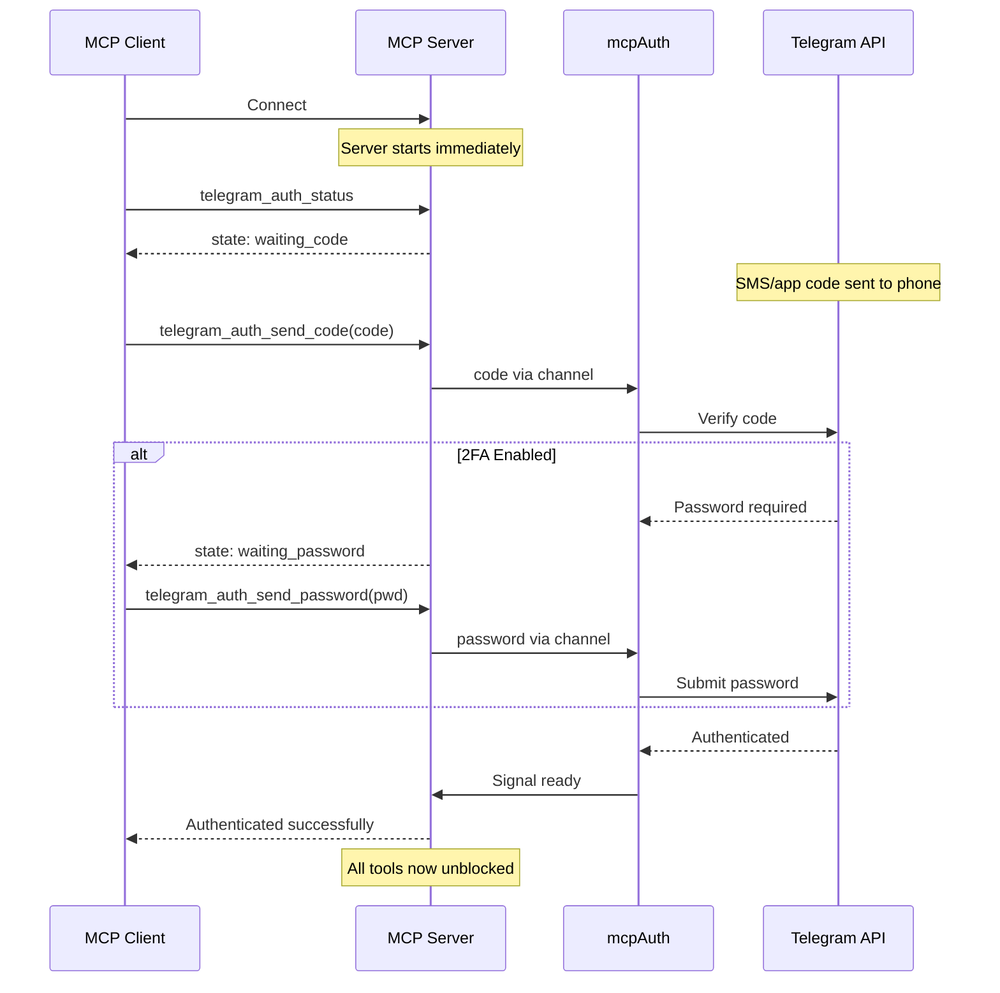

### Auth State Machine

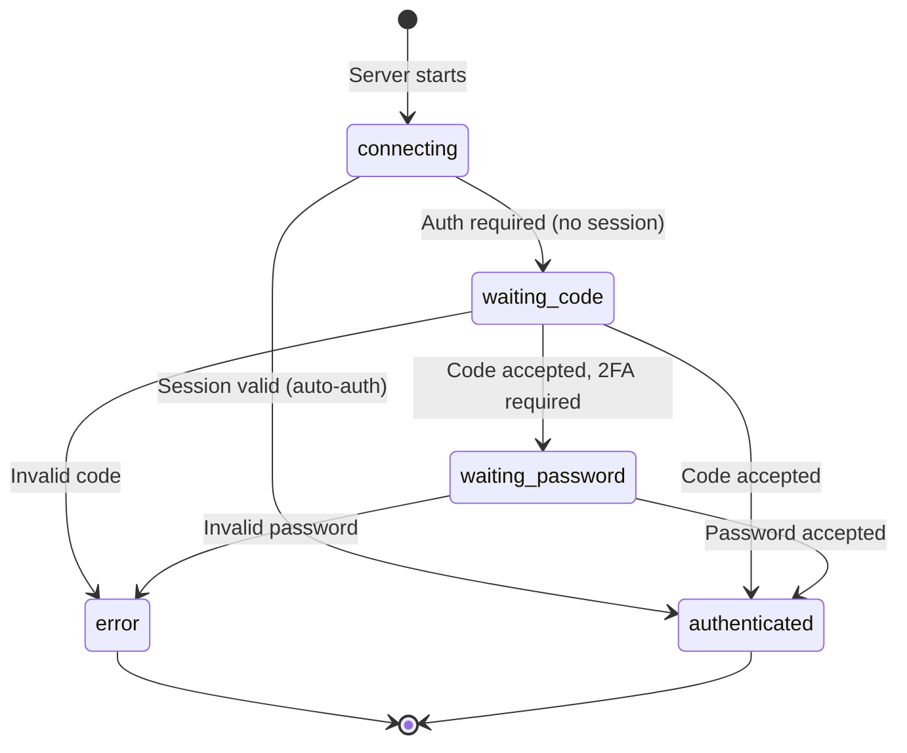

### Auth Tools

| Tool | Purpose | When to Use |
|------|---------|-------------|
| `telegram_auth_status` | Check current auth state | Anytime — to see if auth is needed |
| `telegram_auth_send_code` | Submit SMS/app verification code | When state is `waiting_code` |
| `telegram_auth_send_password` | Submit 2FA password | When state is `waiting_password` |

### Authentication Components

The `mcpAuth` struct implements Telegram's `auth.UserAuthenticator` interface using channels:

| Method | Purpose | Behavior |
|--------|---------|----------|
| `Phone()` | Provide phone number | Returns `TELEGRAM_PHONE` from env |
| `Code()` | Provide verification code | Sets state to `waiting_code`, blocks on channel |
| `Password()` | Provide 2FA password | Sets state to `waiting_password`, blocks on channel |
| `SignUp()` | Register new account | Not supported (returns error) |
| `AcceptTermsOfService()` | Accept TOS | Returns SignUpRequired error |

### Session Persistence

**Storage Location:** `~/.telegram-mcp/` (configurable via `TELEGRAM_SESSION_DIR`)

**Files:**
- `session.json` - Encrypted session data
- `peers.pebble.db` - Peer resolution cache

**Benefits:**
- No re-authentication on restart
- Faster peer resolution
- Reduced API calls

---

## Concurrency Model

### Goroutine Lifecycle

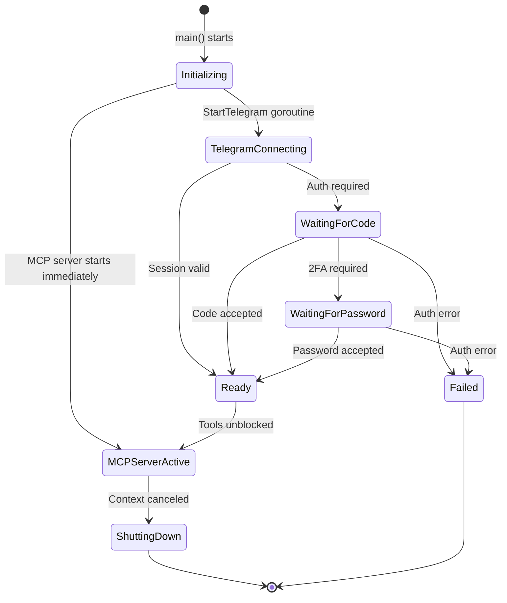

### Main Goroutine Pattern

The MCP server starts immediately without waiting for auth. Auth is handled via MCP tools.

```go
func main() {
    ctx, cancel := context.WithCancel(context.Background())
    defer cancel()

    // Background goroutine for Telegram client
    go func() {
        if err := services.StartTelegram(ctx); err != nil && !isContextCanceled(err) {
            log.Printf("Telegram client error: %v", err)
        }
    }()

    // MCP server starts immediately — no waiting for auth
    mcpServer := server.NewMCPServer(...)
    tools.RegisterAuthTools(mcpServer)    // Auth tools available right away
    tools.RegisterMessageTools(mcpServer) // These block on <-ready internally
    // ...
}
```

**Key Points:**
- **No blocking on auth:** MCP server starts immediately, auth tools available right away
- **Other tools block internally:** `API()`, `Context()`, etc. block on `<-ready` until auth completes
- **Cancellation:** Handled via `context.WithCancel()` - deferred cancel ensures cleanup
- **Error Handling:** Distinguishes between context cancellation and actual errors using `isContextCanceled()`

---

## Error Handling

### Error Categories

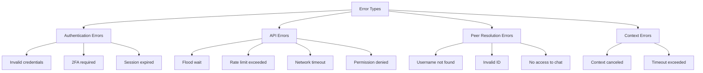

### Flood Wait Handling

The system includes automatic flood wait handling:

```go
waiter := floodwait.NewWaiter().WithCallback(func(ctx context.Context, wait floodwait.FloodWait) {
    lg.Warn("Flood wait", zap.Duration("wait", wait.Duration))
})
```

**Behavior:**
- Automatically waits when Telegram requests flood wait
- Logs wait duration for monitoring
- Resumes operation after wait period

### Rate Limiting

Built-in rate limiting prevents API abuse:

```go
ratelimit.New(rate.Every(time.Millisecond*100), 5)
```

**Configuration:** 5 requests per 100ms average

---

## Configuration

### Environment Variables

| Variable | Required | Description | Default |
|----------|----------|-------------|---------|
| `TELEGRAM_API_ID` | ✅ | Telegram API ID from my.telegram.org | - |
| `TELEGRAM_API_HASH` | ✅ | Telegram API Hash from my.telegram.org | - |
| `TELEGRAM_PHONE` | ✅ | Phone number in international format | - |
| `TELEGRAM_SESSION_DIR` | ❌ | Directory for session storage | `~/.telegram-mcp` |

### Command-Line Flags

| Flag | Description |
|------|-------------|
| `-env <path>` | Path to .env file |
| `-http_port <port>` | Enable HTTP server on port (default: stdio) |

### Example Configuration

**.env file:**
```bash
TELEGRAM_API_ID=12345
TELEGRAM_API_HASH=your_api_hash
TELEGRAM_PHONE=+1234567890
TELEGRAM_SESSION_DIR=/home/user/.telegram-mcp
```

**Running with HTTP:**
```bash
telegram-mcp -env .env -http_port 8080
```

**Running with stdio:**
```bash
telegram-mcp -env .env
```

---

## High Complexity Components

### handleListChats (Cognitive Complexity: 128)

This function has the highest cognitive complexity due to extensive type assertions and conditional formatting.

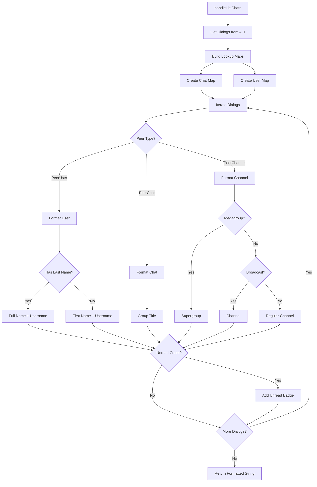

**Edge Cases:**
1. **Missing user data** - User not in map, display only ID
2. **Channel without username** - Skip @username display
3. **Mixed peer types** - Handle all three peer types in same result
4. **Unread count = 0** - Skip unread badge display

---

### handleGetChat (Cognitive Complexity: 112)

Complex type switching for different peer types and full chat retrieval.

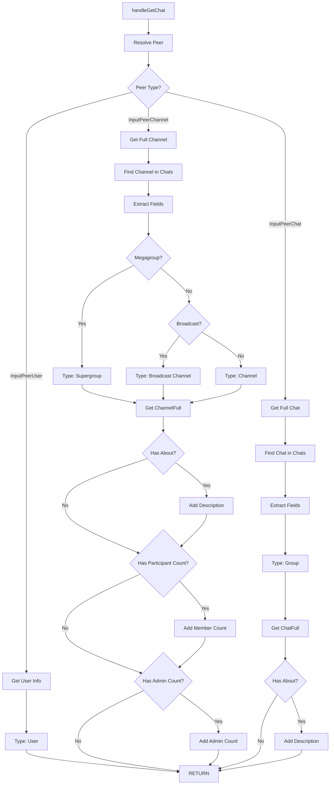

**Branching Logic:**
- **Channels:** Can be megagroups, broadcast channels, or regular channels
- **Chats:** Basic groups with participant count
- **Users:** Minimal information display
- **Full data:** Conditional display based on availability

---

### main (Cyclomatic Complexity: 12)

The entry point has multiple validation and branching paths.

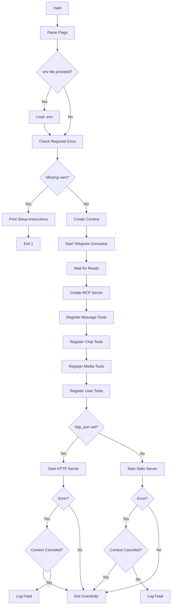

**Decision Points:**
1. Environment file loading (optional)
2. Required environment variable validation
3. HTTP vs stdio transport selection
4. Error type checking (context canceled vs actual error)

---

## Unstable Components

Components with **instability = 1.0** are highly dependent on external packages. Changes to these dependencies will have significant impact.

### External Dependencies

| Component | External Dependencies | Impact of Changes |
|-----------|----------------------|-------------------|
| **All tool handlers** | `github.com/gotd/td/tg`, `github.com/mark3labs/mcp-go` | API signature changes require handler updates |
| **handleSendMessage** | Telegram API, MCP framework | Breaking changes in message sending protocol |
| **handleDownloadMedia** | gotd downloader, file system | Changes to download API or file handling |
| **handleListChats** | Telegram dialogs API | Dialog structure changes |

### Dependency Impact Analysis

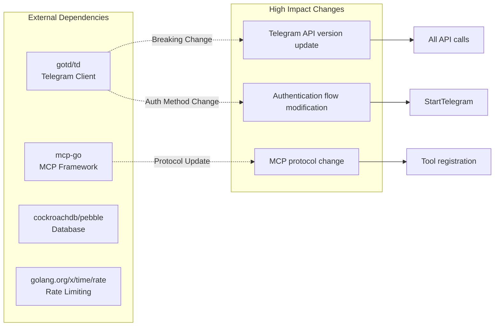

**Mitigation Strategies:**
1. **Version Pinning:** Pin external dependencies to specific versions
2. **Interface Abstraction:** Create wrapper interfaces for critical external APIs
3. **Comprehensive Testing:** Test coverage for all integration points
4. **Change Monitoring:** Monitor upstream changelogs for breaking changes

---

## Deployment

### stdio Mode (Default)

Best for local AI assistant integration:

```bash
./telegram-mcp -env .env
```

**Use Case:** Direct integration with MCP-compatible AI assistants via standard input/output.

### HTTP Mode

Best for remote access and webhooks:

```bash
./telegram-mcp -env .env -http_port 8080
```

**Endpoint:** `http://localhost:8080/mcp`

**Use Case:** 
- Remote AI assistant access
- Webhook integrations
- Load balancer setups
- Container deployments

### Docker Deployment

```dockerfile
FROM golang:1.21-alpine AS builder
WORKDIR /app
COPY . .
RUN go build -o telegram-mcp .

FROM alpine:latest
RUN apk --no-cache add ca-certificates
WORKDIR /root/
COPY --from=builder /app/telegram-mcp .
COPY .env .

EXPOSE 8080
CMD ["./telegram-mcp", "-http_port", "8080"]
```

---

## Security Considerations

### Authentication Security

- **Phone Number Required:** Prevents anonymous usage
- **2FA Support:** Supports two-factor authentication
- **Session Encryption:** Sessions stored with encryption
- **No Password Storage:** Passwords never stored, only used during auth

### API Security

- **Rate Limiting:** Prevents API abuse
- **Flood Wait Compliance:** Respects Telegram's rate limits
- **Session Isolation:** Each instance has separate session storage

### File System Security

- **Session Directory:** Uses secure permissions (0700)
- **Download Directory:** Configurable location
- **No World-Readable Files:** Sensitive data protected

---

## Performance Characteristics

### Caching Strategy

**Peer Resolution Cache:**
- **Backend:** PebbleDB (embedded key-value store)
- **Location:** `~/.telegram-mcp/peers.pebble.db`
- **Benefit:** Avoids repeated API calls for peer resolution

### Rate Limiting

- **Limit:** 5 requests per 100ms
- **Strategy:** Token bucket algorithm
- **Impact:** Prevents API abuse while maintaining responsiveness

### Concurrency

- **Goroutine Model:** Single background goroutine for Telegram client
- **Synchronization:** Channel-based ready signal
- **Context Propagation:** All operations use shared context for cancellation

---

## Troubleshooting

### Common Issues

1. **"Missing required environment variables"**
   - **Cause:** Environment variables not set
   - **Solution:** Create .env file or export variables

2. **"Failed to authenticate"**
   - **Cause:** Invalid credentials or network issues
   - **Solution:** Verify phone number format, check network

3. **"Context canceled" errors**
   - **Cause:** Client shutdown during operation
   - **Solution:** Normal during shutdown, investigate if unexpected

4. **"Flood wait" warnings**
   - **Cause:** Rate limiting by Telegram
   - **Solution:** System handles automatically, wait for completion

### Debug Logging

Enable verbose logging by modifying the zap logger configuration:

```go
lg, _ := zap.NewDevelopment()  // Instead of NewProduction()
```

---

## See Also

- **[services.md](services.md)** - Detailed services and core infrastructure documentation
- **[tools_message.md](tools_message.md)** - Detailed message tools documentation
- **[tools_chat.md](tools_chat.md)** - Detailed chat tools documentation  
- **[tools_media.md](tools_media.md)** - Detailed media tools documentation
- **[tools_user.md](tools_user.md)** - Detailed user tools documentation

---

## References

- [Telegram API Documentation](https://core.telegram.org/api)
- [gotd/td Library](https://github.com/gotd/td)
- [MCP Specification](https://modelcontextprotocol.io/)
- [mcp-go Framework](https://github.com/mark3labs/mcp-go)
