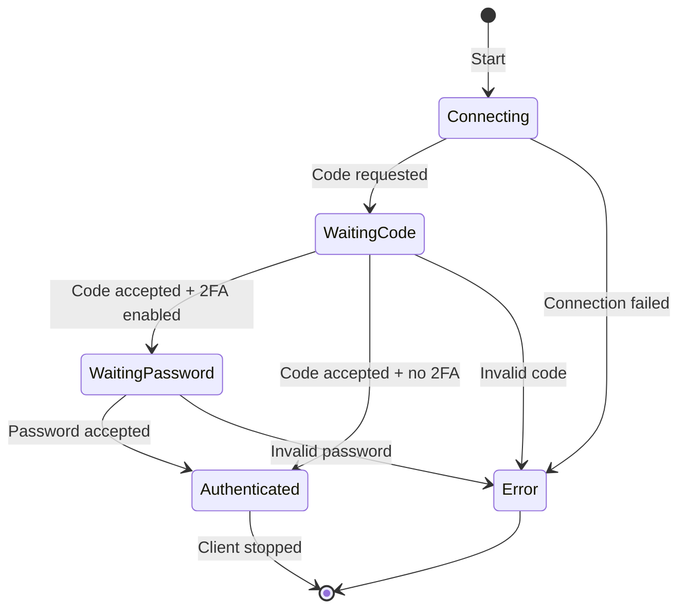
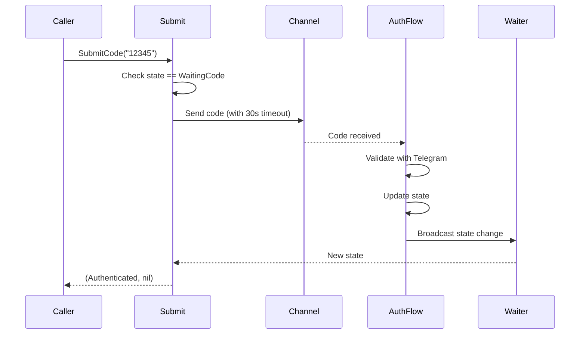
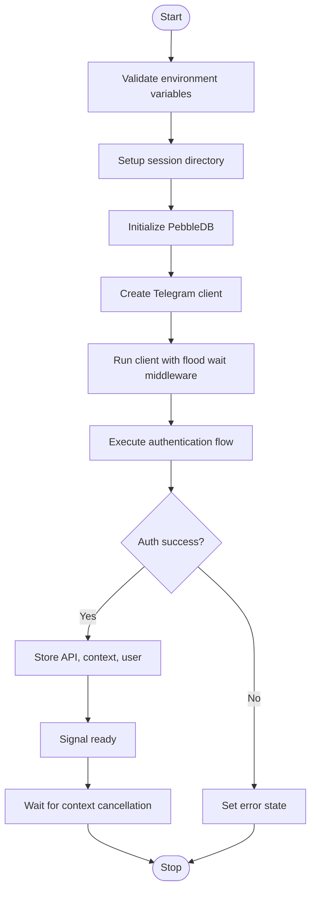
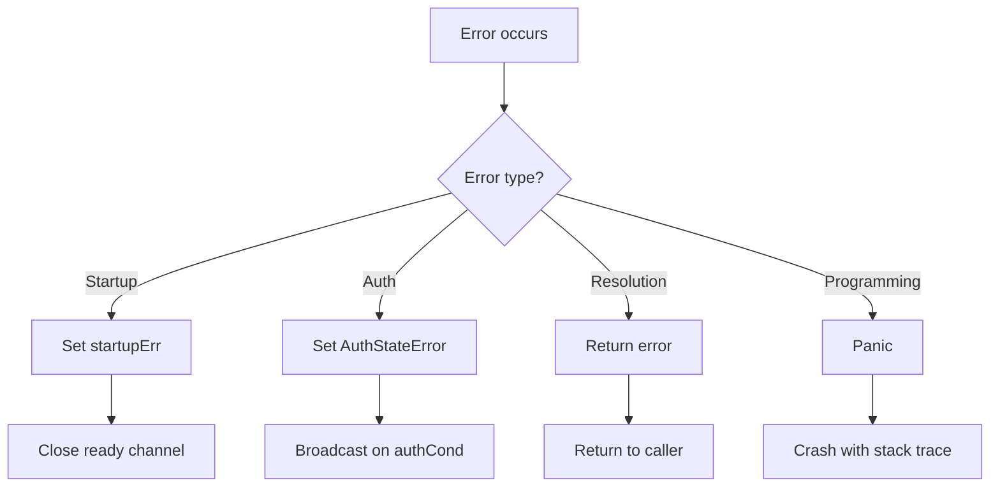

# Service Layer Documentation

## Overview

The service layer (`services/telegram.go`) is the core of the Telegram MCP server. It manages the Telegram client lifecycle, handles authentication, provides peer resolution services, and exposes the Telegram API to tool handlers.

## Architecture

```mermaid
graph TB
    subgraph "Global State"
        API[telegramAPI *tg.Client]
        CTX[telegramCtx context.Context]
        PEER_DB[peerDB *pebble.PeerStorage]
        RESOLVER[peerResolver *storage.ResolverCache]
        SELF[selfUser *tg.User]
    end

    subgraph "Synchronization"
        READY[ready chan struct{}]
        ONCE[readyOnce sync.Once]
        AUTH_MU[authMu sync.Mutex]
        AUTH_COND[authCond *sync.Cond]
    end

    subgraph "Authentication"
        AUTH_STATE[authState AuthState]
        AUTH_ERR[authErrorMsg string]
        CODE_CH[authCodeCh chan string]
        PWD_CH[authPasswordCh chan string]
    end

    subgraph "Initialization"
        INIT[init]
        START[StartTelegram]
    end

    INIT --> AUTH_COND
    START --> API
    START --> CTX
    START --> PEER_DB
    START --> RESOLVER
    START --> SELF
    START --> READY
```

## Core Components

### 1. Global State Variables

#### Telegram Client
```go
var (
    telegramAPI  *tg.Client        // Telegram API client
    telegramCtx  context.Context   // Client context
    peerDB       *pebble.PeerStorage  // Peer storage database
    peerResolver *storage.ResolverCache  // Peer resolver cache
    selfUser     *tg.User          // Current authenticated user
)
```

**Purpose**: These variables hold the core Telegram client infrastructure. They are initialized once during `StartTelegram` and accessed through accessor functions.

**Thread Safety**: Read-only after initialization. Protected by `ready` channel pattern.

#### Synchronization Primitives
```go
var (
    ready        = make(chan struct{})  // Initialization complete signal
    readyOnce    sync.Once               // Ensure single close
    startupErr   error                   // Initialization error
)
```

**Purpose**: Coordinate goroutine startup and provide safe access to client resources.

**Thread Safety**: Uses `sync.Once` to ensure `ready` is closed exactly once.

#### Authentication State
```go
var (
    authMu       sync.Mutex
    authCond     *sync.Cond
    authState    AuthState = AuthStateConnecting
    authErrorMsg string

    authCodeCh     = make(chan string)
    authPasswordCh = make(chan string)
)
```

**Purpose**: Manage authentication state machine and handle user input for codes/passwords.

**Thread Safety**: Protected by mutex + condition variable pattern.

## 2. Authentication State Machine

### State Definitions

```go
type AuthState string

const (
    AuthStateConnecting      AuthState = "connecting"
    AuthStateWaitingCode     AuthState = "waiting_code"
    AuthStateWaitingPassword AuthState = "waiting_password"
    AuthStateAuthenticated   AuthState = "authenticated"
    AuthStateError           AuthState = "error"
)
```

### State Transitions



### State Management Functions

#### `setAuthState(s AuthState, errMsg string)`

**Purpose**: Thread-safe state transition with notification.

**Implementation**:
```go
func setAuthState(s AuthState, errMsg string) {
    authMu.Lock()
    authState = s
    authErrorMsg = errMsg
    authMu.Unlock()
    authCond.Broadcast()  // Wake all waiting goroutines
}
```

**Concurrency**: Uses mutex to protect state, condition variable to notify waiters.

**Use Cases**:
- Transition from `Connecting` → `WaitingCode` when code is requested
- Transition from `WaitingCode` → `Authenticated` when code is valid
- Transition to `Error` state on authentication failure

#### `GetAuthState() AuthState`

**Purpose**: Thread-safe state read.

**Implementation**:
```go
func GetAuthState() AuthState {
    authMu.Lock()
    defer authMu.Unlock()
    return authState
}
```

**Thread Safety**: Mutex-protected read.

**Use Cases**: Check if authentication is complete before allowing operations.

#### `GetAuthError() string`

**Purpose**: Get error message when state is `AuthStateError`.

**Implementation**:
```go
func GetAuthError() string {
    authMu.Lock()
    defer authMu.Unlock()
    return authErrorMsg
}
```

**Thread Safety**: Mutex-protected read.

**Use Cases**: Diagnose authentication failures.

#### `waitAuthStateChange(from AuthState) AuthState`

**Purpose**: Block until state changes from specified state.

**Implementation**:
```go
func waitAuthStateChange(from AuthState) AuthState {
    authMu.Lock()
    defer authMu.Unlock()
    for authState == from {
        authCond.Wait()  // Release lock, wait for broadcast
    }
    return authState
}
```

**Concurrency Pattern**: Condition variable wait loop.

**Use Cases**: Wait for code/password submission to complete.

### Authentication Input Functions

#### `SubmitCode(code string) (AuthState, error)`

**Purpose**: Submit verification code during authentication flow.

**Flow**:


**Implementation**:
```go
func SubmitCode(code string) (AuthState, error) {
    current := GetAuthState()
    if current != AuthStateWaitingCode {
        return current, fmt.Errorf("not waiting for code, current state: %s", current)
    }

    select {
    case authCodeCh <- code:
        // Success - code sent to auth flow
    case <-time.After(30 * time.Second):
        return GetAuthState(), fmt.Errorf("timeout: auth flow not accepting code")
    }

    newState := waitAuthStateChange(AuthStateWaitingCode)
    if newState == AuthStateError {
        return newState, fmt.Errorf("%s", GetAuthError())
    }
    return newState, nil
}
```

**Error Conditions**:
- Not in `WaitingCode` state
- Timeout submitting code (30s)
- Invalid code from Telegram

#### `SubmitPassword(password string) (AuthState, error)`

**Purpose**: Submit 2FA password during authentication flow.

**Implementation**: Identical to `SubmitCode` but for password submission.

**Error Conditions**: Same as `SubmitCode`.

## 3. MCP Auth Flow

### `mcpAuth` Type

Implements the `auth.Flow` interface from gotd/td for MCP-driven authentication:

```go
type mcpAuth struct {
    phone string
}
```

### Interface Methods

#### `Phone(ctx context.Context) (string, error)`

**Purpose**: Provide phone number for authentication.

**Implementation**:
```go
func (a mcpAuth) Phone(_ context.Context) (string, error) {
    return a.phone, nil
}
```

**Called During**: Initial authentication flow setup.

#### `Code(ctx context.Context, _ *tg.AuthSentCode) (string, error)`

**Purpose**: Request verification code from user.

**Implementation**:
```go
func (a mcpAuth) Code(ctx context.Context, _ *tg.AuthSentCode) (string, error) {
    setAuthState(AuthStateWaitingCode, "")
    select {
    case code := <-authCodeCh:
        return code, nil
    case <-ctx.Done():
        return "", ctx.Err()
    }
}
```

**Concurrency**: Blocks on channel until code is submitted or context cancelled.

**Side Effects**: Updates auth state to `WaitingCode`.

#### `Password(ctx context.Context) (string, error)`

**Purpose**: Request 2FA password from user.

**Implementation**:
```go
func (a mcpAuth) Password(ctx context.Context) (string, error) {
    setAuthState(AuthStateWaitingPassword, "")
    select {
    case pwd := <-authPasswordCh:
        return pwd, nil
    case <-ctx.Done():
        return "", ctx.Err()
    }
}
```

**Concurrency**: Blocks on channel until password is submitted or context cancelled.

**Side Effects**: Updates auth state to `WaitingPassword`.

#### `SignUp(ctx context.Context) (auth.UserInfo, error)`

**Purpose**: Handle sign-up (not supported).

**Implementation**:
```go
func (mcpAuth) SignUp(_ context.Context) (auth.UserInfo, error) {
    return auth.UserInfo{}, fmt.Errorf("signing up not supported")
}
```

**Reason**: Only existing account authentication is supported.

#### `AcceptTermsOfService(ctx context.Context, tos tg.HelpTermsOfService) error`

**Purpose**: Handle terms of service acceptance.

**Implementation**:
```go
func (mcpAuth) AcceptTermsOfService(_ context.Context, tos tg.HelpTermsOfService) error {
    return &auth.SignUpRequired{TermsOfService: tos}
}
```

**Behavior**: Returns sign-up required error with TOS details.

## 4. Initialization

### `StartTelegram(ctx context.Context) error`

**Purpose**: Initialize and start the Telegram client.

**Flow**:


**Key Steps**:

1. **Environment Validation**:
```go
appID, err := strconv.Atoi(os.Getenv("TELEGRAM_API_ID"))
if err != nil {
    startupErr = fmt.Errorf("invalid TELEGRAM_API_ID: %w", err)
    return startupErr
}
appHash := os.Getenv("TELEGRAM_API_HASH")
phone := os.Getenv("TELEGRAM_PHONE")
```

2. **Session Directory Setup**:
```go
sessionDir := os.Getenv("TELEGRAM_SESSION_DIR")
if sessionDir == "" {
    home, err := os.UserHomeDir()
    if err != nil {
        startupErr = fmt.Errorf("cannot determine home directory: %w", err)
        return startupErr
    }
    sessionDir = filepath.Join(home, ".telegram-mcp")
}
```

3. **Database Initialization**:
```go
db, err := pebbledb.Open(filepath.Join(sessionDir, "peers.pebble.db"), &pebbledb.Options{})
if err != nil {
    return fmt.Errorf("open peer storage: %w", err)
}
defer func() { _ = db.Close() }()
peerDB = pebble.NewPeerStorage(db)
```

4. **Client Creation with Middleware**:
```go
waiter := floodwait.NewWaiter().WithCallback(func(ctx context.Context, wait floodwait.FloodWait) {
    lg.Warn("Flood wait", zap.Duration("wait", wait.Duration))
})

client := telegram.NewClient(appID, appHash, telegram.Options{
    Logger:         lg,
    SessionStorage: sessionStorage,
    Middlewares: []telegram.Middleware{
        waiter,
        ratelimit.New(rate.Every(time.Millisecond*100), 5),
    },
})
```

5. **Authentication Flow**:
```go
flow := auth.NewFlow(mcpAuth{phone: phone}, auth.SendCodeOptions{})
if err := client.Auth().IfNecessary(ctx, flow); err != nil {
    setAuthState(AuthStateError, err.Error())
    return fmt.Errorf("auth: %w", err)
}
```

6. **Post-Authentication Setup**:
```go
self, err := client.Self(ctx)
if err != nil {
    return fmt.Errorf("get self: %w", err)
}

api := client.API()
telegramAPI = api
telegramCtx = ctx
selfUser = self
rc := storage.NewResolverCache(peer.Plain(api), peerDB)
peerResolver = &rc

setAuthState(AuthStateAuthenticated, "")
readyOnce.Do(func() { close(ready) })
```

**Concurrency**: Runs in a goroutine from `main.go`. Uses defer to ensure `ready` is closed even on error.

**Error Handling**: All errors set `AuthStateError` and are stored in `startupErr`.

## 5. Accessor Functions

### `ReadyCh() <-chan struct{}`

**Purpose**: Provide channel that closes when initialization is complete.

**Implementation**:
```go
func ReadyCh() <-chan struct{} {
    return ready
}
```

**Use Cases**: Wait for client initialization before proceeding.

### `API() *tg.Client`

**Purpose**: Access Telegram API client.

**Implementation**:
```go
func API() *tg.Client {
    <-ready  // Block until ready
    if telegramAPI == nil {
        panic("Telegram client not initialized - check startup logs")
    }
    return telegramAPI
}
```

**Blocking**: Yes, waits for `ready` channel to close.

**Panic Condition**: Client is nil after ready (programming error).

**Use Cases**: All Telegram API calls from tool handlers.

### `PeerStorage() *pebble.PeerStorage`

**Purpose**: Access peer storage database.

**Implementation**:
```go
func PeerStorage() *pebble.PeerStorage {
    <-ready
    if peerDB == nil {
        panic("Telegram client not initialized - check startup logs")
    }
    return peerDB
}
```

**Blocking**: Yes.

**Use Cases**: Storing and retrieving peer information.

### `Resolver() *storage.ResolverCache`

**Purpose**: Access peer resolver cache.

**Implementation**:
```go
func Resolver() *storage.ResolverCache {
    <-ready
    if peerResolver == nil {
        panic("Telegram client not initialized - check startup logs")
    }
    return peerResolver
}
```

**Blocking**: Yes.

**Use Cases**: Resolving peer identifiers to InputPeer objects.

### `Self() *tg.User`

**Purpose**: Get current authenticated user.

**Implementation**:
```go
func Self() *tg.User {
    <-ready
    if selfUser == nil {
        panic("Telegram client not initialized - check startup logs")
    }
    return selfUser
}
```

**Blocking**: Yes.

**Use Cases**: Getting current user info, checking permissions.

### `Context() context.Context`

**Purpose**: Get Telegram client context.

**Implementation**:
```go
func Context() context.Context {
    <-ready
    if telegramCtx == nil {
        panic("Telegram client not initialized - check startup logs")
    }
    return telegramCtx
}
```

**Blocking**: Yes.

**Use Cases**: Passing context to API calls.

## 6. Peer Resolution

### `GetInputPeerByID(ctx context.Context, chatID int64) (tg.InputPeerClass, error)`

**Purpose**: Resolve peer by numeric ID from local storage.

**Implementation**:
```go
func GetInputPeerByID(ctx context.Context, chatID int64) (tg.InputPeerClass, error) {
    db := PeerStorage()
    // Try all peer kinds: User(0), Chat(1), Channel(2)
    for kind := 0; kind <= 2; kind++ {
        p, err := db.Find(ctx, storage.PeerKey{Kind: dialogs.PeerKind(kind), ID: chatID})
        if err == nil {
            return p.AsInputPeer(), nil
        }
    }
    return nil, fmt.Errorf("peer %d not found in local storage", chatID)
}
```

**Algorithm**: Iterates through all peer types (User, Chat, Channel) looking for a match.

**Error Conditions**: Peer not found in any kind.

**Use Cases**: Converting numeric chat IDs from previous API calls.

### `ResolveUsername(ctx context.Context, username string) (tg.InputPeerClass, error)`

**Purpose**: Resolve @username via Telegram API.

**Implementation**:
```go
func ResolveUsername(ctx context.Context, username string) (tg.InputPeerClass, error) {
    username = strings.TrimPrefix(username, "@")
    p, err := Resolver().ResolveDomain(ctx, username)
    if err != nil {
        return nil, fmt.Errorf("resolve @%s: %w", username, err)
    }
    return p, nil
}
```

**Side Effects**: Strips @ prefix if present.

**Error Conditions**: Username doesn't exist or API error.

**Use Cases**: First-time resolution of public usernames.

### `ResolvePeer(ctx context.Context, identifier string) (tg.InputPeerClass, error)`

**Purpose**: Generic peer resolution with auto-detection.

**Implementation**:
```go
func ResolvePeer(ctx context.Context, identifier string) (tg.InputPeerClass, error) {
    if strings.HasPrefix(identifier, "@") {
        return ResolveUsername(ctx, identifier)
    }
    id, err := strconv.ParseInt(identifier, 10, 64)
    if err != nil {
        return ResolveUsername(ctx, identifier)
    }
    return GetInputPeerByID(ctx, id)
}
```

**Detection Logic**:
1. If starts with @ → Username resolution
2. If parses as int64 → ID resolution
3. Otherwise → Username resolution (bare username without @)

**Use Cases**: Universal peer resolution in tool handlers.

### `StorePeers(ctx context.Context, chats []tg.ChatClass, users []tg.UserClass)`

**Purpose**: Persist peer information to local storage.

**Implementation**:
```go
func StorePeers(ctx context.Context, chats []tg.ChatClass, users []tg.UserClass) {
    db := PeerStorage()
    for _, chat := range chats {
        var p storage.Peer
        if p.FromChat(chat) {
            _ = db.Add(ctx, p)
        }
    }
    for _, user := range users {
        var p storage.Peer
        if p.FromUser(user) {
            _ = db.Add(ctx, p)
        }
    }
}
```

**Side Effects**: Adds peers to PebbleDB for future resolution.

**Error Handling**: Silently ignores errors (non-critical operation).

**Use Cases**: Caching peers from API responses for future ID-based lookups.

## Concurrency Analysis

### Thread Safety Guarantees

| Variable | Protection | Access Pattern |
|----------|------------|----------------|
| `telegramAPI` | Write-once, then read-only | Safe after ready |
| `telegramCtx` | Write-once, then read-only | Safe after ready |
| `peerDB` | Write-once, then read-only | Safe after ready |
| `peerResolver` | Write-once, then read-only | Safe after ready |
| `selfUser` | Write-once, then read-only | Safe after ready |
| `authState` | Mutex + condition variable | Thread-safe |
| `authErrorMsg` | Mutex + condition variable | Thread-safe |
| `authCodeCh` | Channel send/receive | Thread-safe |
| `authPasswordCh` | Channel send/receive | Thread-safe |

### Synchronization Patterns

#### Ready Pattern
```go
// Producer
readyOnce.Do(func() { close(ready) })

// Consumer
<-ready  // Block until ready
```

**Purpose**: Ensure resources are initialized before access.

#### Condition Variable Pattern
```go
// Producer
authMu.Lock()
authState = newState
authMu.Unlock()
authCond.Broadcast()

// Consumer
authMu.Lock()
for authState == oldState {
    authCond.Wait()
}
authMu.Unlock()
```

**Purpose**: Efficient waiting for state changes without busy-looping.

#### Channel Pattern
```go
// Producer
select {
case authCodeCh <- code:
    // Success
case <-time.After(30 * time.Second):
    // Timeout
}

// Consumer
select {
case code := <-authCodeCh:
    // Process code
case <-ctx.Done():
    // Context cancelled
}
```

**Purpose**: Thread-safe message passing with timeout and cancellation support.

## Error Handling

### Error Categories

1. **Startup Errors**: Stored in `startupErr`, fatal to initialization
2. **Auth Errors**: Transition to `AuthStateError`, retrievable via `GetAuthError()`
3. **Resolution Errors**: Returned as error from resolution functions
4. **Panic Errors**: Programming errors (nil client after ready)

### Error Propagation



## Performance Considerations

### Database Operations

- **PebbleDB**: Embedded key-value store with excellent read performance
- **Batch writes**: Not currently used, but could be added for bulk peer storage
- **Read path**: O(log n) lookup time

### Memory Usage

- **Peer cache**: Grows with number of unique peers encountered
- **Session data**: Typically < 1MB
- **No explicit limits**: Consider adding for long-running processes

### Network Operations

- **Flood wait handling**: Automatic with exponential backoff
- **Rate limiting**: 100ms interval, burst of 5 requests
- **Connection pooling**: Handled by gotd/td

## Best Practices

### For Tool Handlers

1. **Always use accessor functions**: Never access global variables directly
2. **Check authentication**: Use `GetAuthState()` before operations
3. **Handle resolution errors**: Peers may not be in local storage
4. **Store peers after API calls**: Call `StorePeers()` to cache for future use

### For Extension

1. **Add new state**: Update `AuthState` type and state machine
2. **Add new channel**: Follow same pattern as `authCodeCh`
3. **Add new accessor**: Follow blocking pattern with ready check

## Testing Considerations

### Unit Tests

- Mock `tg.Client` interface
- Test state transitions in isolation
- Verify channel behavior with timeouts

### Integration Tests

- Use test Telegram API credentials
- Test full authentication flow
- Verify peer resolution end-to-end

### Edge Cases

- Context cancellation during auth
- Network failures
- Invalid credentials
- Peer not found
- Concurrent access
