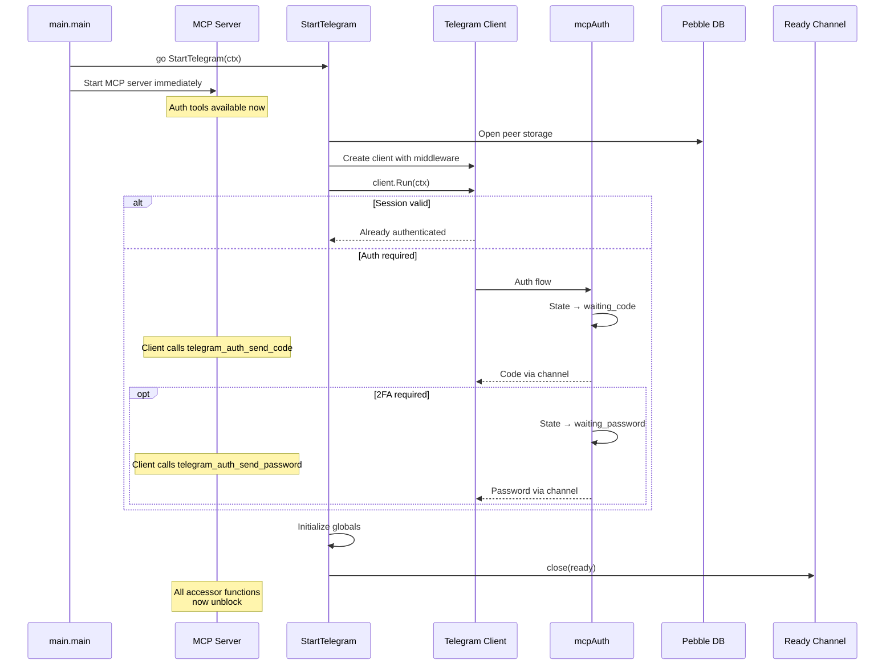
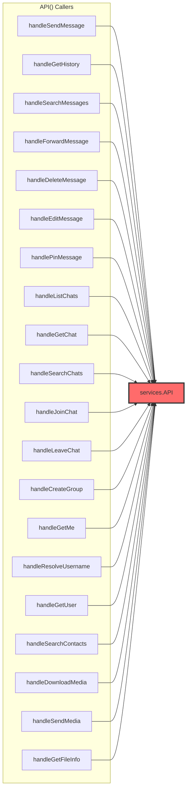
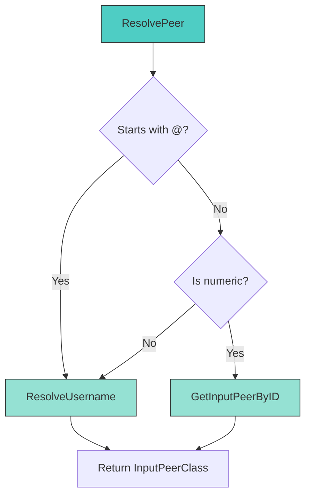
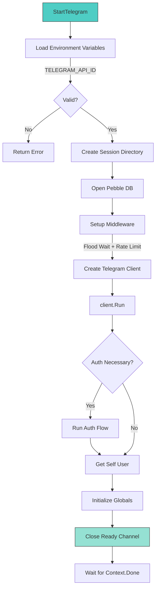
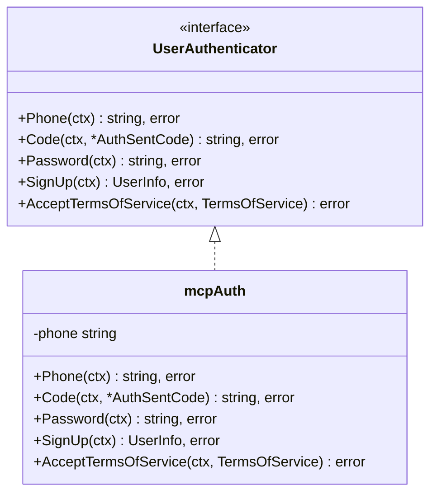
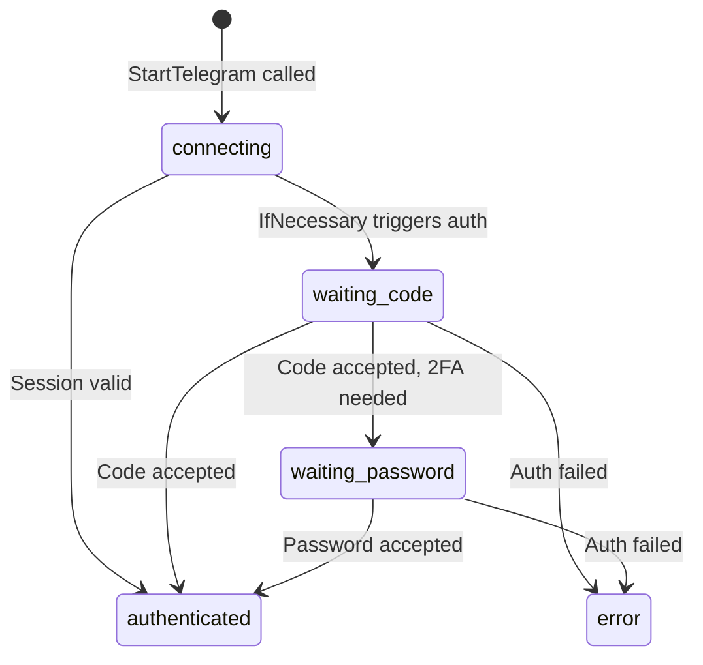
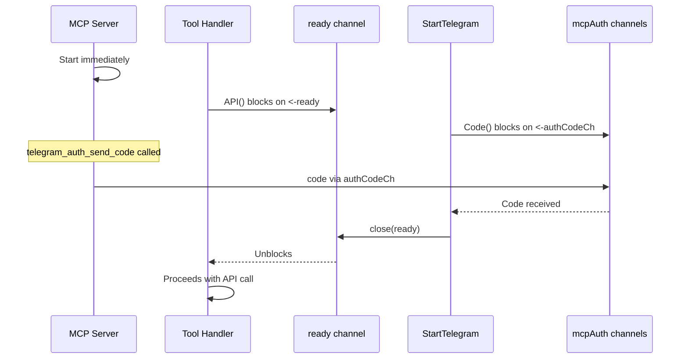

# Services Module - Telegram Client Core

## Overview

The **services** module is the foundational layer of the Telegram CLI application, providing Telegram client initialization, authentication, and API access. It acts as the central hub that all tool modules ([tools_chat](tools_chat.md), [tools_message](tools_message.md), [tools_media](tools_media.md), [tools_user](tools_user.md)) depend on for Telegram API operations.

### Module Purpose

- **Client Lifecycle Management**: Initialize and manage the Telegram client connection
- **Authentication**: Handle MCP-driven authentication flow (phone from env, code and 2FA via MCP tools)
- **API Access**: Provide thread-safe access to the Telegram API client
- **Peer Resolution**: Resolve usernames and IDs to Telegram peer objects with caching
- **State Management**: Maintain global state for the authenticated user and context

---

## Architecture

```mermaid
graph TB
    subgraph "Main Application"
        MAIN[main.main]
    end
    
    subgraph "Services Module"
        direction TB
        ST[StartTelegram]
        RC[ReadyCh]
        
        subgraph "Accessors (Block until Ready)"
            API[API]
            CTX[Context]
            SELF[Self]
            PS[PeerStorage]
            RES[Resolver]
        end
        
        subgraph "Peer Resolution"
            RP[ResolvePeer]
            RU[ResolveUsername]
            GIP[GetInputPeerByID]
        end
        
        subgraph "Auth State"
            AS[AuthState]
            SC[SubmitCode]
            SP[SubmitPassword]
            GAS[GetAuthState]
        end

        subgraph "Authentication"
            MA[mcpAuth]
            PHONE[Phone]
            CODE[Code]
            PWD[Password]
            SIGN[SignUp]
            TOS[AcceptTermsOfService]
        end
    end
    
    subgraph "External Dependencies"
        GOTD[gotd/td<br/>Telegram Library]
        PEBBLE[Pebble DB<br/>Peer Cache]
        FLOOD[Flood Wait<br/>Middleware]
        RATE[Rate Limiter]
    end
    
    subgraph "Tool Modules"
        TM[tools_message]
        TC[tools_chat]
        TME[tools_media]
        TU[tools_user]
    end
    
    MAIN --> ST
    MAIN --> RC
    ST --> GOTD
    ST --> PEBBLE
    ST --> FLOOD
    ST --> RATE
    ST --> MA
    ST --> AS

    MA --> PHONE
    MA --> CODE
    MA --> PWD
    MA --> SIGN
    MA --> TOS

    SC --> CODE
    SP --> PWD
    
    RP --> RU
    RP --> GIP
    
    TM --> API
    TM --> CTX
    TM --> RP
    TC --> API
    TC --> CTX
    TC --> RP
    TME --> API
    TME --> CTX
    TME --> RP
    TU --> API
    TU --> CTX
    TU --> SELF
    
    style API fill:#ff6b6b,stroke:#333,stroke-width:3px
    style CTX fill:#ff6b6b,stroke:#333,stroke-width:3px
    style RP fill:#ff6b6b,stroke:#333,stroke-width:3px
    style ST fill:#4ecdc4,stroke:#333,stroke-width:2px
```



---

## Initialization Flow



---

## Hub Components

### API() - Primary API Accessor

**PageRank**: 0.0608 | **Fan-in**: 21 callers | **Fan-out**: 0

The `API()` function is the most critical hub component, providing access to the Telegram API client (`*tg.Client`). It is called by virtually every tool handler across all tool modules.

#### Callers
- **[tools_message](tools_message.md)**: `handleSendMessage`, `handleGetHistory`, `handleSearchMessages`, `handleForwardMessage`, `handleDeleteMessage`, `handleEditMessage`, `handlePinMessage`
- **[tools_chat](tools_chat.md)**: `handleListChats`, `handleGetChat`, `handleSearchChats`, `handleJoinChat`, `handleLeaveChat`, `handleCreateGroup`
- **[tools_user](tools_user.md)**: `handleGetMe`, `handleResolveUsername`, `handleGetUser`, `handleSearchContacts`
- **[tools_media](tools_media.md)**: `handleDownloadMedia`, `handleSendMedia`, `handleGetFileInfo`

#### Dependency Diagram



#### What Breaks if This Changes
- **All tool functionality** would cease to work
- Any change to return type or blocking behavior requires updating 21+ call sites
- Thread-safety changes could introduce race conditions across all modules

---

### Context() - Telegram Context Accessor

**PageRank**: 0.0400 | **Fan-in**: 16 callers | **Fan-out**: 0

Provides the context associated with the Telegram client lifecycle. This context is canceled when the Telegram client shuts down.

#### Callers
- **[tools_message](tools_message.md)**: All message handlers
- **[tools_chat](tools_chat.md)**: All chat handlers  
- **[tools_media](tools_media.md)**: All media handlers

#### Usage Pattern
```go
tgCtx := services.Context()
// Use tgCtx for all Telegram API calls
result, err := services.API().SomeMethod(tgCtx, request)
```

#### What Breaks if This Changes
- All API calls require a valid context for cancellation propagation
- Context cancellation enables graceful shutdown across all tool modules

---

### ResolvePeer() - Peer Resolution Hub

**PageRank**: 0.0449 | **Betweenness**: 0.0046 | **Fan-in**: 15 callers | **Fan-out**: 2 callees

The central peer resolution function that intelligently routes to either username resolution or ID-based lookup. Acts as a bridge between callers and the two specialized resolvers.

#### Callers
- **[tools_message](tools_message.md)**: All message handlers requiring peer identification
- **[tools_chat](tools_chat.md)**: `handleJoinChat`, `handleGetChat`, `handleLeaveChat`
- **[tools_media](tools_media.md)**: `handleDownloadMedia`, `handleSendMedia`, `handleGetFileInfo`

#### Callees
- `ResolveUsername()` - When identifier starts with `@` or is not numeric
- `GetInputPeerByID()` - When identifier is a numeric ID

#### Decision Logic



#### What Breaks if This Changes
- 15 handlers across 3 modules would fail to resolve peers
- Message sending, chat operations, and media handling would all be affected

---

## Core Components

### StartTelegram - Initialization Function

**Purpose**: Initialize and run the Telegram client with all necessary middleware and storage.

**Parameters**:
- `ctx context.Context` - Application context for cancellation

**Returns**:
- `error` - Initialization or runtime errors

#### Error Conditions

| Error | Condition |
|-------|-----------|
| `invalid TELEGRAM_API_ID` | API ID environment variable is not a valid integer |
| `create session dir` | Failed to create session directory |
| `open peer storage` | Failed to open Pebble database |
| `auth` | Authentication failed (invalid credentials, network issues) |
| `get self` | Failed to retrieve authenticated user info |

#### Initialization Steps



#### Middleware Stack

1. **Flood Wait Middleware**: Automatically handles Telegram's flood wait errors by pausing execution
2. **Rate Limiter**: 5 requests per 500ms to prevent API throttling

---

### ReadyCh - Readiness Signal

**Purpose**: Provides a channel that closes when the Telegram client is fully initialized and ready.

**Returns**: `<-chan struct{}` - Receive-only channel that closes on ready

**Usage**:
```go
go services.StartTelegram(ctx)
<-services.ReadyCh()  // Block until ready
// Now safe to use API(), Context(), etc.
```

---

### Peer Resolution Functions

#### ResolveUsername(ctx, username) 

**Purpose**: Resolve a Telegram username to an InputPeerClass.

**Parameters**:
- `ctx context.Context` - Request context
- `username string` - Username (with or without @ prefix)

**Returns**:
- `tg.InputPeerClass` - Resolved peer object
- `error` - Resolution failure

**Behavior**: 
- Strips `@` prefix if present
- Uses cached resolver with Pebble storage
- Caches results for future lookups

#### GetInputPeerByID(ctx, chatID)

**Purpose**: Get an InputPeer by numeric ID from cache.

**Parameters**:
- `ctx context.Context` - Request context
- `chatID int64` - Numeric peer identifier

**Returns**:
- `tg.InputPeerClass` - Peer object (defaults to InputPeerUser if not cached)
- `error` - Cache lookup error

---

### Accessor Functions

All accessor functions block until the client is ready (using the `ready` channel):

| Function | Return Type | Purpose |
|----------|-------------|---------|
| `API()` | `*tg.Client` | Telegram API client for making API calls |
| `Context()` | `context.Context` | Context tied to Telegram client lifecycle |
| `Self()` | `*tg.User` | Authenticated user information |
| `PeerStorage()` | `*pebble.PeerStorage` | Direct access to peer cache storage |
| `Resolver()` | `*storage.ResolverCache` | Cached peer resolver |

#### Blocking Behavior Pattern

```go
func API() *tg.Client {
    <-ready  // Block until StartTelegram completes
    return telegramAPI
}
```

---

## Authentication - mcpAuth

### Interface Implementation

`mcpAuth` implements the `auth.UserAuthenticator` interface from gotd/td/telegram/auth, providing channel-based authentication driven by MCP tools (no terminal interaction needed).



### Auth State Machine

The auth flow is driven by a state machine with `sync.Cond` for synchronization:



**Exported functions for MCP tools:**

| Function | Purpose |
|----------|---------|
| `GetAuthState()` | Returns current auth state |
| `GetAuthError()` | Returns error message if state is `error` |
| `SubmitCode(code)` | Sends code via channel, waits for state change |
| `SubmitPassword(pwd)` | Sends password via channel, waits for state change |

### Authentication Methods

#### Phone(ctx) - Phone Number Input

**Purpose**: Provide phone number for authentication.

**Behavior**:
- Returns `TELEGRAM_PHONE` from environment
- Phone is always set (validated in `main.go` on startup)

#### Code(ctx, sentCode) - Verification Code

**Purpose**: Provide verification code sent by Telegram.

**Behavior**:
- Sets auth state to `waiting_code`
- Blocks on `authCodeCh` channel until MCP tool submits a code
- Context-aware: unblocks on context cancellation

#### Password(ctx) - 2FA Password

**Purpose**: Provide two-factor authentication password.

**Behavior**:
- Sets auth state to `waiting_password`
- Blocks on `authPasswordCh` channel until MCP tool submits a password
- Context-aware: unblocks on context cancellation

#### SignUp(ctx) - New Account Signup

**Purpose**: Handle new account registration.

**Returns**: Always returns error - signup not supported in this implementation.

#### AcceptTermsOfService(ctx, tos) - TOS Acceptance

**Purpose**: Handle Telegram terms of service acceptance.

**Returns**: `auth.SignUpRequired` error with TOS details - requires explicit user acceptance.

---

## Configuration

### Environment Variables

| Variable | Required | Description |
|----------|----------|-------------|
| `TELEGRAM_API_ID` | Yes | Telegram API ID from [my.telegram.org](https://my.telegram.org/apps) |
| `TELEGRAM_API_HASH` | Yes | Telegram API Hash from [my.telegram.org](https://my.telegram.org/apps) |
| `TELEGRAM_PHONE` | Yes | Phone number in international format (e.g., `+1234567890`) |
| `TELEGRAM_SESSION_DIR` | No | Directory for session and cache storage. Default: `~/.telegram-mcp` |

### File Storage

```
~/.telegram-mcp/
├── session.json        # Telegram session state
└── peers.pebble.db/    # Peer cache database
```

---

## Concurrency Patterns

### Ready Channel Synchronization



The concurrency model uses two synchronization mechanisms:
1. **Ready channel** — ensures tool handlers block until auth completes
2. **Auth channels + sync.Cond** — bridges MCP tool calls to the gotd auth flow, with state change notifications

---

## Integration with Tool Modules

The services module is the foundation that enables all tool functionality:

| Tool Module | Primary Services Used | Typical Usage Pattern |
|-------------|----------------------|----------------------|
| [tools_message](tools_message.md) | `API()`, `Context()`, `ResolvePeer()` | Send, edit, delete, search messages |
| [tools_chat](tools_chat.md) | `API()`, `Context()`, `ResolvePeer()` | List, join, leave, create chats |
| [tools_media](tools_media.md) | `API()`, `Context()`, `ResolvePeer()` | Download and send media files |
| [tools_user](tools_user.md) | `API()`, `Context()`, `Self()` | Get user info, resolve usernames |

---

## Error Handling Summary

| Component | Error Returns | Common Error Conditions |
|-----------|--------------|------------------------|
| `StartTelegram` | Yes | Invalid config, auth failure, storage errors |
| `ResolveUsername` | Yes | Invalid username, network error, user not found |
| `GetInputPeerByID` | Yes | Cache miss (returns fallback) |
| `AcceptTermsOfService` | Yes | TOS requires acceptance |
| `SignUp` | Yes | Signup not supported |

---

## Best Practices

1. **Always wait for ready**: Use `<-services.ReadyCh()` before accessing any service
2. **Use ResolvePeer for user input**: It handles both usernames and IDs intelligently
3. **Pass Context() to API calls**: Ensures proper cancellation propagation
4. **Handle authentication errors gracefully**: Terminal auth may require multiple retries
5. **Monitor flood waits**: The middleware logs warnings for flood wait events
