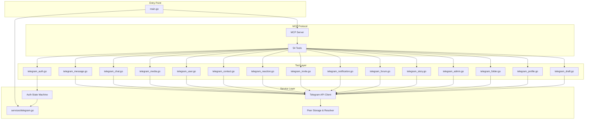
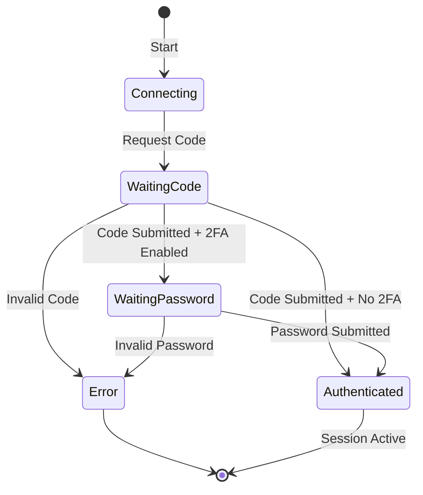
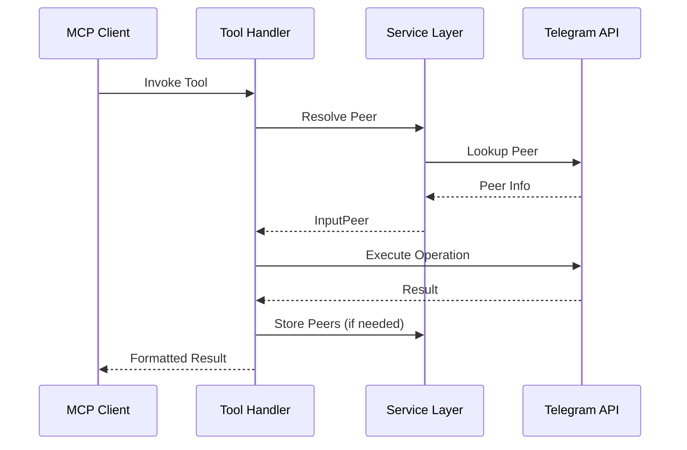

# Telegram MCP Server

## Overview

The **Telegram MCP Server** is a Model Context Protocol (MCP) server that provides AI assistants with comprehensive access to Telegram as a user account (not a bot). Built on the [gotd/td](https://github.com/gotd/td) library—a pure Go implementation of MTProto 2.0—it enables full user-account functionality through 54 tools across 12 functional categories.

### Key Features

- **Full User Account Access**: Interact with Telegram as a real user, not a bot
- **MCP-Driven Authentication**: Complete authentication flow through AI client interfaces
- **Session Persistence**: Automatic reconnection with saved sessions
- **Dual Transport**: Stdio for local MCP clients, HTTP for remote deployments
- **Comprehensive Tool Coverage**: Messages, chats, media, contacts, admin functions, and more

### Architecture Overview



## Module Structure

### Core Components

#### [main.go](#main-entry-point)
- Entry point and initialization
- Environment validation
- MCP server setup
- Tool registration
- Transport configuration (stdio/HTTP)

#### [services/telegram.go](#service-layer)
- Telegram client lifecycle management
- Authentication state machine
- Peer resolution and storage
- API client exposure

#### [tools/](#tool-layer)
Each file implements a category of MCP tools:

- **[telegram_auth.go](#authentication-tools)** (3 tools) - Authentication flow management
- **[telegram_message.go](#message-tools)** (14 tools) - Message operations
- **[telegram_chat.go](#chat-tools)** (8 tools) - Chat and dialog management
- **[telegram_media.go](#media-tools)** (4 tools) - Media upload/download
- **[telegram_user.go](#user-tools)** (4 tools) - User information and resolution
- **[telegram_contact.go](#contact-tools)** (3 tools) - Contact management
- **[telegram_reaction.go](#reaction-tools)** (2 tools) - Message reactions
- **[telegram_invite.go](#invite-tools)** (3 tools) - Invite link management
- **[telegram_notification.go](#notification-tools)** (2 tools) - Notification settings
- **[telegram_forum.go](#forum-tools)** (3 tools) - Forum topic management
- **[telegram_story.go](#story-tools)** (4 tools) - Story operations
- **[telegram_admin.go](#admin-tools)** (4 tools) - Admin and moderation
- **[telegram_folder.go](#folder-tools)** (2 tools) - Chat folder management
- **[telegram_profile.go](#profile-tools)** (1 tool) - Profile updates
- **[telegram_draft.go](#draft-tools)** (3 tools) - Draft message management

## Data Flow

### Authentication Flow



### Tool Execution Flow



## Authentication State Machine

The service layer implements a sophisticated authentication state machine with the following states:

| State | Description |
|-------|-------------|
| `AuthStateConnecting` | Initial connection to Telegram servers |
| `AuthStateWaitingCode` | Awaiting verification code from SMS/app |
| `AuthStateWaitingPassword` | Awaiting 2FA password |
| `AuthStateAuthenticated` | Fully authenticated and ready |
| `AuthStateError` | Authentication failed with error |

### Concurrency Model

The authentication system uses:

- **Mutex (`authMu`)**: Protects state transitions
- **Condition Variable (`authCond`)**: Broadcasts state changes to waiting goroutines
- **Channels (`authCodeCh`, `authPasswordCh`)**: Thread-safe code/password submission
- **Ready Channel (`ready`)**: Signals when the Telegram client is fully initialized

```go
// Thread-safe state transition
func setAuthState(s AuthState, errMsg string) {
    authMu.Lock()
    authState = s
    authErrorMsg = errMsg
    authMu.Unlock()
    authCond.Broadcast()  // Notify all waiters
}

// Wait for state change
func waitAuthStateChange(from AuthState) AuthState {
    authMu.Lock()
    defer authMu.Unlock()
    for authState == from {
        authCond.Wait()
    }
    return authState
}
```

## Peer Resolution System

The peer resolution system is a critical component that abstracts Telegram's complex peer identification:

### Peer Types

- **User**: Individual user accounts
- **Chat**: Legacy group chats
- **Channel**: Modern channels and supergroups

### Resolution Methods

1. **By ID (`GetInputPeerByID`)**: Look up peer from local storage using numeric ID
2. **By Username (`ResolveUsername`)**: Resolve `@username` to peer via Telegram API
3. **Generic (`ResolvePeer`)**: Auto-detect input type and route appropriately

### Storage Layer

Uses [PebbleDB](https://github.com/cockroachdb/pebble) for persistent peer storage:

```go
func StorePeers(ctx context.Context, chats []tg.ChatClass, users []tg.UserClass) {
    db := PeerStorage()
    for _, chat := range chats {
        var p storage.Peer
        if p.FromChat(chat) {
            _ = db.Add(ctx, p)
        }
    }
    // Similar for users...
}
```

This ensures that once a peer is resolved, it can be referenced by ID in future calls without network requests.

## Tool Pattern

All tools follow a consistent pattern:

### Input Structure
```go
type sendMessageInput struct {
    Peer         string `json:"peer" jsonschema:"required"`
    Message      string `json:"message" jsonschema:"required"`
    ReplyToMsgID int    `json:"reply_to_msg_id"`
}
```

### Registration
```go
func RegisterMessageTools(s *server.MCPServer) {
    s.AddTool(
        mcp.NewTool("telegram_send_message",
            mcp.WithDescription("Send a message to a chat"),
            mcp.WithString("peer", mcp.Required(), mcp.Description("Chat ID or @username")),
            mcp.WithString("message", mcp.Required(), mcp.Description("Message text")),
        ),
        mcp.NewTypedToolHandler(handleSendMessage),
    )
}
```

### Handler Function
```go
func handleSendMessage(ctx context.Context, _ mcp.CallToolRequest, input sendMessageInput) (*mcp.CallToolResult, error) {
    peer, err := services.ResolvePeer(ctx, input.Peer)
    if err != nil {
        return mcp.NewToolResultError(err.Error()), nil
    }

    // ... implementation ...

    return mcp.NewToolResultText(result), nil
}
```

## Service Layer API

### Accessor Functions

These functions provide access to the Telegram client and related resources:

| Function | Purpose | Blocking |
|----------|---------|----------|
| `API()` | Get Telegram API client | Yes (waits for ready) |
| `PeerStorage()` | Get peer storage database | Yes |
| `Resolver()` | Get peer resolver cache | Yes |
| `Self()` | Get current user info | Yes |
| `Context()` | Get Telegram client context | Yes |
| `ReadyCh()` | Get ready notification channel | No |

### Authentication Functions

| Function | Purpose |
|----------|---------|
| `GetAuthState()` | Get current authentication state |
| `GetAuthError()` | Get error message if state is `AuthStateError` |
| `SubmitCode(code)` | Submit verification code during auth |
| `SubmitPassword(password)` | Submit 2FA password during auth |

### Peer Functions

| Function | Purpose |
|----------|---------|
| `GetInputPeerByID(ctx, chatID)` | Resolve peer by numeric ID from storage |
| `ResolveUsername(ctx, username)` | Resolve `@username` via Telegram API |
| `ResolvePeer(ctx, identifier)` | Generic peer resolution (auto-detects type) |
| `StorePeers(ctx, chats, users)` | Persist peer information to local storage |

## Error Handling

The service layer uses a multi-layered error handling approach:

1. **Validation Errors**: Invalid input parameters (returned immediately)
2. **Resolution Errors**: Peer not found or unresolvable
3. **API Errors**: Telegram API errors (flood wait, permission denied, etc.)
4. **Context Errors**: Cancellation and timeout handling

### Panic Recovery

The accessor functions use panic-on-nil pattern for programming errors:

```go
func API() *tg.Client {
    <-ready  // Wait for initialization
    if telegramAPI == nil {
        panic("Telegram client not initialized - check startup logs")
    }
    return telegramAPI
}
```

This ensures that bugs are caught early while providing clear error messages.

## Rate Limiting

The client implements comprehensive rate limiting:

1. **Flood Wait Middleware**: Automatically handles Telegram's flood wait responses
2. **Rate Limiter**: 100ms interval with burst of 5 requests
3. **Backoff Strategy**: Exponential backoff for transient errors

```go
waiter := floodwait.NewWaiter().WithCallback(func(ctx context.Context, wait floodwait.FloodWait) {
    lg.Warn("Flood wait", zap.Duration("wait", wait.Duration))
})

client := telegram.NewClient(appID, appHash, telegram.Options{
    Middlewares: []telegram.Middleware{
        waiter,
        ratelimit.New(rate.Every(time.Millisecond*100), 5),
    },
})
```

## Configuration

### Environment Variables

| Variable | Required | Default | Description |
|----------|----------|---------|-------------|
| `TELEGRAM_API_ID` | Yes | - | API ID from my.telegram.org |
| `TELEGRAM_API_HASH` | Yes | - | API hash from my.telegram.org |
| `TELEGRAM_PHONE` | Yes | - | Phone number for authentication |
| `TELEGRAM_SESSION_DIR` | No | `~/.telegram-mcp` | Directory for session storage |

### Session Storage

Sessions are persisted to disk in the configured session directory:

- **session.json**: Session authentication data
- **peers.pebble.db**: Peer storage database

This allows the client to auto-reconnect on restart without requiring re-authentication.

## Dependencies

### Core Dependencies

- **[gotd/td](https://github.com/gotd/td)**: Pure Go MTProto 2.0 implementation
- **[mark3labs/mcp-go](https://github.com/mark3labs/mcp-go)**: MCP server framework for Go
- **[cockroachdb/pebble](https://github.com/cockroachdb/pebble)**: Embedded key-value storage
- **[uber-go/zap](https://github.com/uber-go/zap)**: Structured logging

### Contrib Libraries

- **gotd/contrib/pebble**: Peer storage integration
- **gotd/contrib/middleware/floodwait**: Flood wait handling
- **gotd/contrib/middleware/ratelimit**: Rate limiting

## Concurrency Patterns

### Ready Pattern

The service layer uses a "ready" channel pattern to ensure safe access:

```go
ready = make(chan struct{})
readyOnce = sync.Once{}

// Initialization complete
readyOnce.Do(func() { close(ready) })

// Accessor functions wait for ready
func API() *tg.Client {
    <-ready  // Blocks until initialization completes
    return telegramAPI
}
```

### State synchronization

Authentication state uses a mutex + condition variable pattern:

```go
authMu = sync.Mutex()
authCond = sync.NewCond(&authMu)

// State changes
func setAuthState(s AuthState, errMsg string) {
    authMu.Lock()
    authState = s
    authErrorMsg = errMsg
    authMu.Unlock()
    authCond.Broadcast()  // Wake all waiters
}

// Wait for state change
func waitAuthStateChange(from AuthState) AuthState {
    authMu.Lock()
    defer authMu.Unlock()
    for authState == from {
        authCond.Wait()  // Release lock, wait for broadcast
    }
    return authState
}
```

### Channel-based communication

Code and password submission use buffered channels:

```go
authCodeCh = make(chan string)  // Unbuffered
authPasswordCh = make(chan string)  // Unbuffered

// Thread-safe submission with timeout
select {
case authCodeCh <- code:
    // Success
case <-time.After(30 * time.Second):
    // Timeout
}
```

## Tool Reference

For detailed documentation of each tool category, see:

- [Authentication Tools](tools/telegram_auth.md)
- [Message Tools](tools/telegram_message.md)
- [Chat Tools](tools/telegram_chat.md)
- [Media Tools](tools/telegram_media.md)
- [User Tools](tools/telegram_user.md)
- [Contact Tools](tools/telegram_contact.md)
- [Reaction Tools](tools/telegram_reaction.md)
- [Invite Tools](tools/telegram_invite.md)
- [Notification Tools](tools/telegram_notification.md)
- [Forum Tools](tools/telegram_forum.md)
- [Story Tools](tools/telegram_story.md)
- [Admin Tools](tools/telegram_admin.md)
- [Folder Tools](tools/telegram_folder.md)
- [Profile Tools](tools/telegram_profile.md)
- [Draft Tools](tools/telegram_draft.md)

## Development

### Adding a New Tool

1. Create input struct in appropriate tools file
2. Register tool with `RegisterXXXTools` function
3. Implement handler function
4. Register tool category in `main.go`

Example:

```go
// 1. Define input
type myToolInput struct {
    Peer string `json:"peer" jsonschema:"required"`
    Data string `json:"data" jsonschema:"required"`
}

// 2. Register
func RegisterMyTools(s *server.MCPServer) {
    s.AddTool(
        mcp.NewTool("telegram_my_tool",
            mcp.WithDescription("Tool description"),
            mcp.WithString("peer", mcp.Required(), mcp.Description("Peer identifier")),
            mcp.WithString("data", mcp.Required(), mcp.Description("Data parameter")),
        ),
        mcp.NewTypedToolHandler(handleMyTool),
    )
}

// 3. Implement handler
func handleMyTool(ctx context.Context, _ mcp.CallToolRequest, input myToolInput) (*mcp.CallToolResult, error) {
    peer, err := services.ResolvePeer(ctx, input.Peer)
    if err != nil {
        return mcp.NewToolResultError(err.Error()), nil
    }

    // Implementation...

    return mcp.NewToolResultText(result), nil
}

// 4. Register in main.go
tools.RegisterMyTools(mcpServer)
```

## Security Considerations

### Session Security

- Sessions are stored in plaintext in the session directory
- Ensure proper file permissions on `TELEGRAM_SESSION_DIR`
- Consider environment isolation for production deployments

### 2FA Password Handling

- Passwords are transmitted through in-memory channels
- Never logged or persisted
- Cleared from memory after submission

### API Credentials

- API ID and hash are sensitive credentials
- Store in environment variables, not in code
- Rotate credentials if compromised

## Deployment

### Docker

```dockerfile
FROM golang:1.24-alpine AS builder
WORKDIR /app
COPY . .
RUN go build -o telegram-mcp

FROM alpine:latest
COPY --from=builder /app/telegram-mcp /usr/local/bin/
ENTRYPOINT ["telegram-mcp"]
```

### Kubernetes

```yaml
apiVersion: v1
kind: ConfigMap
metadata:
  name: telegram-mcp-config
data:
  TELEGRAM_SESSION_DIR: "/data"
---
apiVersion: v1
kind: Secret
metadata:
  name: telegram-mcp-secrets
type: Opaque
stringData:
  TELEGRAM_API_ID: "your-api-id"
  TELEGRAM_API_HASH: "your-api-hash"
  TELEGRAM_PHONE: "+1234567890"
```

## Troubleshooting

### Common Issues

1. **"Telegram client not initialized"**
   - Check that `StartTelegram` completed successfully
   - Verify environment variables are set correctly
   - Check logs for authentication errors

2. **"Peer not found in local storage"**
   - Peer hasn't been resolved yet
   - Use username instead of ID for first reference
   - Check if peer ID is correct

3. **Flood wait errors**
   - Normal rate limiting behavior
   - Automatically handled by middleware
   - Reduce request frequency if persistent

4. **Authentication timeout**
   - Check network connectivity
   - Verify phone number is correct
   - Ensure code is submitted within timeout window

### Debug Logging

Enable debug logging by modifying the logger configuration in `services/telegram.go`:

```go
lg, _ := zap.NewDevelopment()  // Instead of NewProduction()
```

## License

MIT License - See [LICENSE](LICENSE) for details.
