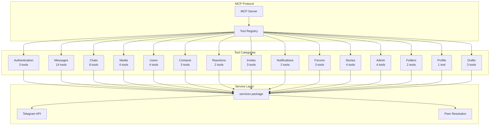
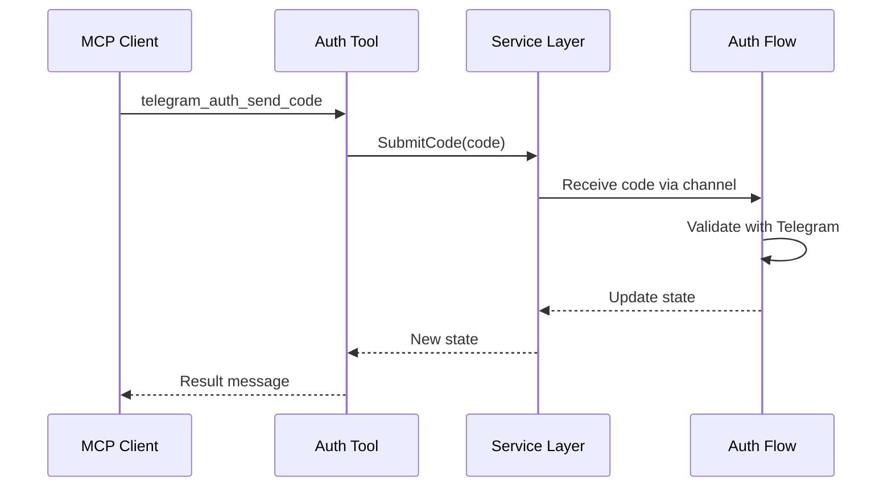

# Tool Layer Documentation

## Overview

The tool layer (`tools/` directory) implements 54 MCP tools across 14 categories. Each tool file exposes a set of related functionality through the Model Context Protocol, allowing AI assistants to interact with Telegram as a user account.

## Architecture



## Tool Pattern

All tools follow a consistent implementation pattern:

### 1. Input Structure

```go
type sendMessageInput struct {
    Peer         string `json:"peer" jsonschema:"required"`
    Message      string `json:"message" jsonschema:"required"`
    ReplyToMsgID int    `json:"reply_to_msg_id"`
    ScheduleDate int    `json:"schedule_date"`
}
```

**Conventions**:
- Use `json` tags for JSON serialization
- Use `jsonschema:"required"` for mandatory fields
- Optional fields omit the required tag
- Use descriptive names matching MCP tool schema

### 2. Tool Registration

```go
func RegisterMessageTools(s *server.MCPServer) {
    s.AddTool(
        mcp.NewTool("telegram_send_message",
            mcp.WithDescription("Send a message to a Telegram chat"),
            mcp.WithReadOnlyHintAnnotation(false),
            mcp.WithDestructiveHintAnnotation(false),
            mcp.WithString("peer",
                mcp.Required(),
                mcp.Description("Chat ID or @username"),
            ),
            mcp.WithString("message",
                mcp.Required(),
                mcp.Description("Message text to send"),
            ),
            mcp.WithNumber("reply_to_msg_id",
                mcp.Description("Message ID to reply to"),
            ),
        ),
        mcp.NewTypedToolHandler(handleSendMessage),
    )
}
```

**Annotations**:
- **readOnly**: Tool doesn't modify state (queries, reads)
- **destructive**: Tool deletes or destroys data
- Default is read-write, non-destructive

### 3. Handler Function

```go
func handleSendMessage(ctx context.Context, _ mcp.CallToolRequest, input sendMessageInput) (*mcp.CallToolResult, error) {
    // 1. Resolve peer
    peer, err := services.ResolvePeer(ctx, input.Peer)
    if err != nil {
        return mcp.NewToolResultError(err.Error()), nil
    }

    // 2. Build request
    req := &tg.MessagesSendMessageRequest{
        Peer:     peer,
        Message:  input.Message,
        RandomID: randomID(),
    }

    if input.ReplyToMsgID != 0 {
        req.ReplyTo = &tg.MessageReplyHeader{
            ReplyToMsgID: input.ReplyToMsgID,
        }
    }

    // 3. Execute API call
    api := services.API()
    result, err := api.MessagesSendMessage(ctx, req)
    if err != nil {
        return mcp.NewToolResultError(fmt.Sprintf("send message failed: %v", err)), nil
    }

    // 4. Store peers from response
    if modified, ok := result.AsModified(); ok {
        services.StorePeers(ctx, modified.GetChats(), modified.GetUsers())
    }

    // 5. Format and return result
    return mcp.NewToolResultText(fmt.Sprintf("Message sent successfully")), nil
}
```

**Handler Flow**:
1. Resolve peer identifier
2. Build Telegram API request
3. Execute API call
4. Store peers from response
5. Format and return result

## Tool Categories

### 1. Authentication Tools (`telegram_auth.go`)

**Purpose**: Manage authentication flow through MCP protocol.

**Tools**:
- `telegram_auth_status`: Check authentication state
- `telegram_auth_send_code`: Submit verification code
- `telegram_auth_send_password`: Submit 2FA password

**Key Pattern**: These tools don't access the Telegram API directly. Instead, they interact with the service layer's authentication state machine.



**File**: [tools/telegram_auth.go](../tools/telegram_auth.go)
**Lines of Code**: 79
**Complexity**: Low - straightforward state machine interaction

### 2. Message Tools (`telegram_message.go`)

**Purpose**: Comprehensive message operations.

**Tools**:
- `telegram_send_message`: Send text messages
- `telegram_get_history`: Retrieve chat history
- `telegram_search_messages`: Search within a chat
- `telegram_search_global`: Search across all chats
- `telegram_forward_message`: Forward messages
- `telegram_edit_message`: Edit sent messages
- `telegram_delete_message`: Delete messages
- `telegram_pin_message`: Pin messages
- `telegram_unpin_all_messages`: Unpin all messages
- `telegram_read_history`: Mark messages as read
- `telegram_set_typing`: Send typing indicators
- `telegram_delete_history`: Clear entire chat history
- `telegram_translate`: Translate messages
- `telegram_send_poll`: Create polls and quizzes

**Key Patterns**:

#### Random ID Generation
```go
func randomID() int64 {
    var b [8]byte
    _, _ = rand.Read(b[:])
    return int64(binary.LittleEndian.Uint64(b[:]))
}
```

**Purpose**: Generate unique random IDs for Telegram messages (required by MTProto).

#### Message ID Parsing
```go
func parseMessageIDs(s string) ([]int, error) {
    parts := strings.Split(s, ",")
    if len(parts) > 100 {
        return nil, fmt.Errorf("too many message IDs (max 100)")
    }
    // ... parse each part ...
}
```

**Purpose**: Parse comma-separated message IDs with validation.

#### Message Formatting
```go
func formatMessages(msgs []tg.MessageClass) string {
    if len(msgs) == 0 {
        return "No messages found."
    }
    var sb strings.Builder
    for _, mc := range msgs {
        msg, ok := mc.(*tg.Message)
        if !ok {
            continue
        }
        // ... format message ...
    }
    return sb.String()
}
```

**Purpose**: Convert Telegram message objects to human-readable text.

**File**: [tools/telegram_message.go](../tools/telegram_message.go)
**Lines of Code**: 794
**Complexity**: High - most complex tool file with diverse operations

### 3. Chat Tools (`telegram_chat.go`)

**Purpose**: Manage chats, dialogs, and groups.

**Tools**:
- `telegram_list_chats`: List dialogs with pagination
- `telegram_get_chat`: Get chat details
- `telegram_search_chats`: Search for chats
- `telegram_join_chat`: Join via username or invite link
- `telegram_leave_chat`: Leave a chat
- `telegram_create_group`: Create new group
- `telegram_toggle_dialog_pin`: Pin/unpin dialogs
- `telegram_mark_dialog_unread`: Mark as unread

**Key Patterns**:

#### Dialog Listing
```go
func handleListChats(ctx context.Context, _ mcp.CallToolRequest, input listChatsInput) (*mcp.CallToolResult, error) {
    api := services.API()
    limit := input.Limit
    if limit == 0 {
        limit = 20
    }

    dialogs, err := api.MessagesGetDialogs(ctx, &tg.MessagesGetDialogsRequest{
        Limit:      limit,
        OffsetDate: 0,
        OffsetID:   input.OffsetID,
        OffsetPeer: &tg.InputPeerEmpty{},
    })
    // ... process results ...
}
```

**Purpose**: Paginated dialog retrieval.

#### Invite Link Handling
```go
func handleJoinChat(ctx context.Context, _ mcp.CallToolRequest, input joinChatInput) (*mcp.CallToolResult, error) {
    peer, err := services.ResolvePeer(ctx, input.Peer)
    if err != nil {
        return mcp.NewToolResultError(err.Error()), nil
    }

    api := services.API()
    _, err = api.MessagesImportChatInvite(ctx, &tg.MessagesImportChatInviteRequest{
        Hash: extractHashFromLink(input.Peer),
    })
    // ... handle result ...
}
```

**Purpose**: Extract hash from invite links and join chats.

**File**: [tools/telegram_chat.go](../tools/telegram_chat.go)
**Lines of Code**: 534
**Complexity**: Medium - diverse chat operations

### 4. Media Tools (`telegram_media.go`)

**Purpose**: Upload and download media files.

**Tools**:
- `telegram_download_media`: Download files from messages
- `telegram_send_media`: Upload and send files
- `telegram_get_file_info`: Get media metadata
- `telegram_view_image`: Download images for AI viewing

**Key Patterns**:

#### Photo Size Selection
```go
var photoSizeOrder = map[string]int{
    "s": 1, "m": 2, "x": 3, "y": 4, "w": 5,
}
```

**Purpose**: Define size preference for photo downloads.

#### Media Download
```go
func handleDownloadMedia(ctx context.Context, _ mcp.CallToolRequest, input downloadMediaInput) (*mcp.CallToolResult, error) {
    // 1. Get message
    peer, err := services.ResolvePeer(ctx, input.Peer)
    // ...

    // 2. Extract media from message
    media, ok := msg.Media.(*tg.MessageMediaPhoto)
    if !ok {
        return mcp.NewToolResultError("message does not contain photo media"), nil
    }

    // 3. Download using downloader
    downloader := downloader.NewDownloader()
    path, err := downloader.Download(ctx, api, input.DownloadDir, location)
    // ... return path ...
}
```

**Purpose**: Stream media download to local filesystem.

#### Media Upload
```go
func handleSendMedia(ctx context.Context, _ mcp.CallToolRequest, input sendMediaInput) (*mcp.CallToolResult, error) {
    uploader := uploader.NewUploader(api)

    file, err := uploader.FromPath(ctx, input.FilePath)
    if err != nil {
        return mcp.NewToolResultError(err.Error()), nil
    }

    // Determine MIME type
    mime := mimeFromPath(input.FilePath)

    // Send based on file type
    // ... image, document, video, audio ...
}
```

**Purpose**: Handle file upload with automatic type detection.

#### AI Image Viewing
```go
func handleViewImage(ctx context.Context, _ mcp.CallToolRequest, input viewImageInput) (*mcp.CallToolResult, error) {
    // Download to temporary file
    tmpDir := os.TempDir()
    path, err := downloadPhoto(ctx, api, peer, msg.ID, tmpDir)

    // Read file and encode as base64
    data, _ := os.ReadFile(path)
    base64 := base64.StdEncoding.EncodeToString(data)

    // Return with image content type
    return mcp.NewToolResultImageContent("data:image/jpeg;base64,"+base64), nil
}
```

**Purpose**: Return images in MCP image content format for AI vision.

**File**: [tools/telegram_media.go](../tools/telegram_media.go)
**Lines of Code**: 475
**Complexity**: Medium - file I/O and type detection

### 5. User Tools (`telegram_user.go`)

**Purpose**: User information and resolution.

**Tools**:
- `telegram_get_me`: Get current user info
- `telegram_resolve_username`: Resolve @username
- `telegram_get_user`: Get user details
- `telegram_search_contacts`: Search contacts

**Key Patterns**:

#### User Formatting
```go
func formatUser(user *tg.User) string {
    var sb strings.Builder
    fmt.Fprintf(&sb, "ID: %d\n", user.ID)
    fmt.Fprintf(&sb, "First Name: %s\n", user.FirstName)
    if user.LastName != "" {
        fmt.Fprintf(&sb, "Last Name: %s\n", user.LastName)
    }
    if user.Username != "" {
        fmt.Fprintf(&sb, "Username: @%s\n", user.Username)
    }
    // ... more fields ...
    return sb.String()
}
```

**Purpose**: Format user objects for display.

#### Contact Search
```go
func handleSearchContacts(ctx context.Context, _ mcp.CallToolRequest, input searchContactsInput) (*mcp.CallToolResult, error) {
    api := services.API()
    limit := input.Limit
    if limit == 0 {
        limit = 20
    }

    result, err := api.ContactsSearch(ctx, &tg.ContactsSearchRequest{
        Q:     input.Query,
        Limit: limit,
    })
    // ... format results ...
}
```

**Purpose**: Global contact search by name or username.

**File**: [tools/telegram_user.go](../tools/telegram_user.go)
**Lines of Code**: 311
**Complexity**: Low - straightforward user operations

### 6. Admin Tools (`telegram_admin.go`)

**Purpose**: Admin and moderation functions.

**Tools**:
- `telegram_edit_admin`: Edit admin rights
- `telegram_edit_banned`: Ban/restrict users
- `telegram_get_participants`: List members
- `telegram_get_admin_log`: View admin actions

**Key Patterns**:

#### Admin Rights Parsing
```go
func parseAdminRights(rightsStr string) tg.ChatAdminRights {
    rights := tg.ChatAdminRights{}
    parts := strings.Split(rightsStr, ",")
    for _, part := range parts {
        switch strings.TrimSpace(part) {
        case "change_info":
            rights.ChangeInfo = true
        case "post_messages":
            rights.PostMessages = true
        // ... more rights ...
        }
    }
    return rights
}
```

**Purpose**: Parse comma-separated admin rights string.

#### Ban Rights Parsing
```go
func parseBannedRights(rightsStr string) tg.ChatBannedRights {
    rights := tg.ChatBannedRights{}
    // Similar pattern to admin rights
    // ...
    return rights
}
```

**Purpose**: Parse comma-separated ban/restriction rights.

#### Participant Filtering
```go
func handleGetParticipants(ctx context.Context, _ mcp.CallToolRequest, input getParticipantsInput) (*mcp.CallToolResult, error) {
    var filter tg.ChannelParticipantsClass
    switch input.Filter {
    case "admins":
        filter = &tg.ChannelParticipantsAdmins{}
    case "kicked":
        filter = &tg.ChannelParticipantsKicked{}
    case "banned":
        filter = &tg.ChannelParticipantsBanned{Query: input.Query}
    // ... more filters ...
    }

    result, err := api.ChannelsGetParticipants(ctx, &tg.ChannelsGetParticipantsRequest{
        Channel: channel,
        Filter:  filter,
        Limit:   input.Limit,
    })
    // ... format results ...
}
```

**Purpose**: List participants with filtering.

**File**: [tools/telegram_admin.go](../tools/telegram_admin.go)
**Lines of Code**: 557
**Complexity**: High - complex permission parsing

### 7. Remaining Tool Categories

#### Contact Tools (`telegram_contact.go`)
- Get contacts, import contacts, block/unblock users
- **Lines**: 160

#### Reaction Tools (`telegram_reaction.go`)
- Send reactions, get message reactions
- **Lines**: 124

#### Invite Tools (`telegram_invite.go`)
- Export invite links, list links, revoke links
- **Lines**: 211

#### Notification Tools (`telegram_notification.go`)
- Get/set notification settings
- **Lines**: 122

#### Forum Tools (`telegram_forum.go`)
- Create, list, edit forum topics
- **Lines**: 201

#### Story Tools (`telegram_story.go`)
- Get stories, send stories, delete stories
- **Lines**: 265

#### Folder Tools (`telegram_folder.go`)
- Get folders, update folders, delete folders
- **Lines**: 166

#### Profile Tools (`telegram_profile.go`)
- Update profile information
- **Lines**: 122

#### Draft Tools (`telegram_draft.go`)
- Save drafts, get drafts, clear drafts
- **Lines**: 151

## Common Patterns

### 1. Error Handling

All tool handlers follow this error pattern:

```go
func handleTool(ctx context.Context, _ mcp.CallToolRequest, input toolInput) (*mcp.CallToolResult, error) {
    // Resolution errors
    peer, err := services.ResolvePeer(ctx, input.Peer)
    if err != nil {
        return mcp.NewToolResultError(err.Error()), nil
    }

    // API errors
    result, err := api.SomeMethod(ctx, req)
    if err != nil {
        return mcp.NewToolResultError(fmt.Sprintf("operation failed: %v", err)), nil
    }

    // Success
    return mcp.NewToolResultText("Success"), nil
}
```

**Key Points**:
- Always return errors as `ToolResultError`, not as Go errors
- Use fmt.Sprintf for error context
- Return nil as the error parameter (error is in the result)

### 2. Peer Resolution

Standard peer resolution pattern:

```go
peer, err := services.ResolvePeer(ctx, input.Peer)
if err != nil {
    return mcp.NewToolResultError(err.Error()), nil
}
```

**Handles**:
- Numeric IDs (lookup in local storage)
- Usernames starting with @
- Bare usernames (without @)

### 3. Peer Storage

Always store peers from API responses:

```go
result, err := api.SomeMethod(ctx, req)
if err != nil {
    return mcp.NewToolResultError(err.Error()), nil
}

// Extract and store peers
if modified, ok := result.AsModified(); ok {
    services.StorePeers(ctx, modified.GetChats(), modified.GetUsers())
}
```

**Purpose**: Cache peers for future ID-based lookups.

### 4. Pagination

Standard pagination pattern:

```go
limit := input.Limit
if limit == 0 {
    limit = 20  // Default
}
if limit > 100 {
    limit = 100  // Max
}

offset := input.OffsetID  // or offset_date, offset_peer
```

**Conventions**:
- Default: 20 items
- Maximum: 100 items
- Use appropriate offset type for the endpoint

### 5. Result Formatting

#### Text Results
```go
return mcp.NewToolResultText(fmt.Sprintf("Operation successful: %d items processed", count)), nil
```

#### Error Results
```go
return mcp.NewToolResultError(fmt.Sprintf("Failed: %v", err)), nil
```

#### Image Results (for AI vision)
```go
return mcp.NewToolResultImageContent("data:image/jpeg;base64,"+base64), nil
```

## Performance Considerations

### 1. Batch Operations

When processing multiple items:

```go
// Good: Batch peer storage
services.StorePeers(ctx, allChats, allUsers)

// Avoid: Individual storage
for _, chat := range chats {
    services.StorePeers(ctx, []tg.ChatClass{chat}, nil)
}
```

### 2. Context Propagation

Always pass context through:

```go
// Good: Pass context to all calls
result, err := api.Method(ctx, request)

// Avoid: Don't drop context
result, err := api.Method(context.Background(), request)
```

### 3. Memory Management

For large result sets:

```go
// Use streaming or pagination for large datasets
limit := 100
if input.Limit > 0 && input.Limit < limit {
    limit = input.Limit
}
```

## Security Considerations

### 1. Input Validation

Always validate user input:

```go
if input.Peer == "" {
    return mcp.NewToolResultError("peer is required"), nil
}

if len(input.Message) > 4096 {
    return mcp.NewToolResultError("message too long (max 4096 characters)"), nil
}
```

### 2. Path Traversal Prevention

For file operations:

```go
// Validate file paths are within allowed directories
downloadDir := filepath.Clean(input.DownloadDir)
if !strings.HasPrefix(downloadDir, allowedBaseDir) {
    return mcp.NewToolResultError("invalid download directory"), nil
}
```

### 3. Rate Limit Awareness

Be aware of Telegram's rate limits:

```go
// Use appropriate delays for bulk operations
time.Sleep(time.Second)
```

## Testing

### Unit Testing Pattern

```go
func TestHandleSendMessage(t *testing.T) {
    ctx := context.Background()
    input := sendMessageInput{
        Peer:    "@test",
        Message: "Hello",
    }

    result, err := handleSendMessage(ctx, mcp.CallToolRequest{}, input)

    if err != nil {
        t.Fatalf("unexpected error: %v", err)
    }

    if result.IsError {
        t.Fatalf("expected success, got error: %s", result.Content)
    }
}
```

### Integration Testing

- Use test Telegram API credentials
- Test against test chats/channels
- Clean up test data after tests

## Best Practices

1. **Always resolve peers before API calls**
2. **Store peers from all API responses**
3. **Use appropriate pagination for list operations**
4. **Provide clear error messages**
5. **Validate input parameters**
6. **Handle all error cases**
7. **Format results for readability**
8. **Use context from parameters, don't create new contexts**
9. **Be mindful of rate limits**
10. **Document complex logic in comments**
