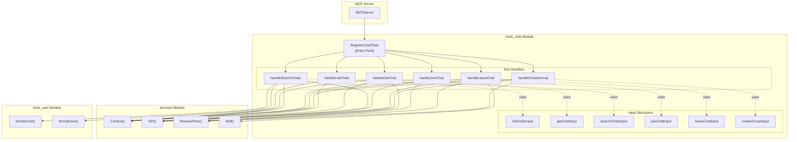
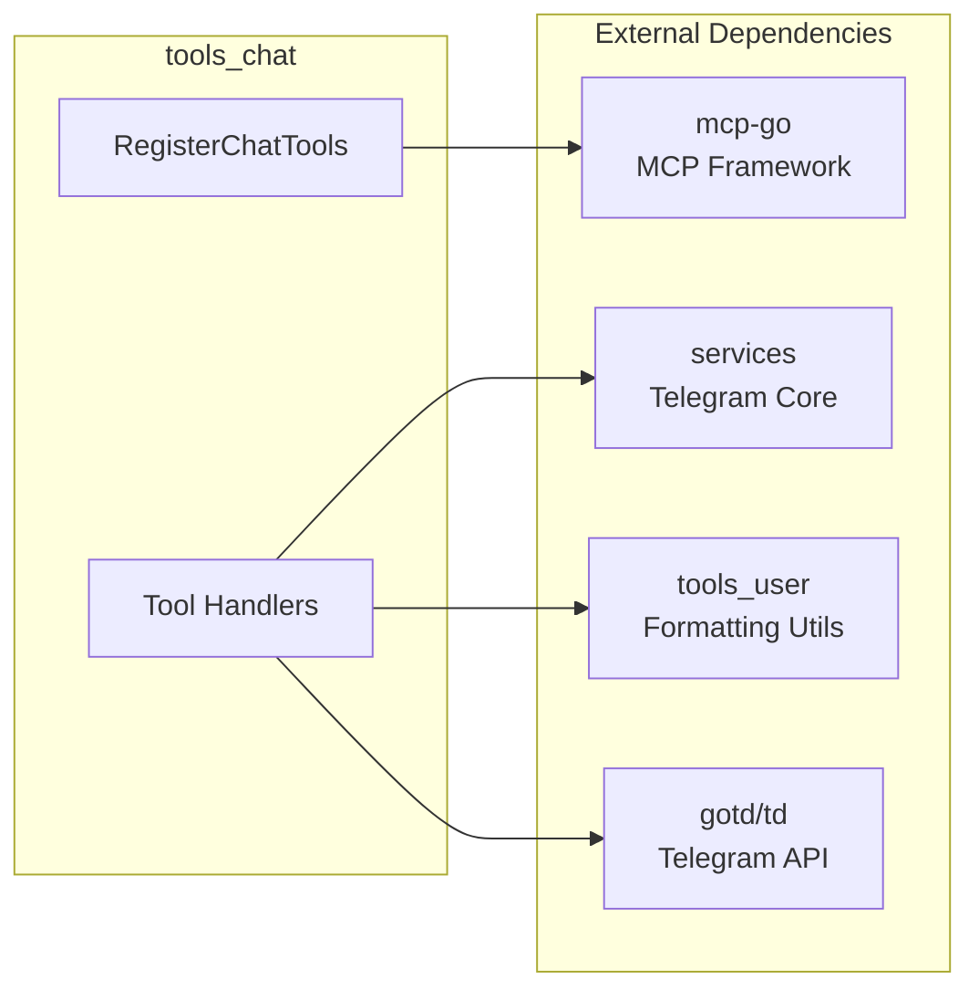
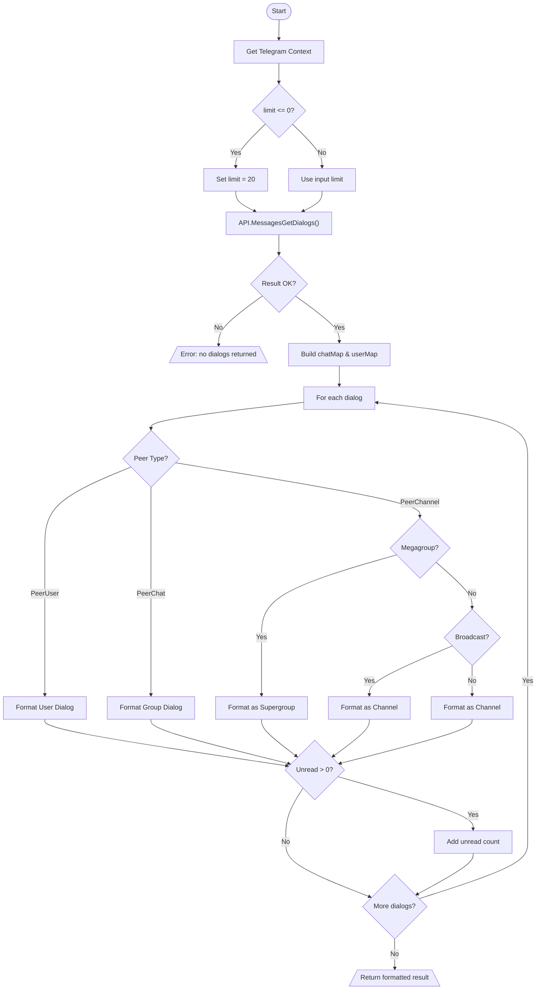
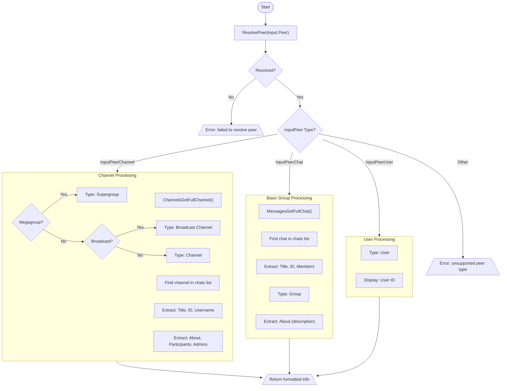
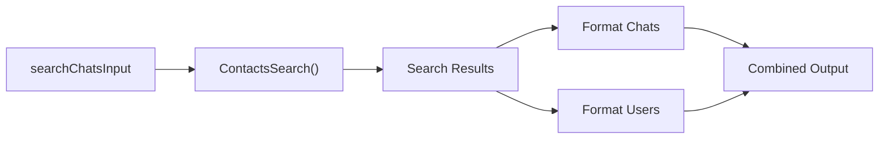
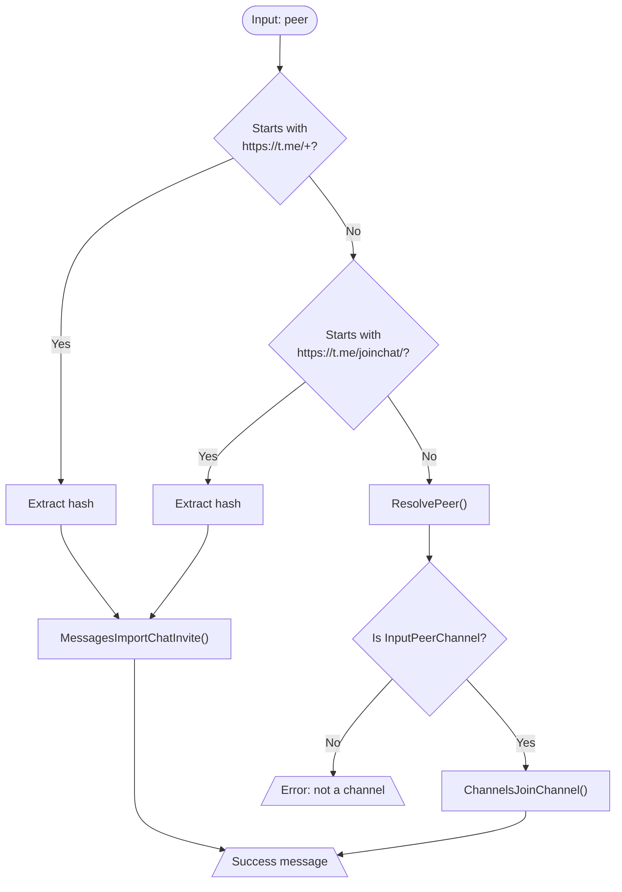
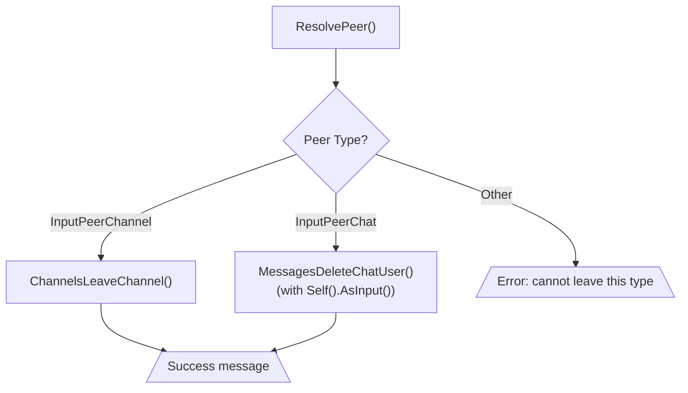
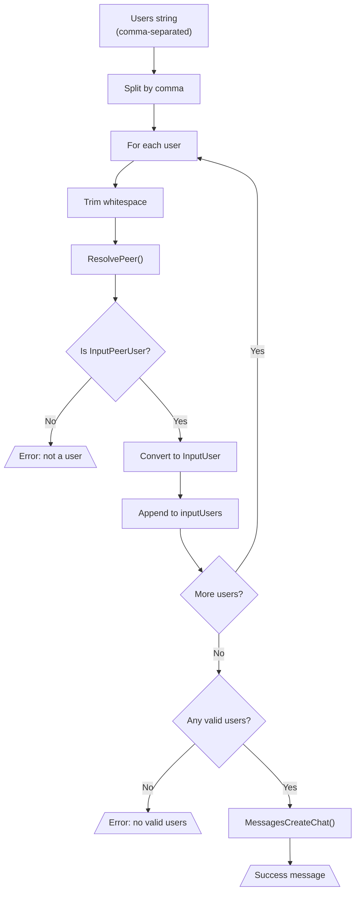

# Chat Management Tools Module (`tools_chat`)

The `tools_chat` module provides comprehensive chat, group, and channel management capabilities for the Telegram MCP (Model Context Protocol) server. It enables AI assistants and clients to interact with Telegram's dialog system through a standardized tool interface.

## Module Overview

This module implements six MCP tools that cover the complete lifecycle of Telegram chat interactions:

| Tool | Purpose | Read-Only | Destructive |
|------|---------|-----------|-------------|
| `telegram_list_chats` | List user's dialogs | ✅ | ❌ |
| `telegram_get_chat` | Get detailed chat info | ✅ | ❌ |
| `telegram_search_chats` | Search chats globally | ✅ | ❌ |
| `telegram_join_chat` | Join channels/groups | ❌ | ❌ |
| `telegram_leave_chat` | Leave chats/channels | ❌ | ✅ |
| `telegram_create_group` | Create new group chats | ❌ | ❌ |

## Architecture

### Component Relationships



### Dependency Flow



---

## Exported API

### `RegisterChatTools`

**Purpose**: Registers all chat management tools with the MCP server. This is the module's single entry point called during application initialization.

**Signature**:
```go
func RegisterChatTools(s *server.MCPServer)
```

**Parameters**:
| Name | Type | Description |
|------|------|-------------|
| `s` | `*server.MCPServer` | The MCP server instance to register tools with |

**Usage**:
```go
// In main.go initialization
mcpServer := server.NewMCPServer("Telegram MCP", "1.0.0")
tools.RegisterChatTools(mcpServer)
```

**Registered Tools**:
1. **`telegram_list_chats`** - Lists user's dialogs with pagination support
2. **`telegram_get_chat`** - Retrieves detailed information about a specific chat
3. **`telegram_search_chats`** - Global search for chats, channels, and users
4. **`telegram_join_chat`** - Join public channels/groups via username or invite link
5. **`telegram_leave_chat`** - Leave channels or basic groups
6. **`telegram_create_group`** - Create new group chats with specified members

---

## High Complexity Handlers

### `handleListChats` (Cognitive Complexity: 128)

This handler processes dialog listing with complex peer type resolution and formatting logic.

#### Decision Flow



#### Edge Cases Handled
- **Empty dialog list**: Returns error if no dialogs are returned from API
- **Unknown peer types**: Gracefully handles peers not found in lookup maps by displaying ID only
- **Missing user/chat data**: Displays ID when entity details unavailable
- **Partial data**: Handles users/chats with missing optional fields (lastName, username)

#### Primary Branching Conditions
1. **Limit validation**: Defaults to 20 when limit ≤ 0
2. **Result type assertion**: Checks if result is `*tg.MessagesDialogs` (modified slice)
3. **Peer type switching**: Three-way switch for User/Chat/Channel peer types
4. **Channel subtype detection**: Distinguishes between Megagroup, Broadcast, and regular channels
5. **Unread indicator**: Conditionally appends unread count badge

---

### `handleGetChat` (Cognitive Complexity: 112)

Retrieves detailed information about a specific chat with type-specific data extraction.

#### Decision Flow



#### Edge Cases Handled
- **Unresolvable peer**: Returns error when peer identifier cannot be resolved
- **Unsupported peer types**: Returns error for non-chat/channel/user peers
- **Missing full chat data**: Gracefully handles absent `About`, `ParticipantsCount`, `AdminsCount`

---

## Standard Handlers

### `handleSearchChats`

**Purpose**: Performs global search for chats, channels, and users via Telegram's contacts search API.

**External Dependencies**:
- `services.Context()` - Telegram context
- `services.API().ContactsSearch()` - Search API endpoint
- [`formatChat()`](tools_user.md#formatchat) - Chat formatting (from tools_user module)
- [`formatUser()`](tools_user.md#formatuser) - User formatting (from tools_user module)

**Flow**:


---

### `handleJoinChat`

**Purpose**: Joins public channels/groups via username or invite link with multi-format support.

**Supported Input Formats**:
| Format | Example | Method |
|--------|---------|--------|
| Username | `@channelname` | `ChannelsJoinChannel` |
| Invite Link (new) | `https://t.me/+AbCdEf` | `MessagesImportChatInvite` |
| Invite Link (legacy) | `https://t.me/joinchat/AbCdEf` | `MessagesImportChatInvite` |

**Flow**:


---

### `handleLeaveChat`

**Purpose**: Leaves channels and basic groups with type-specific handling.

**Peer Type Handling**:


**Key Difference**: Basic groups require explicitly removing the user (`MessagesDeleteChatUser`), while channels/supergroups use a dedicated leave method.

---

### `handleCreateGroup`

**Purpose**: Creates a new basic group chat with specified initial members.

**Member Resolution Flow**:


---

## Input Structures

### `listChatsInput`
```go
type listChatsInput struct {
    Limit    int `json:"limit"`      // Number of chats (default: 20)
    OffsetID int `json:"offset_id"`  // Pagination offset
}
```

### `getChatInput`
```go
type getChatInput struct {
    Peer string `json:"peer" jsonschema:"required"` // Chat ID or @username
}
```

### `searchChatsInput`
```go
type searchChatsInput struct {
    Query string `json:"query" jsonschema:"required"` // Search query
    Limit int    `json:"limit"`                       // Max results (default: 20)
}
```

### `joinChatInput`
```go
type joinChatInput struct {
    Peer string `json:"peer" jsonschema:"required"` // @username or invite link
}
```

### `leaveChatInput`
```go
type leaveChatInput struct {
    Peer string `json:"peer" jsonschema:"required"` // Chat ID or @username
}
```

### `createGroupInput`
```go
type createGroupInput struct {
    Title string `json:"title" jsonschema:"required"` // Group name
    Users string `json:"users" jsonschema:"required"` // Comma-separated user IDs/usernames
}
```

---

## External Dependencies

### Services Module Dependencies

All handlers depend on the [`services`](services.md) module for Telegram connectivity:

| Service | Usage | Handlers Using |
|---------|-------|----------------|
| `Context()` | Retrieves active Telegram context | All handlers |
| `API()` | Accesses Telegram API client | All handlers |
| `ResolvePeer()` | Resolves peer identifiers to InputPeer | get, join, leave, create |
| `Self()` | Gets current user info | handleLeaveChat |

### Cross-Module Dependencies

| Dependency | Module | Purpose |
|------------|--------|---------|
| `formatChat()` | [tools_user](tools_user.md) | Formats chat/channel output |
| `formatUser()` | [tools_user](tools_user.md) | Formats user output |

---

## Error Handling

All handlers follow a consistent error handling pattern:

```go
// Error response pattern
return mcp.NewToolResultError(fmt.Sprintf("operation failed: %v", err)), nil
```

### Error Conditions by Handler

| Handler | Error Conditions |
|---------|-----------------|
| `handleListChats` | API failure, no dialogs returned |
| `handleGetChat` | Peer resolution failure, unsupported peer type, API failure |
| `handleSearchChats` | API search failure |
| `handleJoinChat` | Invalid invite link, peer resolution failure, not a channel, join failure |
| `handleLeaveChat` | Peer resolution failure, unsupported peer type, leave failure |
| `handleCreateGroup` | User resolution failure, not a user, no valid users, create failure |

### Impact of Upstream Changes

**⚠️ High Instability (1.00)**: All handlers have maximum instability due to complete dependence on external services:

1. **`services.API()` changes**: Would require updates to all API method calls
2. **`services.Context()` changes**: Would affect all handler initialization
3. **`services.ResolvePeer()` changes**: Would impact peer resolution in 4 handlers
4. **Telegram API changes (gotd/td)**: Would require updates to type assertions and method calls

---

## MCP Tool Definitions

### Tool Annotations

Tools are annotated with hints for AI assistants:

| Annotation | Tools | Meaning |
|------------|-------|---------|
| `ReadOnlyHintAnnotation(true)` | list, get, search | Operations don't modify state |
| `DestructiveHintAnnotation(true)` | leave | Operation permanently removes user from chat |
| `DestructiveHintAnnotation(false)` | join, create | Operations are reversible |

### Parameter Schemas

All input structures use JSON Schema tags for validation:
- `jsonschema:"required"` marks mandatory fields
- Optional fields have `omitempty` or no schema tags
- Default values applied when parameters are zero-valued
