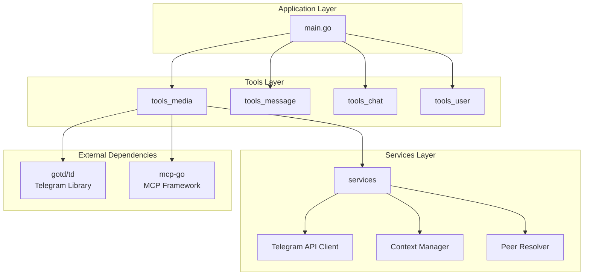
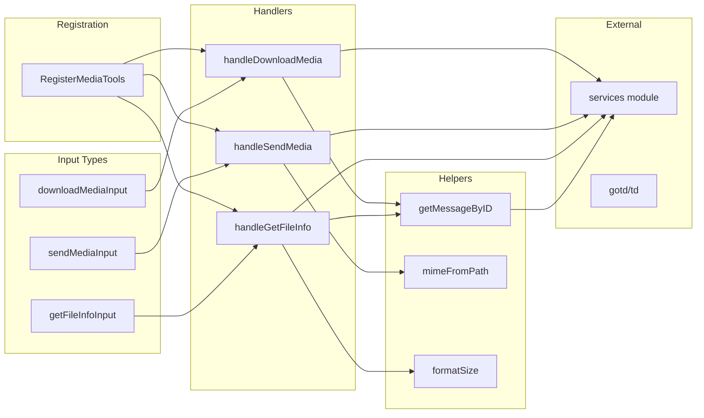
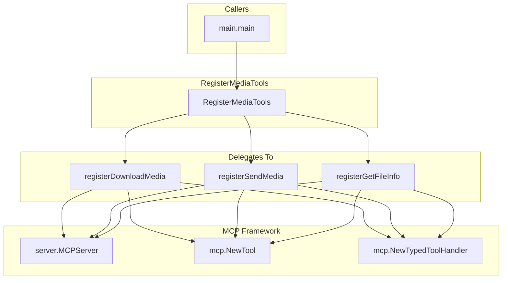
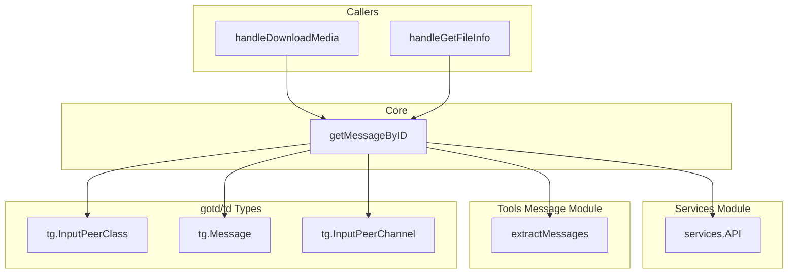
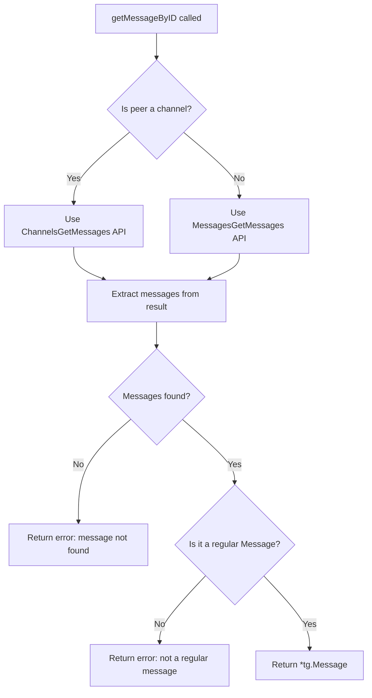
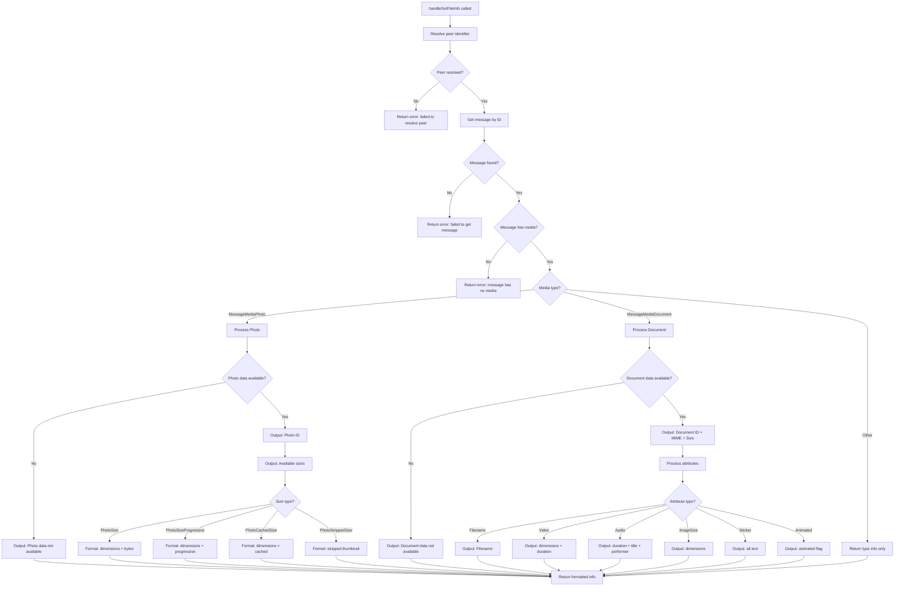
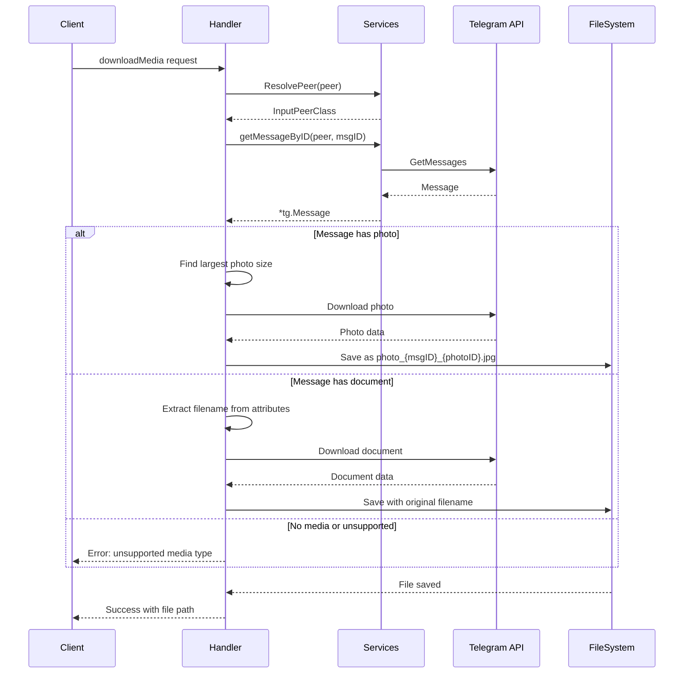
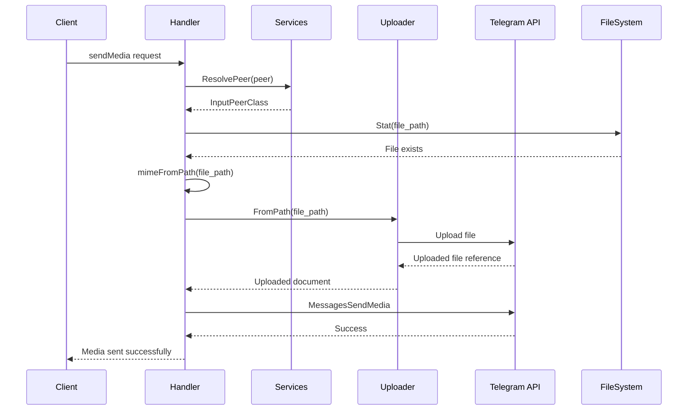
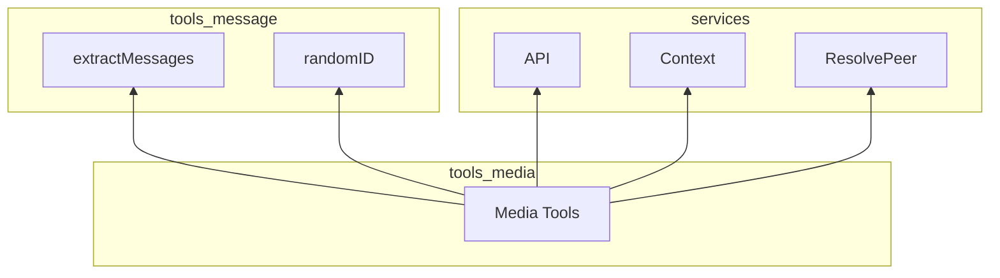

# Tools Media Module

## Overview

The `tools_media` module provides media handling capabilities for the Telegram MCP (Model Context Protocol) server. It enables downloading, uploading, and inspecting media files (photos, documents, videos, audio) from Telegram messages through three MCP tools.

### Purpose

This module bridges the gap between Telegram's media API and MCP clients, allowing AI assistants and other MCP consumers to:
- Download media attachments from Telegram messages
- Send local files as media to Telegram chats
- Retrieve metadata about media without downloading

### Module Position in System



---

## Architecture

### Component Community Structure

The module is organized into distinct communities based on functionality:

| Community | Components | Purpose |
|-----------|------------|---------|
| **Community 0** | `RegisterMediaTools` | Entry point and tool registration |
| **Community 14** | `downloadMediaInput` | Download operation input schema |
| **Community 15** | `sendMediaInput` | Send operation input schema |
| **Community 16** | `getFileInfoInput` | File info query input schema |
| **Community 20** | `handleSendMedia`, `mimeFromPath` | Media upload pipeline |
| **Community 21** | `handleDownloadMedia`, `handleGetFileInfo`, `getMessageByID`, `formatSize` | Media retrieval and inspection pipeline |

### High-Level Architecture



---

## Hub Components

### RegisterMediaTools

**Architectural Role:** Entry point for the entire media tools module

**Metrics:**
- **PageRank:** 0.0103
- **Betweenness Centrality:** 0.0005
- **Fan-in:** 1 (called by `main.main`)
- **Fan-out:** 3 (registers 3 tools)
- **Instability:** 0.75 (high outward dependency)

#### Dependency Diagram



#### Function Signature

```go
func RegisterMediaTools(s *server.MCPServer)
```

#### Purpose

Registers three MCP tools with the server:
1. `telegram_download_media` - Download media from messages
2. `telegram_send_media` - Upload and send files to chats
3. `telegram_get_file_info` - Get media metadata without downloading

#### Impact of Changes

If `RegisterMediaTools` changes, the following would break:
- **Upstream:** The `main.main` function would fail to compile if the signature changes
- **Downstream:** All three tool registration functions must maintain their expected MCP tool interface contracts
- **Runtime:** Any change to tool names or parameters would affect all MCP clients using these tools

#### External Dependencies

| Dependency | Purpose | Change Impact |
|------------|---------|---------------|
| `github.com/mark3labs/mcp-go/server` | MCP server type | Interface changes require code updates |
| `github.com/mark3labs/mcp-go/mcp` | Tool definition utilities | Tool schema changes affect client compatibility |

---

### getMessageByID

**Architectural Role:** Central helper for message retrieval, shared by multiple handlers

**Metrics:**
- **PageRank:** 0.0146 (highest in module)
- **Betweenness Centrality:** 0.0005
- **Fan-in:** 2 (called by `handleDownloadMedia` and `handleGetFileInfo`)
- **Fan-out:** 2 (calls `services.API()` and `extractMessages`)

#### Dependency Diagram



#### Function Signature

```go
func getMessageByID(ctx context.Context, peer tg.InputPeerClass, msgID int) (*tg.Message, error)
```

#### Purpose

Retrieves a single message by ID from Telegram, handling the complexity of different peer types (channels vs. regular chats/users). This abstraction allows handlers to work with messages uniformly.

#### Behavior



#### Error Conditions

| Error | Condition |
|-------|-----------|
| `"get message: %w"` | API call failed |
| `"message %d not found"` | No messages returned for the given ID |
| `"message %d is not a regular message"` | Message exists but is not a `*tg.Message` type (could be a service message) |

---

## High Complexity Component

### handleGetFileInfo

**Metrics:**
- **Cognitive Complexity:** 102 (very high)
- **Cyclomatic Complexity:** 0
- **Maintainability Index:** 59.0/100
- **Instability:** 1.0

This component has the highest cognitive complexity in the module due to extensive type switching and conditional formatting for different media types.

#### Decision Logic Flowchart



#### Edge Cases Handled

| Edge Case | Handling |
|-----------|----------|
| Photo without actual photo data | Outputs "Photo data not available" instead of crashing |
| Document without actual document data | Outputs "Document data not available" instead of crashing |
| Unknown media type | Outputs type name with "(unsupported for detailed info)" |
| Audio without title/performer | Gracefully omits those fields |
| Multiple document attributes | Iterates and outputs all applicable attributes |

#### Branching Conditions

1. **Peer Resolution:** Validates input peer identifier
2. **Message Existence:** Checks if message was retrieved
3. **Media Presence:** Verifies message contains media
4. **Media Type Switch:** Routes to photo or document handler
5. **Photo Size Type Switch:** Handles 4 different size representations
6. **Document Attribute Type Switch:** Handles 6+ different attribute types

---

## MCP Tools Reference

### 1. telegram_download_media

Downloads media attachments from Telegram messages.

**Handler:** `handleDownloadMedia`

**Input Schema:**
```go
type downloadMediaInput struct {
    Peer        string `json:"peer" jsonschema:"required"`        // Chat ID or @username
    MessageID   int    `json:"message_id" jsonschema:"required"` // Message containing media
    DownloadDir string `json:"download_dir"`                      // Optional save directory
}
```

**Behavior:**


**Supported Media Types:**
- Photos (saved as JPG)
- Documents (preserves original filename)

**Default Behavior:**
- If `download_dir` not specified, uses `./downloads`
- Creates download directory if it doesn't exist
- For photos, selects the largest available size

---

### 2. telegram_send_media

Uploads and sends local files to Telegram chats.

**Handler:** `handleSendMedia`

**Input Schema:**
```go
type sendMediaInput struct {
    Peer     string `json:"peer" jsonschema:"required"`     // Chat ID or @username
    FilePath string `json:"file_path" jsonschema:"required"` // Local file path
    Caption  string `json:"caption"`                         // Optional caption
}
```

**Behavior:**


**MIME Type Detection:**

| Extension | MIME Type |
|-----------|-----------|
| `.jpg`, `.jpeg` | `image/jpeg` |
| `.png` | `image/png` |
| `.gif` | `image/gif` |
| `.webp` | `image/webp` |
| `.mp4` | `video/mp4` |
| `.webm` | `video/webm` |
| `.mp3` | `audio/mpeg` |
| `.ogg` | `audio/ogg` |
| `.pdf` | `application/pdf` |
| `.zip` | `application/zip` |
| `.txt` | `text/plain` |
| Other | `application/octet-stream` |

---

### 3. telegram_get_file_info

Retrieves metadata about media in a message without downloading.

**Handler:** `handleGetFileInfo`

**Input Schema:**
```go
type getFileInfoInput struct {
    Peer      string `json:"peer" jsonschema:"required"`      // Chat ID or @username
    MessageID int    `json:"message_id" jsonschema:"required"` // Message to inspect
}
```

**Annotations:**
- `ReadOnlyHintAnnotation`: `true` (no side effects)
- `DestructiveHintAnnotation`: `false` (safe operation)

**Output Format Examples:**

**For Photos:**
```
Message ID: 12345
Type: Photo
Photo ID: 67890
Available sizes:
  - y: 1920x1080 (1.25 MB)
  - x: 1280x720 (512.00 KB)
  - m: 640x360 (128.00 KB)
```

**For Documents:**
```
Message ID: 12345
Type: Document
Document ID: 67890
MIME Type: video/mp4
Size: 25.50 MB
Filename: vacation.mp4
Video: 1920x1080, duration 120.5s
```

---

## Helper Functions

### mimeFromPath

```go
func mimeFromPath(path string) string
```

Detects MIME type from file extension. Returns `application/octet-stream` for unknown extensions.

**Location:** Community 20 (Send Media pipeline)

### formatSize

```go
func formatSize(bytes int64) string
```

Formats byte counts into human-readable sizes (B, KB, MB, GB).

**Examples:**
- `512` → `"512 B"`
- `1024` → `"1.00 KB"`
- `1572864` → `"1.50 MB"`
- `1073741824` → `"1.00 GB"`

**Location:** Community 21 (Retrieval/Inspection pipeline)

---

## Unstable Components Analysis

Components with **Instability = 1.0** are highly dependent on external modules. Changes in dependencies will directly impact these components.

### Dependency Impact Matrix

| Component | External Dependencies | Impact of Upstream Changes |
|-----------|----------------------|---------------------------|
| `handleDownloadMedia` | `services.API()`, `services.Context()`, `services.ResolvePeer()`, `gotd/td/downloader` | API signature changes, downloader interface changes |
| `handleSendMedia` | `services.API()`, `services.Context()`, `services.ResolvePeer()`, `gotd/td/uploader` | API signature changes, uploader interface changes |
| `handleGetFileInfo` | `services.API()`, `services.Context()`, `services.ResolvePeer()` | API signature changes, context handling changes |

### Mitigation Strategies

1. **Interface Abstraction:** Consider creating internal interfaces that wrap `services` calls
2. **Error Handling:** All handlers already return errors through MCP's result system, providing isolation
3. **Testing:** Mock the `services` package for unit testing these handlers

---

## Integration with Other Modules

### Dependencies



| Module | Component | Usage |
|--------|-----------|-------|
| [services](services.md) | `API()` | Telegram API client for media operations |
| [services](services.md) | `Context()` | Telegram context for API calls |
| [services](services.md) | `ResolvePeer()` | Convert peer identifiers to Telegram peers |
| [tools_message](tools_message.md) | `extractMessages()` | Extract messages from API responses |
| [tools_message](tools_message.md) | `randomID()` | Generate random IDs for sent messages |

### Used By

| Module | Component | Usage |
|--------|-----------|-------|
| `main` | `main()` | Registers media tools with MCP server |

---

## Error Handling Patterns

All handlers follow a consistent error handling pattern:

```go
func handleX(ctx context.Context, request mcp.CallToolRequest, input XInput) (*mcp.CallToolResult, error) {
    // 1. Resolve dependencies
    if err != nil {
        return mcp.NewToolResultError(fmt.Sprintf("operation failed: %v", err)), nil
    }
    
    // 2. Perform operation
    if err != nil {
        return mcp.NewToolResultError(fmt.Sprintf("operation failed: %v", err)), nil
    }
    
    // 3. Return success
    return mcp.NewToolResultText("Success message"), nil
}
```

**Key Pattern:** Errors are returned as `*mcp.CallToolResult` with error text, NOT as the second return value. This allows MCP clients to receive structured error information.

---

## API Surface Summary

### Exported Functions

| Function | Signature | Purpose |
|----------|-----------|---------|
| `RegisterMediaTools` | `func RegisterMediaTools(s *server.MCPServer)` | Entry point to register all media tools |

### Internal Functions (9 total)

| Function | Purpose |
|----------|---------|
| `handleDownloadMedia` | MCP tool handler for media download |
| `handleSendMedia` | MCP tool handler for media upload |
| `handleGetFileInfo` | MCP tool handler for file metadata |
| `downloadMediaInput` | Input struct for download operation |
| `sendMediaInput` | Input struct for send operation |
| `getFileInfoInput` | Input struct for file info query |
| `getMessageByID` | Helper to fetch a single message |
| `mimeFromPath` | MIME type detection from extension |
| `formatSize` | Byte size humanization |

---

## Usage Example

```go
// In main.go
func main() {
    // ... initialize Telegram client ...
    
    mcpServer := server.NewMCPServer(
        "Telegram MCP",
        "1.0.0",
        server.WithLogging(),
        server.WithRecovery(),
    )
    
    // Register media tools
    tools.RegisterMediaTools(mcpServer)
    
    // ... start server ...
}
```

Once registered, MCP clients can invoke:
- `telegram_download_media` with `{"peer": "@channel", "message_id": 123}`
- `telegram_send_media` with `{"peer": "123456789", "file_path": "/path/to/file.jpg"}`
- `telegram_get_file_info` with `{"peer": "@channel", "message_id": 123}`
