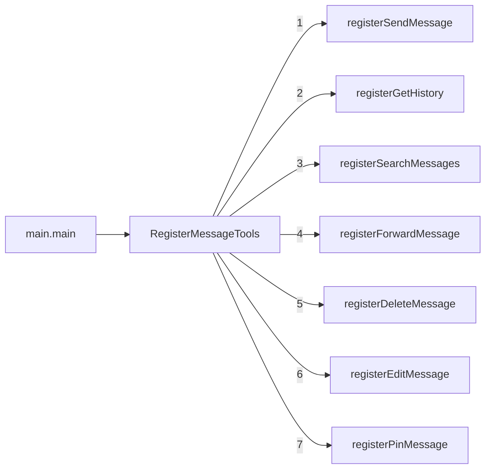
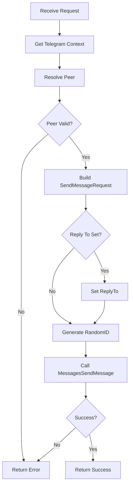
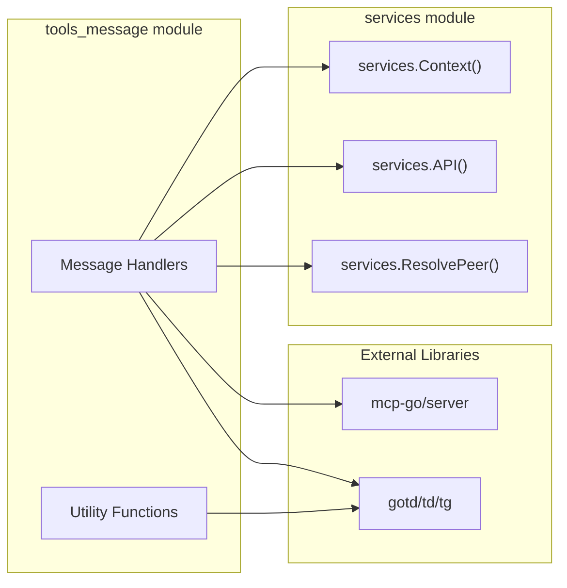

# Telegram Message Tools Module

## Overview

The `tools_message` module provides a comprehensive set of MCP (Model Context Protocol) tools for managing Telegram messages. It implements seven distinct operations covering the full message lifecycle: sending, retrieving, searching, forwarding, editing, pinning, and deleting messages.

This module serves as the primary interface for message manipulation within the telegram-mcp system, bridging the gap between MCP clients and the Telegram API through the [services](services.md) module.

## Architecture

```mermaid
graph TB
    subgraph "Entry Point"
        RegisterMessageTools["RegisterMessageTools<br/>(Hub)"]
    end
    
    subgraph "Tool Handlers"
        handleSendMessage["handleSendMessage"]
        handleGetHistory["handleGetHistory"]
        handleSearchMessages["handleSearchMessages"]
        handleForwardMessage["handleForwardMessage"]
        handleDeleteMessage["handleDeleteMessage"]
        handleEditMessage["handleEditMessage"]
        handlePinMessage["handlePinMessage"]
    end
    
    subgraph "Utility Functions"
        randomID["randomID<br/>(Hub)"]
        extractMessages["extractMessages<br/>(Hub)"]
        parseMessageIDs["parseMessageIDs"]
        formatMessages["formatMessages"]
    end
    
    subgraph "Input Types"
        SendMessageInput["SendMessageInput"]
        GetHistoryInput["GetHistoryInput"]
        SearchMessagesInput["SearchMessagesInput"]
        ForwardMessageInput["ForwardMessageInput"]
        DeleteMessageInput["DeleteMessageInput"]
        EditMessageInput["EditMessageInput"]
        PinMessageInput["PinMessageInput"]
    end
    
    subgraph "External Services"
        servicesAPI["services.API()"]
        servicesContext["services.Context()"]
        servicesResolvePeer["services.ResolvePeer()"]
    end
    
    RegisterMessageTools --> handleSendMessage
    RegisterMessageTools --> handleGetHistory
    RegisterMessageTools --> handleSearchMessages
    RegisterMessageTools --> handleForwardMessage
    RegisterMessageTools --> handleDeleteMessage
    RegisterMessageTools --> handleEditMessage
    RegisterMessageTools --> handlePinMessage
    
    handleSendMessage --> randomID
    handleSendMessage --> servicesResolvePeer
    handleSendMessage --> servicesAPI
    handleSendMessage --> servicesContext
    
    handleGetHistory --> extractMessages
    handleGetHistory --> formatMessages
    handleGetHistory --> servicesResolvePeer
    handleGetHistory --> servicesAPI
    handleGetHistory --> servicesContext
    
    handleSearchMessages --> extractMessages
    handleSearchMessages --> formatMessages
    handleSearchMessages --> servicesResolvePeer
    handleSearchMessages --> servicesAPI
    handleSearchMessages --> servicesContext
    
    handleForwardMessage --> randomID
    handleForwardMessage --> parseMessageIDs
    handleForwardMessage --> servicesResolvePeer
    handleForwardMessage --> servicesAPI
    handleForwardMessage --> servicesContext
    
    handleDeleteMessage --> parseMessageIDs
    handleDeleteMessage --> servicesResolvePeer
    handleDeleteMessage --> servicesAPI
    handleDeleteMessage --> servicesContext
    
    handleEditMessage --> servicesResolvePeer
    handleEditMessage --> servicesAPI
    handleEditMessage --> servicesContext
    
    handlePinMessage --> servicesResolvePeer
    handlePinMessage --> servicesAPI
    handlePinMessage --> servicesContext
    
    SendMessageInput -.-> handleSendMessage
    GetHistoryInput -.-> handleGetHistory
    SearchMessagesInput -.-> handleSearchMessages
    ForwardMessageInput -.-> handleForwardMessage
    DeleteMessageInput -.-> handleDeleteMessage
    EditMessageInput -.-> handleEditMessage
    PinMessageInput -.-> handlePinMessage
```



## Hub Components

### RegisterMessageTools (Entry Point Hub)

**PageRank:** 0.0103 | **Betweenness:** 0.0011 | **Fan-out:** 7 | **Instability:** 0.88

`RegisterMessageTools` is the primary entry point for the message module, called by `main.main` during server initialization. It orchestrates the registration of all seven message-related MCP tools.

```go
func RegisterMessageTools(s *server.MCPServer)
```

**Dependencies (Callees):**
- `registerSendMessage` - Registers the send message tool
- `registerGetHistory` - Registers the history retrieval tool
- `registerSearchMessages` - Registers the message search tool
- `registerForwardMessage` - Registers the forward message tool
- `registerDeleteMessage` - Registers the delete message tool
- `registerEditMessage` - Registers the edit message tool
- `registerPinMessage` - Registers the pin message tool

**Callers (Fan-in):**
- `main.main` - Called during MCP server initialization

**Impact of Changes:**
- Adding new message tools requires modifying this function
- Removing or renaming tools affects all MCP clients relying on these capabilities
- Changes to registration order have no functional impact



### randomID (Utility Hub)

**PageRank:** 0.0160 | **Fan-in:** 3 | **Fan-out:** 0

Generates cryptographically random 64-bit integers used as unique identifiers for message operations. Telegram requires unique `random_id` values for certain API calls to prevent duplicate processing.

```go
func randomID() int64
```

**Callers:**
- `handleSendMessage` - For new message sends
- `handleForwardMessage` - For forwarded messages (one per message)
- `tools.telegram_media.handleSendMedia` - For media uploads

**Implementation Details:**
- Uses `crypto/rand` for secure random generation
- Returns `int64` in little-endian format
- Errors from `rand.Read` are silently ignored (edge case with minimal impact)

### extractMessages (Utility Hub)

**PageRank:** 0.0200 | **Fan-in:** 3 | **Fan-out:** 0

Extracts message slices from Telegram API response types, handling the various response formats returned by different API methods.

```go
func extractMessages(result tg.MessagesMessagesClass) []tg.MessageClass
```

**Callers:**
- `handleGetHistory` - Extract messages from history response
- `handleSearchMessages` - Extract messages from search results
- `tools.telegram_media.getMessageByID` - Extract single message lookup result

**Implementation Details:**
- Uses `AsModified()` to handle both full and slice responses
- Returns `nil` if the response cannot be converted to a modified form
- Returns a slice of `tg.MessageClass` interface types

## API Surface (Exported Symbols)

### Functions

#### RegisterMessageTools

```go
func RegisterMessageTools(s *server.MCPServer)
```

**Purpose:** Registers all message-related MCP tools with the provided server instance.

**Parameters:**
| Name | Type | Description |
|------|------|-------------|
| `s` | `*server.MCPServer` | The MCP server instance to register tools with |

**Usage:**
```go
mcpServer := server.NewMCPServer("Telegram MCP", "1.0.0")
tools.RegisterMessageTools(mcpServer)
```

### Input Types (Exported Structs)

All input types include JSON tags with validation annotations for the MCP framework.

#### SendMessageInput

```go
type SendMessageInput struct {
    Peer         string `json:"peer" validate:"required"`
    Message      string `json:"message" validate:"required"`
    ReplyToMsgID int    `json:"reply_to_msg_id"`
}
```

**Fields:**
| Field | Type | Required | Description |
|-------|------|----------|-------------|
| `Peer` | `string` | Yes | Chat ID or @username of the target |
| `Message` | `string` | Yes | Message text to send |
| `ReplyToMsgID` | `int` | No | Message ID to reply to (creates a reply thread) |

#### GetHistoryInput

```go
type GetHistoryInput struct {
    Peer     string `json:"peer" validate:"required"`
    Limit    int    `json:"limit"`
    OffsetID int    `json:"offset_id"`
}
```

**Fields:**
| Field | Type | Required | Description |
|-------|------|----------|-------------|
| `Peer` | `string` | Yes | Chat ID or @username |
| `Limit` | `int` | No | Number of messages to retrieve (default: 20) |
| `OffsetID` | `int` | No | Offset message ID for pagination (default: 0) |

#### SearchMessagesInput

```go
type SearchMessagesInput struct {
    Peer  string `json:"peer" validate:"required"`
    Query string `json:"query" validate:"required"`
    Limit int    `json:"limit"`
}
```

**Fields:**
| Field | Type | Required | Description |
|-------|------|----------|-------------|
| `Peer` | `string` | Yes | Chat ID or @username to search in |
| `Query` | `string` | Yes | Search query string |
| `Limit` | `int` | No | Maximum results (default: 20) |

#### ForwardMessageInput

```go
type ForwardMessageInput struct {
    FromPeer   string `json:"from_peer" validate:"required"`
    ToPeer     string `json:"to_peer" validate:"required"`
    MessageIDs string `json:"message_ids" validate:"required"`
}
```

**Fields:**
| Field | Type | Required | Description |
|-------|------|----------|-------------|
| `FromPeer` | `string` | Yes | Source chat ID or @username |
| `ToPeer` | `string` | Yes | Destination chat ID or @username |
| `MessageIDs` | `string` | Yes | Comma-separated message IDs to forward |

#### DeleteMessageInput

```go
type DeleteMessageInput struct {
    Peer       string `json:"peer" validate:"required"`
    MessageIDs string `json:"message_ids" validate:"required"`
    Revoke     *bool  `json:"revoke"`
}
```

**Fields:**
| Field | Type | Required | Description |
|-------|------|----------|-------------|
| `Peer` | `string` | Yes | Chat ID or @username |
| `MessageIDs` | `string` | Yes | Comma-separated message IDs to delete |
| `Revoke` | `*bool` | No | Delete for everyone (default: true) |

#### EditMessageInput

```go
type EditMessageInput struct {
    Peer      string `json:"peer" validate:"required"`
    MessageID int    `json:"message_id" validate:"required"`
    Message   string `json:"message" validate:"required"`
}
```

**Fields:**
| Field | Type | Required | Description |
|-------|------|----------|-------------|
| `Peer` | `string` | Yes | Chat ID or @username |
| `MessageID` | `int` | Yes | ID of the message to edit |
| `Message` | `string` | Yes | New message text |

#### PinMessageInput

```go
type PinMessageInput struct {
    Peer      string `json:"peer" validate:"required"`
    MessageID int    `json:"message_id" validate:"required"`
    Silent    bool   `json:"silent"`
}
```

**Fields:**
| Field | Type | Required | Description |
|-------|------|----------|-------------|
| `Peer` | `string` | Yes | Chat ID or @username |
| `MessageID` | `int` | Yes | ID of the message to pin |
| `Silent` | `bool` | No | Pin silently without notification (default: false) |

## MCP Tools Reference

### 1. telegram_send_message

**Handler:** `handleSendMessage` | **Instability:** 1.00

Sends a text message to a specified Telegram chat.



**MCP Tool Definition:**
- `peer` (string, required): Chat ID or @username
- `message` (string, required): Message text to send
- `reply_to_msg_id` (number, optional): Message ID to reply to

### 2. telegram_get_history

**Handler:** `handleGetHistory` | **Instability:** 1.00

Retrieves message history from a Telegram chat with pagination support.

**MCP Tool Definition:**
- `peer` (string, required): Chat ID or @username
- `limit` (number, optional): Number of messages (default: 20)
- `offset_id` (number, optional): Offset for pagination (default: 0)

**Output Format:**
```
[message_id] sender_id (timestamp): message_text
```

### 3. telegram_search_messages

**Handler:** `handleSearchMessages` | **Instability:** 1.00

Searches for messages within a specific chat using a query string.

**MCP Tool Definition:**
- `peer` (string, required): Chat ID or @username
- `query` (string, required): Search query
- `limit` (number, optional): Maximum results (default: 20)

### 4. telegram_forward_message

**Handler:** `handleForwardMessage` | **Instability:** 1.00

Forwards one or more messages from one chat to another.

**MCP Tool Definition:**
- `from_peer` (string, required): Source chat
- `to_peer` (string, required): Destination chat
- `message_ids` (string, required): Comma-separated IDs

**Note:** Each forwarded message receives a unique random ID to prevent Telegram deduplication.

### 5. telegram_delete_message

**Handler:** `handleDeleteMessage` | **Instability:** 1.00

Deletes one or more messages with optional "delete for everyone" capability.

**MCP Tool Definition:**
- `peer` (string, required): Chat ID or @username
- `message_ids` (string, required): Comma-separated IDs
- `revoke` (boolean, optional): Delete for everyone (default: true)

### 6. telegram_edit_message

**Handler:** `handleEditMessage` | **Instability:** 1.00

Edits the content of an existing message.

**MCP Tool Definition:**
- `peer` (string, required): Chat ID or @username
- `message_id` (number, required): Message to edit
- `message` (string, required): New text content

### 7. telegram_pin_message

**Handler:** `handlePinMessage` | **Instability:** 1.00

Pins a message in a chat with optional silent mode.

**MCP Tool Definition:**
- `peer` (string, required): Chat ID or @username
- `message_id` (number, required): Message to pin
- `silent` (boolean, optional): Pin without notification

## Internal Components

### Utility Functions

#### randomID

```go
func randomID() int64
```

Generates a cryptographically secure random 64-bit integer for Telegram API deduplication.

#### formatMessages

```go
func formatMessages(msgs []tg.MessageClass) string
```

Formats a slice of Telegram messages into a human-readable string output. Handles:
- Empty message slices (returns "No messages found.")
- Message type assertions (skips non-regular messages)
- Sender ID extraction from various peer types
- Timestamp formatting in UTC

**Output Format:**
```
[123] 456789 (2024-01-15 10:30:00): Hello, world!
```

#### extractMessages

```go
func extractMessages(result tg.MessagesMessagesClass) []tg.MessageClass
```

Extracts messages from Telegram API responses, handling the `MessagesMessagesClass` interface.

#### parseMessageIDs

```go
func parseMessageIDs(s string) ([]int, error)
```

Parses comma-separated message IDs into an integer slice. Used by forward and delete operations.

**Error Conditions:**
- Invalid integer format in input
- Empty input (no IDs provided)

## Error Handling

All handlers follow a consistent error handling pattern:

```go
func handleOperation(ctx context.Context, request mcp.CallToolRequest, input InputType) (*mcp.CallToolResult, error) {
    // 1. Get context
    tgCtx := services.Context()
    
    // 2. Resolve peer (if needed)
    peer, err := services.ResolvePeer(tgCtx, input.Peer)
    if err != nil {
        return mcp.NewToolResultError(fmt.Sprintf("failed to resolve peer: %v", err)), nil
    }
    
    // 3. Perform operation
    result, err := services.API().SomeOperation(tgCtx, request)
    if err != nil {
        return mcp.NewToolResultError(fmt.Sprintf("failed to operation: %v", err)), nil
    }
    
    // 4. Return success
    return mcp.NewToolResultText("Success message."), nil
}
```

**Key Patterns:**
- Errors are returned as `mcp.NewToolResultError()` with descriptive messages
- The second return value is always `nil` (error is embedded in the result)
- Peer resolution failures are handled before API calls
- API errors are wrapped with context about the failed operation

## Dependencies and Integration

### External Module Dependencies



| Dependency | Module | Purpose |
|------------|--------|---------|
| `services.Context()` | [services](services.md) | Retrieves the Telegram context |
| `services.API()` | [services](services.md) | Accesses the Telegram API client |
| `services.ResolvePeer()` | [services](services.md) | Resolves peer identifiers |
| `github.com/gotd/td/tg` | External | Telegram API types and methods |
| `github.com/mark3labs/mcp-go` | External | MCP server and tool definitions |

### Cross-Module Usage

The `randomID` and `extractMessages` utilities are shared with:

- **[tools_media](tools_media.md)**: Uses `randomID()` for media uploads and `extractMessages()` for message retrieval in media operations

## Stability Analysis

### High Instability Components (1.00)

All handler functions have maximum instability, meaning they depend entirely on external components:

| Component | External Dependencies |
|-----------|----------------------|
| `handleSendMessage` | `services.Context`, `services.ResolvePeer`, `services.API`, `randomID` |
| `handleGetHistory` | `services.Context`, `services.ResolvePeer`, `services.API`, `extractMessages`, `formatMessages` |
| `handleSearchMessages` | `services.Context`, `services.ResolvePeer`, `services.API`, `extractMessages`, `formatMessages` |
| `handleForwardMessage` | `services.Context`, `services.ResolvePeer`, `services.API`, `randomID`, `parseMessageIDs` |
| `handleDeleteMessage` | `services.Context`, `services.ResolvePeer`, `services.API`, `parseMessageIDs` |
| `handleEditMessage` | `services.Context`, `services.ResolvePeer`, `services.API` |
| `handlePinMessage` | `services.Context`, `services.ResolvePeer`, `services.API` |

**Impact of Upstream Changes:**
- Changes to `services.Context()` signature would require updating all handlers
- Changes to `services.ResolvePeer()` return type would affect all peer-based operations
- `services.API()` interface changes impact all API-calling handlers
- Telegram API changes in `gotd/td` propagate to all handlers

## Community Structure

The module's components cluster into distinct functional communities:

| Community | Components | Purpose |
|-----------|------------|---------|
| Community 20 | `handleSendMessage`, `handleForwardMessage`, `handleDeleteMessage`, `randomID`, `parseMessageIDs` | Write operations and ID handling |
| Community 34 | `handleGetHistory`, `handleSearchMessages`, `formatMessages`, `extractMessages` | Read operations and formatting |
| Community 13 | `handleEditMessage`, `handlePinMessage` | Single-message modifications |

## Usage Examples

### Sending a Message

```go
// Via MCP tool call
input := SendMessageInput{
    Peer:    "@username",
    Message: "Hello from the MCP server!",
}
result, _ := handleSendMessage(ctx, request, input)
```

### Getting Chat History

```go
input := GetHistoryInput{
    Peer:     "123456789",
    Limit:    50,
    OffsetID: 0,
}
result, _ := handleGetHistory(ctx, request, input)
// Output: [1] 123456 (2024-01-15 10:00:00): First message
//         [2] 123456 (2024-01-15 10:01:00): Second message
```

### Forwarding Messages

```go
input := ForwardMessageInput{
    FromPeer:   "@source_channel",
    ToPeer:     "@destination_chat",
    MessageIDs: "1,2,3",
}
result, _ := handleForwardMessage(ctx, request, input)
// Output: Forwarded 3 message(s) successfully.
```
