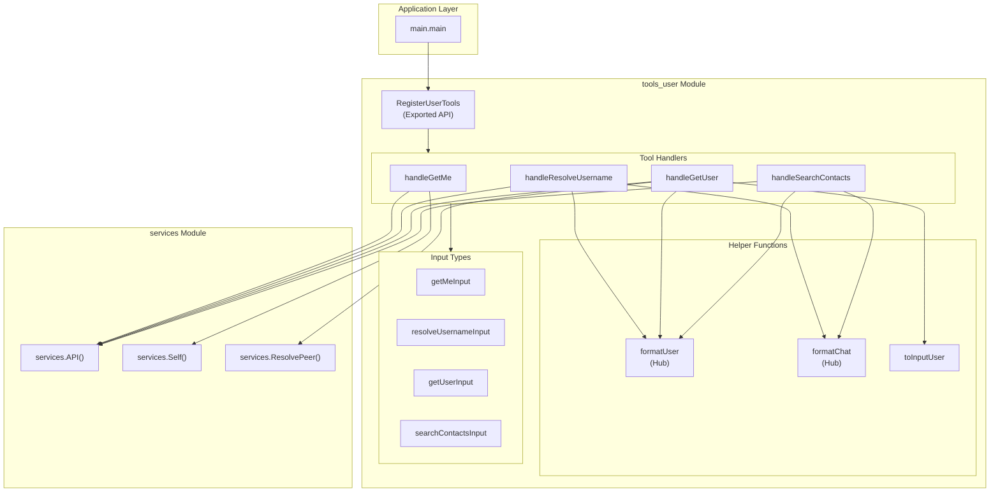
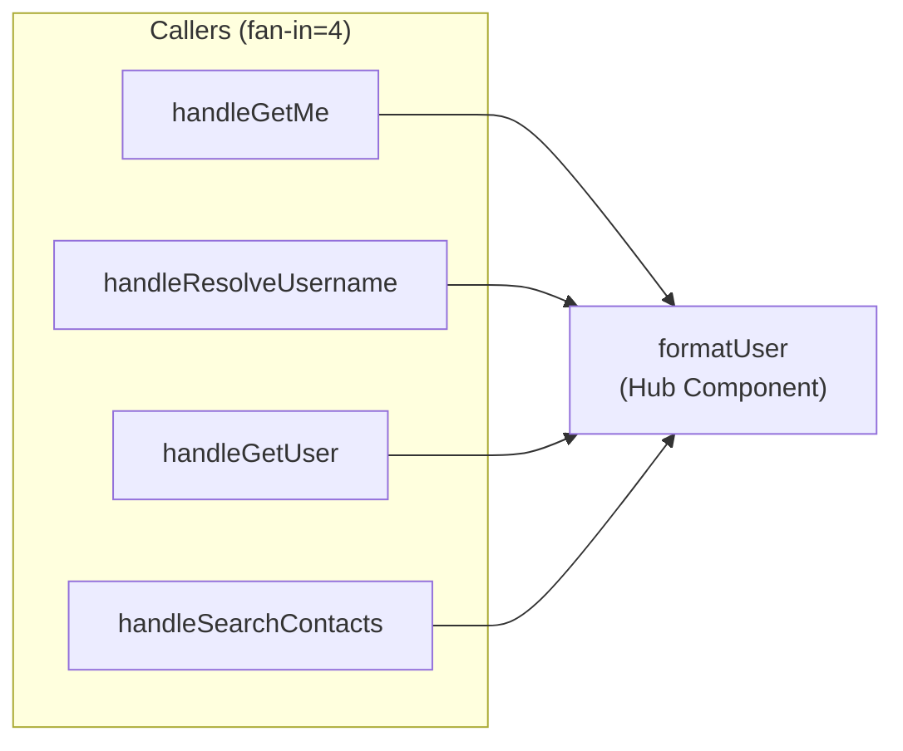
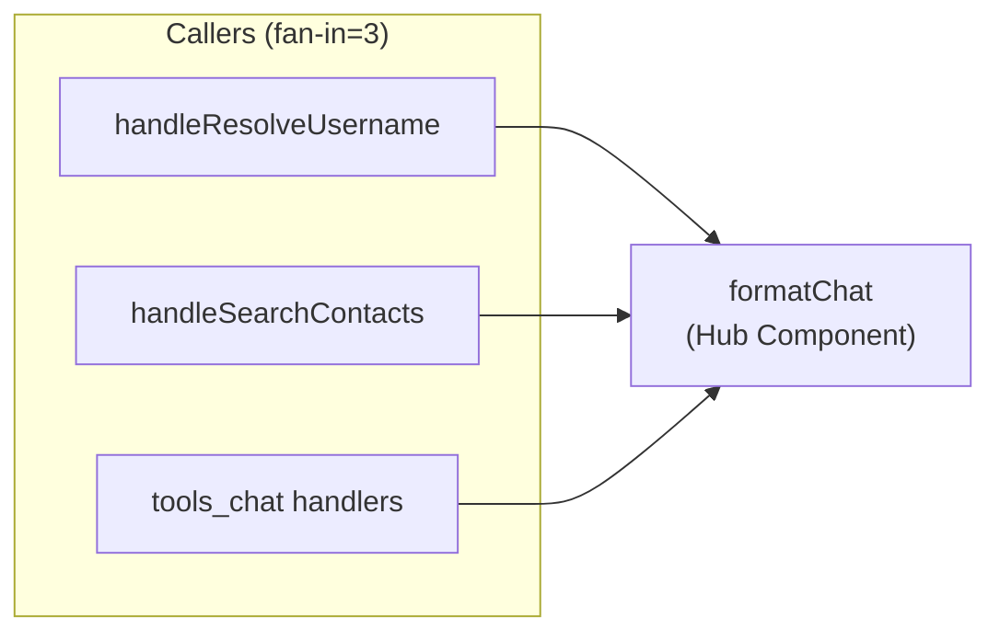
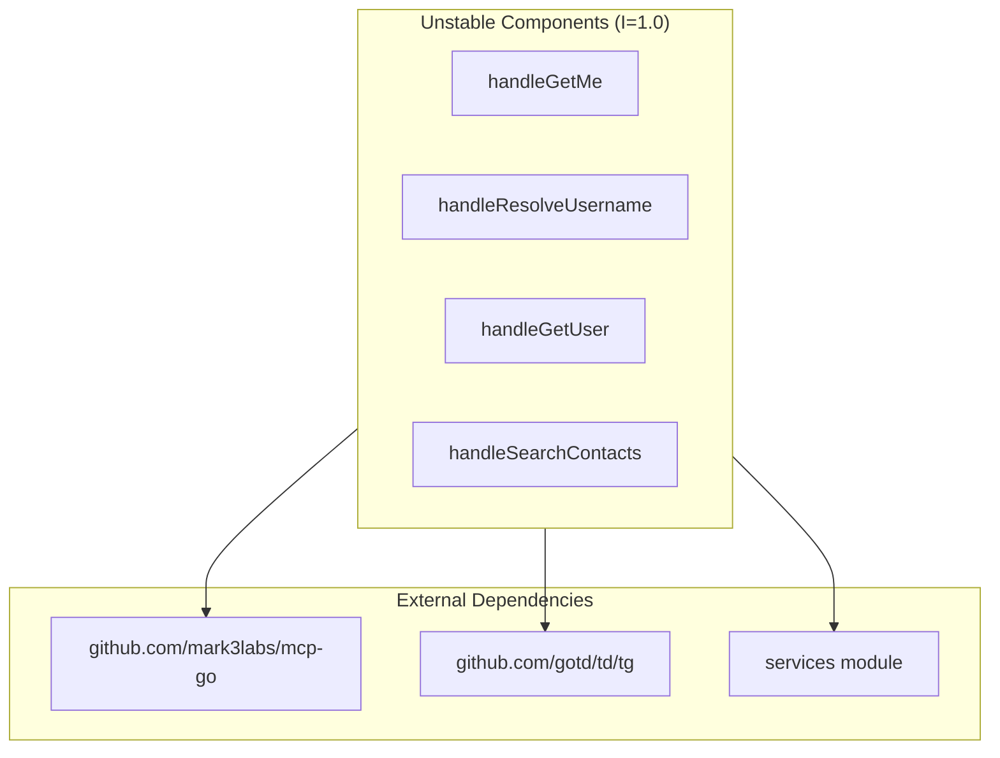
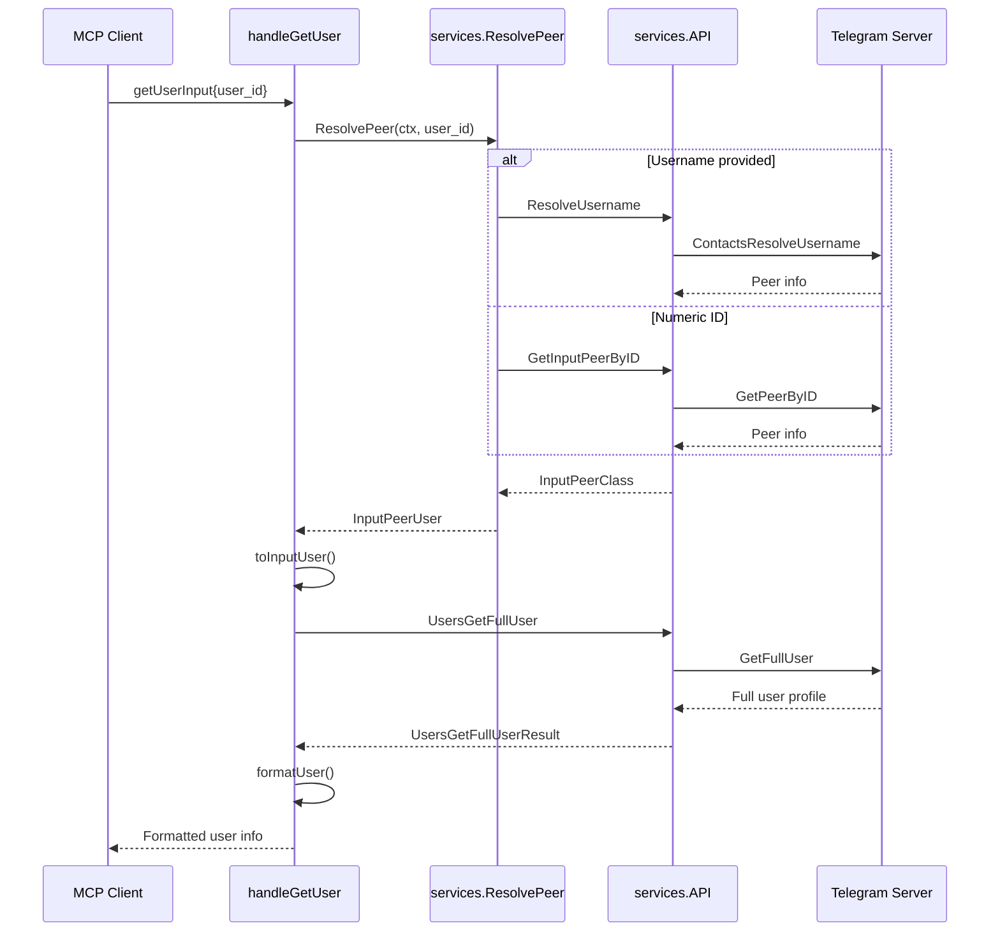
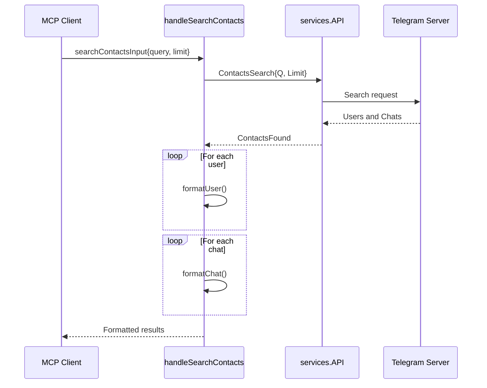

# tools_user Module

## Overview

The `tools_user` module provides MCP (Model Context Protocol) tools for Telegram user-related operations. It enables retrieval of user information, username resolution, and contact searching functionality within the Telegram MCP server ecosystem.

This module is one of four tool modules in the Telegram MCP system:
- **[tools_user](tools_user.md)** - User operations (current module)
- **[tools_chat](tools_chat.md)** - Chat and group operations
- **[tools_message](tools_message.md)** - Message operations
- **[tools_media](tools_media.md)** - Media operations

## Architecture



## Component Reference

### Exported API

#### `RegisterUserTools(s *server.MCPServer)`

The only exported function in this module. Registers four Telegram user-related tools with the MCP server.

**Parameters:**
- `s *server.MCPServer` - The MCP server instance to register tools with

**Registered Tools:**

| Tool Name | Description | Handler |
|-----------|-------------|---------|
| `telegram_get_me` | Get information about the currently logged-in user | `handleGetMe` |
| `telegram_resolve_username` | Resolve a @username to user or channel info | `handleResolveUsername` |
| `telegram_get_user` | Get detailed user info by ID or username | `handleGetUser` |
| `telegram_search_contacts` | Search contacts by name or username | `handleSearchContacts` |

**Usage Example:**
```go
mcpServer := server.NewMCPServer("Telegram MCP", "1.0.0")
tools.RegisterUserTools(mcpServer)
```

---

### Tool Handlers

#### `handleGetMe`

Retrieves comprehensive information about the currently authenticated Telegram user.

**Dependencies:**
- `services.Self()` - Gets current user object
- `services.API().UsersGetFullUser()` - Fetches extended user profile data

**Returns:**
- User display name (first + last name)
- Username (if available)
- User ID
- Phone number
- Account type (User/Bot)
- Bio (if available)

**Error Conditions:**
- `"not logged in"` - When `services.Self()` returns nil
- `"failed to get full user info: %v"` - When API call fails

---

#### `handleResolveUsername`

Resolves a Telegram username (with or without @ prefix) to retrieve the associated user, chat, or channel information.

**Input Structure:**
```go
type resolveUsernameInput struct {
    Username string `json:"username" jsonschema:"required"`
}
```

**Dependencies:**
- `services.API().ContactsResolveUsername()` - Telegram API for username resolution

**Return Information:**
- Peer type (User/Chat/Channel)
- Peer ID
- Formatted user details (if applicable)
- Formatted chat/channel details (if applicable)

**Error Conditions:**
- `"username is required"` - When username is empty
- `"failed to resolve @%s: %v"` - When API resolution fails

---

#### `handleGetUser`

Retrieves detailed information about a specific Telegram user by ID or username.

**Input Structure:**
```go
type getUserInput struct {
    UserID string `json:"user_id" jsonschema:"required"`
}
```

**Dependencies:**
- `services.ResolvePeer()` - Resolves ID/username to peer object
- `services.API().UsersGetFullUser()` - Fetches full user profile

**Return Information:**
- User display name and username
- User ID and phone number
- Account type (User/Bot)
- Bio
- Common chats count

**Error Conditions:**
- `"user_id is required"` - When UserID is empty
- `"failed to resolve peer: %v"` - When peer resolution fails
- `"the provided identifier does not resolve to a user"` - When identifier resolves to non-user
- `"failed to get user info: %v"` - When API call fails

---

#### `handleSearchContacts`

Searches Telegram contacts and public users/chats by query string.

**Input Structure:**
```go
type searchContactsInput struct {
    Query string `json:"query" jsonschema:"required"`
    Limit int    `json:"limit,omitempty"`  // Default: 20
}
```

**Dependencies:**
- `services.API().ContactsSearch()` - Telegram contact search API

**Return Information:**
- Matching users (formatted)
- Matching chats/channels (formatted)
- Result counts for each category

**Error Conditions:**
- `"query is required"` - When query is empty
- `"search failed: %v"` - When API search fails

---

### Hub Components

The following helper functions are identified as hub components due to their high reuse across multiple handlers:

#### `formatUser(b *strings.Builder, user *tg.User)`

**PageRank:** 0.0205 | **Fan-in:** 4 callers | **Fan-out:** 0 callees

Formats a Telegram user object into human-readable text. This is a critical formatting function used by multiple handlers.

**Callers:**
- `handleGetMe`
- `handleResolveUsername`
- `handleGetUser`
- `handleSearchContacts`

**Output Format:**
```
User: FirstName LastName (@username)
ID: 123456789
Phone: +1234567890
Type: Bot
```

**Breaking Change Impact:**
If this function's output format changes, all four calling handlers will produce inconsistent user information displays. Any modification should be carefully versioned.



---

#### `formatChat(b *strings.Builder, chat tg.ChatClass)`

**PageRank:** 0.0183 | **Fan-in:** 3 callers | **Fan-out:** 0 callees

Formats Telegram chat/channel objects into human-readable text. Handles three chat types: basic groups, channels, and supergroups.

**Callers:**
- `handleResolveUsername`
- `handleSearchContacts`
- (Also used in `tools_chat` module)

**Output Formats:**

For `*tg.Chat` (Basic Group):
```
Chat: Group Title
ID: 123456789
Type: Group
Members: 100
```

For `*tg.Channel`:
```
Channel: Channel Title
ID: 123456789
Username: @channelname
Type: Supergroup|Broadcast Channel|Channel
Members: 10000
```



---

### Utility Functions

#### `toInputUser(p tg.InputPeerClass) (*tg.InputUser, bool)`

Converts a generic `InputPeerClass` to a typed `InputUser`. Returns `nil, false` if the peer is not a user type.

**Used by:** `handleGetUser`

---

## Community Structure

Analysis reveals the following component groupings:

| Community ID | Components | Description |
|--------------|------------|-------------|
| 0 | `RegisterUserTools` | Entry point - tool registration |
| 3 | `handleGetMe` | Self-user operations |
| 28 | `handleResolveUsername`, `handleGetUser`, `handleSearchContacts`, `formatUser`, `formatChat`, `toInputUser` | Core user lookup and formatting |
| 29-32 | Input struct types | Data transfer objects |

---

## External Dependencies

### High Instability Components (Instability = 1.0)

All four handler functions have maximum instability scores, indicating complete dependence on external modules:



**Impact of Upstream Changes:**

| Dependency | Change Risk | Affected Handlers |
|------------|-------------|-------------------|
| `mcp-go` API | Tool handler signature changes | All handlers |
| `gotd/td/tg` | Telegram API type changes | All handlers |
| `services.API()` | Method signature changes | All handlers |
| `services.ResolvePeer()` | Return type changes | `handleGetUser` |
| `services.Self()` | Return type changes | `handleGetMe` |

**Mitigation Strategy:**
Consider adding adapter interfaces to decouple handlers from direct service dependencies, reducing instability scores.

---

## Data Flow

### User Lookup Flow



### Contact Search Flow



---

## Error Handling

All handlers follow a consistent error handling pattern:

```go
// Validation errors - return immediately
if input.Field == "" {
    return mcp.NewToolResultError("field is required"), nil
}

// API errors - wrap with context
if err != nil {
    return mcp.NewToolResultError(fmt.Sprintf("operation failed: %v", err)), nil
}
```

**Error Categories:**

| Category | Pattern | Example |
|----------|---------|---------|
| Input Validation | Direct check | `"username is required"` |
| Authentication | Service check | `"not logged in"` |
| API Failure | Wrapped error | `"failed to resolve @%s: %v"` |
| Type Conversion | Fallback message | `"does not resolve to a user"` |

---

## Integration with Other Modules

### Dependencies

- **[services](services.md)** - Core Telegram client and peer resolution services

### Related Modules

- **[tools_chat](tools_chat.md)** - Uses `formatChat` for chat-related operations
- **[tools_message](tools_message.md)** - May use user info for message formatting
- **[tools_media](tools_media.md)** - May reference user info in media operations

---

## Key Concepts

Based on TF-IDF analysis, the primary concepts in this module are:
- **User identification** (user, username, ID)
- **Full profile retrieval** (full, bio, phone)
- **Search functionality** (query, limit, found)
- **MCP integration** (mcp, input, jsonschema)
- **Result formatting** (fprintf, format)

---

## Summary

The `tools_user` module provides essential user-related functionality for the Telegram MCP server:

1. **Single Entry Point**: `RegisterUserTools` registers all user tools with the MCP server
2. **Four Core Operations**: Get self, resolve username, get user, search contacts
3. **Hub Components**: `formatUser` and `formatChat` provide reusable formatting logic
4. **High Coupling**: Handlers depend heavily on external services (instability = 1.0)
5. **Consistent Error Handling**: All handlers follow the same error pattern

For implementation details of the underlying Telegram services, refer to the [services](services.md) documentation.
